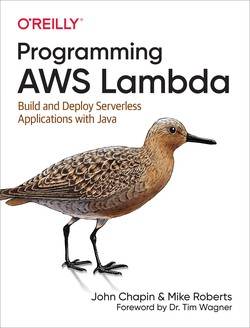
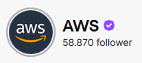

# Hi!

Matteo Francia, Ph.D.

- Email: m.francia@unibo.it
- Assistant Professor (junior) @ DISI, UniBO
- www: [https://www.unibo.it/sitoweb/m.francia/en](https://www.unibo.it/sitoweb/m.francia/en)

Teaching

- [DTM] Big Data and Cloud Platforms (Module 2)
- [DTM] Machine Learning and Data Mining (Module 2)

Research topics

- Big data / database / machine learning
- Precision agriculture and spatio-temporal analytics

[BIG (Business Intelligence Group)](https://big.csr.unibo.it/)

- w/ Prof. Golfarelli, Prof. Gallinucci
- You can check our open projects [here](https://big-unibo.github.io/thesis/)

# Table of Contents and Exam

Handling data pipelines in the Cloud

* Introduction to *data platforms*: shifting from databases to well-integrated data ecosystems
* Definition of *cloud computing* and taxonomy of cloud services
* Introduction to the most *relevant cloud platforms*
* Introduction to the *billing models* of cloud computing services
* Cluster *migration*: on-premises vs on-cloud
* Real *case studies + labs*

Seminars by companies working with cloud and big data platforms

* Connect the dots
* Information systems, BI, data mining, big data, and machine learning

... **all these points** will be part of the oral examination! :)

# Table of Contents and Exam

Questions on all (**theoretical** and **practical**) aspects of the course

* A *single session* with both teachers
* Exam covers *both modules*
* *Seminars and labs* are included
* *Interaction during the lectures/labs* is considered in the final evaluation

The exam is not technical

- However, you must be capable to explain the concepts and connect the dots

No scheduled dates, just come **when you are ready**

* At least one week in advance
* Link to the [Booking](https://outlook.office365.com/owa/calendar/BigDataandCloudPlatformsexams@live.unibo.it/bookings/) application

According to the University's regulation

* Exams must be in presence
* **Cannot refuse a grade more than once**

Be prepared: you have to wait **1 month before trying again** (in any case)

# Office hours

- Lectures start/end 10 minutes later/earlier than the time stated in the teaching calendar
- You can ask questions before/after each lecture
- ... or send an email to book an appointment

If you need help with coding and labs, *you can ask the tutor*!

# So far

> Digital transformation
>
> The process of using digital technologies to create new — or modify existing — business processes, culture, and customer experiences to meet changing business and market requirements

You have acquainted/practiced with *on-premises* solutions

* You were given a working hardware cluster
* ... to deploy software applications on a Hadoop-based stack

In the perspective of digital transformation, let us guess

* How would you start from scratch?
* How much time would it take?

# So far

No easy answers

* Big-data (distributed) architectures require a lot of skills
* *Configuration*: how do I set up dozens of new machines?
* *Networking*: how do I cable dozens of machines?
* *Management*: how do I replace a broken disk?
* *Upgrade*: how do I extend the cluster with new services/machines?
* (energy and cooling, software licenses, insurance, ...)

[https://aws.amazon.com/compliance/data-center/data-centers/](https://aws.amazon.com/compliance/data-center/data-centers/)

# So far

Two sides of the same coin, and your profile is a perfect? fit

* Technological perspective
  * How do we configure a distributed environment?
  * How do we set up/integrate/control independent services?
  * How do we orchestrate data flows?
* Business perspective
  * Can we afford to spend resources on tasks that are not mission-oriented?
    * Mission: a statement used by a company to explain its purpose(s)
  * No free lunch, each choice has a cost/benefit
  * How much time does it take to master a technology?
  * How many people do I need?

... but first, what are our **data needs**?

# Teaching material

:::: {.columns}
::: {.column width=25%}

:::
::: {.column width=25%}

:::
::: {.column width=25%}

:::
::: {.column width=25%}

:::
::: {.column width=50%}

:::
::: {.column width=50%}

:::
::::

# Teaching material

You will find all you need in these slides

* However, keeping up the pace with data platforms and the cloud is hard
* There is a rapid development of technologies, and not all of them will survive
* Books are easily outdated with respect to cutting-edge services and technologies
* Research papers (often) describe solutions that are not commercial yet
* (IRL) You will need to deal with a lot of (bad) documentation, online articles, etc.

Rule of thumb

* Understand the general concepts
* Do not be afraid of change
* Connect the dots... and ask questions!