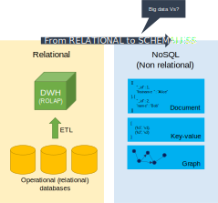
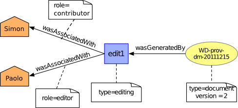
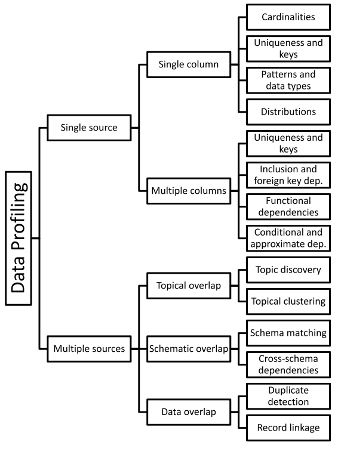
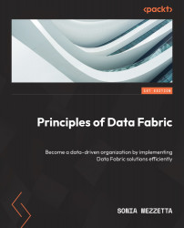
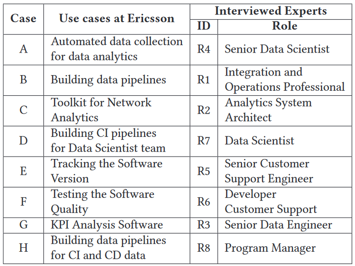

# How did we get here?

**Data-Driven Innovation**

- Use of data and _analytics_ to foster new products, processes, and markets
- Drive discovery and execution of innovation, achieving new services with a business value

**Analytics**

- A catch-all term for different business intelligence (BI)- and application-related initiatives
  - E.g., analyzing information from a particular domain
  - E.g., applying BI capabilities to a specific content area (e.g., sales, service, supply chain)

**Advanced Analytics**

- (Semi-)Autonomous examination of data to discover deeper insights, make predictions, or generate recommendations (e.g., through data/text mining and machine learning)

**Augmented Analytics**

- Use of technologies such as machine learning and AI to assist with data preparation, insight generation, and insight explanation to augment how people explore and analyze data

[https://www.gartner.com/en/information-technology/glossary](https://www.gartner.com/en/information-technology/glossary) (accessed 2022-08-01)

# How did we get here?


# Data platform

Companies are collecting tons of data to enable advanced analytics

- Raw data is difficult to obtain, interpret, and maintain
- Data is more and more heterogeneous
- There is a need for curating data to make it _consumable_

Where are we _collecting/processing_ data?

- Getting _value_ from data _is not_ (only) a matter of _storage_
- Need integrated and multilevel analytical skills and techniques

# Data platform

> "It is a capital mistake to theorize before one has data. Insensibly, one begins to twist the facts to suit theories, instead of theories to suit facts."
>
> – Sherlock Holmes

Getting _value_ from data _is not_ (only) a matter of _storage_

- Any example?

# Case study: photo gallery

:::: {.columns}
::: {.column width=50%}


:::
::: {.column width=50%}


:::
::::

# From databases to data platforms

# Data platform

:::: {.columns}
::: {.column width=50%}

> Database [@ozsu2018]
>
> "A database is a _structured and persistent collection_ of information about some aspect of the real world organized and stored in a way that facilitates efficient retrieval and modification. The structure of a database is determined by an _abstract data model_. Primarily, it is this structure that differentiates a database from a data file."

:::
::: {.column width=50%}


:::
::::

# Data platform

:::: {.columns}
::: {.column width=50%}

> Data Warehouse [@golfarelli2009data]
>
> "A collection of data that supports decision-making processes. It provides the following features: subject-oriented, integrated and consistent, not volatile."

:::
::: {.column width=50%}


:::
::::

# OLTP vs OLAP?

# Data platform: OLTP vs OLAP

| Characteristic | OLTP | OLAP |
|:-: |:-: |:-: |
| Nature | Constant transactions (queries/updates) | Periodic large updates, complex queries |
| Examples | Accounting database, online retail transactions | Reporting, decision support |
| Type | Operational data | Consolidated data |
| Data retention | Short-term (2-6 months) | Long-term (2-5 years) |
| Storage | Gigabytes (GB) | Terabytes (TB) / Petabytes (PB) |
| Users | Many | Few |
| Protection | Robust, constant data protection and fault tolerance | Periodic protection |

# Data platform

:::: {.columns}
::: {.column width=50%}

> Schemaless databases
>
> There is no predefined schema the data must conform to before it's added to the database.
> As a result, you don't need to know the structure of your data, enabling you to store all your data more easily and quickly.

:::
::: {.column width=50%}



:::
::::

# Data platform

:::: {.columns}
::: {.column width=50%}

> Data lake [@couto2019mapping]
>
> "A DL is a _central repository_ system for _storage, processing, and analysis of raw data_, in which the data is kept in its _original format and is processed to be queried only when needed_. It can _store a varied amount of formats_ in big data ecosystems, from unstructured, semi-structured, to structured data sources"

:::
::: {.column width=50%}


:::
::::

# Data platform


# DWH vs Data Lake?

# Data platform: DWH vs Data Lake

| Characteristics | Data warehouse | Data lake |
|:-: |:-: |:-: |
| Data | Relational | Non-relational and relational |
| Schema | Designed prior to implementation (**schema-on-write**) | Written at the time of analysis <br /> (**schema-on-read**) |
| Price/performance | Fastest query results using higher cost storage | Query results getting faster using low-cost storage |
| Data quality | Highly curated data that serves as the central version of the truth | Any data, which may or may not be curated (e.g., raw data) |
| Users | Business analysts | Data scientists, data developers, and business analysts (using curated data) |
| Analytics | Batch reporting, BI, and visualizations | Machine learning, predictive analytics, data discovery, and profiling. |

# Data lakehouse

**Data lakehouse**

:::: {.columns}
::: {.column width=50%}

- Data management architecture that combines the flexibility, cost-efficiency, and scale of data lakes with the data management and ACID transactions of data warehouses, enabling business intelligence (BI) and machine learning (ML) on all data

Key technologies used to implement Data Lakehouses

- Databricks' Delta Tables
- Apache Hudi
- Apache Iceberg

:::
::: {.column width=50%}


:::
::::

[https://databricks.com/blog/2021/05/19/evolution-to-the-data-lakehouse.html](https://databricks.com/blog/2021/05/19/evolution-to-the-data-lakehouse.html)

[https://www.databricks.com/glossary/data-lakehouse](https://www.databricks.com/glossary/data-lakehouse)

# Data lakehouse


# Data lakehouse

|  | Data warehouse | Data lake | Data lakehouse |
|:-: |:-: |:-: |:-: |
| *Data format*       | Closed, proprietary format | Open format (e.g., Parquet) | Open format |
| *Types of data*     | Structured data, with limited support for semi-structured data | All types: Structured data, semi-structured data, textual data, unstructured (raw) data | All types: Structured data, semi-structured data, textual data, unstructured (raw) data |
| *Data access*       | SQL-only, no direct access to file | Open APIs for direct access to files with SQL, R, Python, and other languages | Open APIs for direct access to files with SQL, R, Python, and other languages |
| *Reliability*       | High quality, reliable data with ACID transactions | Low quality, data swamp | High quality, reliable data with ACID transactions |
| *Governance and security* | Fine-grained security and governance for row/columnar level for tables | Poor governance as security needs to be applied to files | Fine-grained security and governance for row/columnar level for tables |
| *Performance*       | High | Low | High |
| *Scalability*       | Scaling becomes exponentially more expensive | Scales to hold any amount of data at low cost, regardless of type | Scales to hold any amount of data at low cost, regardless of type |
| *Use case support*  | Limited to BI, SQL applications and decision support | Limited to machine learning | One data architecture for BI, SQL and machine learning |

# Data platform

Data lakes (or lakehouses) have increasingly taken the role of data hubs

- Eliminate up-front costs of ingestion and ETL since data are stored in original format
- Once in DL, data are available for analysis by everyone in the organization

Drawing a sharp line between storage/computation/analysis is hard

- Is a database just storage?
- What about SQL/OLAP?

Blurring of the architectural borderlines

- DL is often replaced by "data platform" or "data ecosystem"
- Encompass systems supporting data-intensive storage, computation, analysis

# Data platform

A data platform is a **centralized** infrastructure that facilitates the ingestion, storage, management, and exploitation of large volumes of heterogeneous data. It provides a collection of **independent** and **well-integrated** services meeting **end-to-end** data needs.

- **Centralized**: is conceptually a single and unified component
- **Independent**: a service is not coupled with any other
- **Well-integrated**: services have interfaces that enable easy and frictionless composition
- **End-to-end**: services cover the entire data life cycle

Rationale: relieve users from the complexity of administration and provision

- Not only technological skills but also privacy, access control, etc.
- Users should only focus on functional aspects

# Data platform

Are we done? No!

- Lacking smart support to govern the complexity of data and transformations
- Data transformations must be governed to prevent DP from turning into a swamp
  - Amplified in data science, with data scientists prevailing data architects
  - Leverage descriptive metadata and maintenance to keep control over data

# Which functionalities for (automated) data management can you think about?

# Managing data platforms

- Tracking data pipelines: Data provenance
- Tracking changes: Data versioning
- Saving storage: Compression
- Understanding the data: Data profiling
- Integrating data sources: Entity resolution
- ...

# Data governance

:::: {.columns}
::: {.column width=60%}

**Data governance** is everything you do to ensure data is secure, private, accurate, available, and usable

- It includes the actions people must take, the processes they must follow, and the technology that supports them throughout the data life cycle
- Every organization needs data governance since industries proceed on their digital-transformation journeys

A *data steward* is a role that ensures that data governance processes are followed and that guidelines are enforced, and recommends improvements to data governance processes. 

:::
::: {.column width=40%}


:::
::::

# Data provenance

Provenance (also referred to as lineage, pedigree, parentage, genealogy)

- The description of the origins of data and the process by which it arrived at the database
- Not only data products (e.g., tables, files), but also the processes that created them

Examples of use cases [@simmhan2005survey]

- Business domain.
  - Users traditionally work with an _organized data schema_, where the structure and _semantics of the data in use are shared_ across the corporation or even B2B. Yet, a large proportion of businesses deal with _bad-quality data_. _Sources_ of bad data _need to be identified_ and corrected to avoid costly errors in business forecasting.
- Scientific/research domain.
  - _Data_ used in the scientific field can be _ad hoc_ and driven by _individual researchers_ or small communities. The scientific field is moving _towards more collaborative research_ and organizational boundaries are disappearing. _Sharing data and metadata across organizations is essential_, leading to convergence on common schemes to ensure compatibility. Issues of _trust_, _quality_, and _copyright_ of data are significant when using third-party data in such a loosely connected network.

# Data provenance

:::: {.columns}
::: {.column width=60%}

Astronomers are creating an international Virtual Observatory

- A _federation_ of all the world significant astronomical _data resources_ coupled with _provision of the computational resources_ needed to exploit the data scientifically
- Astronomy changed from being an individualistic to a _collective enterprise_
- Telescope time is devoted/allocated to systematic sky surveys and analysis is performed using data from the archives
- Astronomers are _increasingly relying on data that they did not take themselves_
- Raw data bear _many instrumental signatures that must be removed_ in the process of generating data products [@mann2002some]

:::
::: {.column width=40%}


:::
::::

[https://www.esa.int/Science_Exploration/Space_Science/Webb/Webb_inspects_the_heart_of_the_Phantom_Galaxy](https://www.esa.int/Science_Exploration/Space_Science/Webb/Webb_inspects_the_heart_of_the_Phantom_Galaxy) (accessed 2022-08-01)

# Data provenance

![Characteristics of data provenance [@simmhan2005survey]](imgs/slides15.png)

# Data provenance

Granularity [@simmhan2005survey]

- _Fine-grained_ (instance level): tracking data items (e.g., a tuple in a dataset) transformations
- _Coarse-grained_ (schema-level): tracking dataset transformations

Queries [@ikeda2009data]

- _Where_ provenance: given some output, which inputs did the output come from?
- _How_ provenance: given some output, how were the inputs manipulated?
- _Why_ provenance: given some output, why was data generated?
  - E.g., in the form of a proof tree that locates source data items contributing to its creation

# Data provenance

:::: {.columns}
::: {.column width=60%}

Data provenance, an example of data management

- Metadata pertaining to the history of a data item
- Pipeline including the origin of objects & operations they are subjected to
- We have a standard: [PROV-DM](https://www.w3.org/TR/prov-dm/)

:::
::: {.column width=40%}



:::
::::

# Data provenance

:::: {.columns}
::: {.column width=60%}

_Entity_

- Physical/conceptual things

_Activity_

- Dynamic aspects of the world, such as actions
- How entities come into existence, often making use of previously existing entities

_Agent_

- A person, a piece of software
- Takes a role in an activity such that the agent can be assigned some degree of responsibility for the activity taking place

:::
::: {.column width=40%}


:::
::::

[https://www.w3.org/TR/2013/NOTE-prov-primer-20130430/](https://www.w3.org/TR/2013/NOTE-prov-primer-20130430/)

# Data provenance: fine grained vs coarse grained

How would you represent this table update?
 
> :::: {.columns}
> ::: {.column width=50%}
> 
> Original data
> 
> | `product_id` | `sales_v1` |
> |:-------------|--------:|
> | "p1"         |      10 |
> | "p2"         |      20 |
> | "p3"         |      30 |
> | "p4"         |      10 |
> | "p5"         |      20 |
> | "p6"         |      30 |
> 
> :::
> ::: {.column width=50%}
> 
> ```sales_v2 = sales_v1 + 1```
> 
> | `product_id` | `sales_v2` |
> |:-------------|--------:|
> | "p1"         |      11 |
> | "p2"         |      21 |
> | "p3"         |      31 |
> | "p4"         |      11 |
> | "p5"         |      21 |
> | "p6"         |      31 |
> 
> :::
> ::::

# Data provenance: fine grained vs coarse grained

:::: {.columns}
::: {.column width=20%}

:::
::: {.column width=60%}

:::: {.columns}
::: {.column width=100%}


:::
::: {.column width=100%}


:::
::::

:::
::::

# Data provenance

Use cases for data provenance

- Accountability and auditing

Data quality

- Monitoring of the quality (e.g., accuracy) of the objects produced
- Notify when a transformation pipeline is not behaving as expected

Debugging

- Inferring the cause of pipeline failures is challenging
- Store inputs of each operation with versions and environmental settings (RAM, CPUs, etc.)

And so on...

# Data versioning

:::: {.columns}
::: {.column width=50%}

Version control

- A class of systems responsible for managing changes to computer programs, documents, or data collections
- Changes are identified by a number/letter code, termed the revision/version number

However, data pipelines are not only about code but also about

- Model Version control
- Data Version Control
- Model Parameter Tracking
- Model Performance Comparison

:::
::: {.column width=50%}


:::
::::

# Data versioning

Support CRUD (Create, Read, Update, Delete) operations with versions

For example, on [AWS (PUT, GET, DELETE)](https://docs.aws.amazon.com/AmazonS3/latest/userguide/versioning-workflows.html)

:::: {.columns}
::: {.column width=40%}


:::
::: {.column width=24%}


:::
::: {.column width=25%}


:::
::::

What about updating?

# Compression

:::: {.columns}
::: {.column width=60%}

**Data compression** is the process of encoding information using fewer bits than the original representation

- *Lossless*: reduces bits by identifying and eliminating redundancy
  - No information is lost in lossless compression
  - Examples?
- *Lossy*: reduces bits by removing less important information
  - Examples?

**Summarization**: find a concise representation of a dataset in a comprehensible informative manner

> :::: {.columns}
> ::: {.column width=50%}
> 
> Transaction dataset
>
> | TID | Products |
> |-----|----------|
> | T1  | Beer, Diapers, Cola |
> | T2  | Cola, Fanta |
> | T3  | Beer, Cola |
> | T3  | Beer, Diapers |
>
>:::
>::: {.column width=50%}
>
> Frequent itemset mining
>
> Itemset 1: {Cola}
>
> Itemset 2: {Beer}
>
> Itemset 3: {Beer, Diapers}
> 
> :::
> ::::

:::
::: {.column width=40%}

![Characteristics of data summarization [@ahmed2019data]](imgs/slides18.png)

:::
::::

# Data profiling

:::: {.columns}
::: {.column width=60%}

Data profiling [@naumann2014data]

- A broad range of methods to efficiently analyze a given data set
- E.g., in a _relational_ scenario, _tables_ of a relational database are _scanned_ to derive _metadata_, such as _data types_, _completeness_ and _uniqueness_ of columns, _keys_ and  _foreign keys_, and occasionally _functional dependencies_ and _association rules_

:::
::: {.column width=40%}



:::
::::

# Data profiling: single column (Iris dataset)

Schema and statistics

```
df.info()
```

> ```
> <class 'pandas.core.frame.DataFrame'>
> RangeIndex: 150 entries, 0 to 149
> Data columns (total 5 columns):
>  #   Column             Non-Null Count  Dtype  
> ---  ------             --------------  -----  
>  0   sepal length (cm)  150 non-null    float64
>  1   sepal width (cm)   150 non-null    float64
>  2   petal length (cm)  150 non-null    float64
>  3   petal width (cm)   150 non-null    float64
>  4   species            150 non-null    int64  
> dtypes: float64(4), int64(1)
> memory usage: 6.0 KB
> ```

# Data profiling: single columns (Iris dataset)

Statistics

```
df.describe()
```

> |       |   sepal length (cm) |   sepal width (cm) |   petal length (cm) |   petal width (cm) |
> |:------|--------------------:|-------------------:|--------------------:|-------------------:|
> | count |          120        |         120        |           120       |         120        |
> | mean  |            5.80917  |           3.06167  |             3.72667 |           1.18333  |
> | std   |            0.823805 |           0.449123 |             1.75234 |           0.752289 |
> | min   |            4.3      |           2        |             1       |           0.1      |
> | 25%   |            5.1      |           2.8      |             1.5     |           0.3      |
> | 50%   |            5.75     |           3        |             4.25    |           1.3      |
> | 75%   |            6.4      |           3.4      |             5.1     |           1.8      |
> | max   |            7.7      |           4.4      |             6.7     |           2.5      |

# Data profiling: statistic query optimization

:::: {.columns}
::: {.column width=30%}

> Table `R`
>
> | `a` | `b` |
> |-----|-----|
> | 10  | 20  |
> | 20  | 30  |
> | 30  | 40  |
>
> `min(R.a) = 10`
>
> `max(R.a) = 30`

No need to access `R.a` because `min(R.a) >= 10`

:::
::: {.column width=70%}

![[@bruno2002exploiting]](imgs/executionplan.png)

:::
::::

# Data profiling: multiple columns (Iris dataset)

```
df.corr(method='pearson', numeric_only=True)
```

> |                   |   sepal length (cm) |   sepal width (cm) |   petal length (cm) |   petal width (cm) |
> |:------------------|--------------------:|-------------------:|--------------------:|-------------------:|
> | sepal length (cm) |            1        |          -0.106926 |            0.862175 |           0.80148  |
> | sepal width (cm)  |           -0.106926 |           1        |           -0.432089 |          -0.369509 |
> | petal length (cm) |            0.862175 |          -0.432089 |            1        |           0.962577 |
> | petal width (cm)  |            0.80148  |          -0.369509 |            0.962577 |           1        |

# Data profiling

Use cases

- _Query optimization_
  - Performed by DBMS to support query optimization with statistics about tables and columns
  - Profiling results can be used to estimate the selectivity of operators and the cost of a query plan
- _Data cleansing _ (typical use case is profiling data)
  - Prepare a cleansing process by revealing errors (e.g., in formatting), missing values, or outliers
- _Data integration and analytics_

Challenges?

# Data profiling

The results of data profiling are _computationally heavy_ to discover

- E.g., discovering keys/dependencies usually involves some sorting step for each considered column

Verification of _constraints on combinations (groups) of columns_ in a database

:::: {.columns}
::: {.column width=50%}

**Complexity**: how many combinations (groups of columns)?

Given a table with columns $C = \{w, x, y, z\}$

| w | x | y | z |
|:-: |:-: |:-: |:-: |
| 1 | 1 | 2 | 2 |
| 1 | 2 | 1 | 4 |

:::
::: {.column width=30%}


:::
::::

- To extract the (distinct) cardinality of each column, I will consider $\binom{|C|}{1}=|C|$ columns $\{(w), (x), (y), (z)\}$
- To extract the correlations between pairs of columns, I will consider $\binom{|C|}{2}$ groups $\{(w, x), (w, y), (w, z), (x, y), ...\}$
- Extracting the relationships among all possible groups of columns generalizes to $\sum_{n=1}^{|C|}\binom{|C|}{n}=2^{|C|}−1$ groups

# Entity resolution

:::: {.columns}
::: {.column width=50%}

Entity resolution [@papadakis2020blocking]

- (also known as entity matching, linking)
- Find records that refer to the same entity across different data sources (e.g., data files, books, websites, and databases)

:::
::: {.column width=50%}


:::
::::

# Data catalog

:::: {.columns}
::: {.column width=60%}

A **data catalog** is an organized inventory of the data in your company [@olesen2023enterprise]

- The data catalog provides an overview at a metadata level only, and thus no actual data values are exposed.
- You can let everyone see everything without fear of exposing confidential or sensitive data.

:::
::: {.column width=40%}


:::
::::

# Data catalog

:::: {.columns}
::: {.column width=60%}

Meta-data is organized into domains

A **domain** is a group of entities sharing knowledge, goals, methods of operation, and communication

:::
::: {.column width=40%}


:::
::::

# Data catalog: processes vs capabilities

:::: {.columns}

*Processes* describe how a company performs its tasks.

*Capabilities*  describe what tasks a company performs.

- Neither processes nor capabilities reflect the business units of your company 1:1.

::: {.column width=50%}


:::
::: {.column width=50%}


:::
::::

# Data platform

Are we done? No!

- Metadata can become bigger than data themselves

We need meta meta-data (or models)...

- ... chasing our own tails

Data management is still a (research) issue in data platforms

# Data platform

**Is it a Lakehouse with another name?**

- A Lakehouse is a part of the data platform, a layer that enables to query multiple data sources (with SQL/Spark) transparently by using some metadata (JSON) log
- Still, you could get a data platform where such transparency is not mandatory or could be achieved by different techniques (e.g., multistore [@forresi2021dataspace])

# Data platform

**Is it a new name for BI?**

No, in a data platform, you also need to manage (streams of) operational data and OLTP workloads

# How do we build data platforms?

# Data fabric

**Data fabric** is a "vision for data management [...] that seamlessly connects different clouds, whether they are private, public, or hybrid environments." ([2016](https://cloud.netapp.com/hubfs/Data-Fabric/Data%20Fabric%20WP%20April%202017.pdf))

Frictionless access and sharing of data in a distributed data environment

- Enables a *single and consistent data management framework*
- ... that allows *seamless data access and processing* by design across otherwise siloed storage
- Leverages *human and machine capabilities to access data* in place or support its consolidation where appropriate
- *Continuously identifies and connects data* from disparate applications to discover unique business-relevant relationships

It is a unified architecture with an integrated set of technologies and services

- Designed to deliver integrated and enriched data at the right time, in the right method, and to the right data consumer
- Combines key data management technologies such as *data governance*, *integration*, *pipelining*, and *orchestration*

[Gartner (2021). Data fabric architecture](https://www.gartner.com/smarterwithgartner/data-fabric-architecture-is-key-to-modernizing-data-management-and-integration)

[K2View Whitepaper (2021). What is a Data Fabric? The Complete Guide](https://www.k2view.com/what-is-data-fabric/)

# Data fabric: example from Cloudera


# Data fabric

- *Catalog all your data*: including business glossary and design-time and runtime metadata
- *Enable self-service capabilities*: data discovery, profiling, exploration, quality assessment, consumption of data-as-a-product
- *Provide a knowledge graph*: Visualizing how data, people, processes, systems, etc. are interconnected, deriving additional actionable insight
- *Provide intelligent (smart) information integration*: Supporting IT staff and business users alike in their data integration and transformation, data virtualization, and federation tasks
- *Derive insight from metadata*: Orchestrating and automating tasks and jobs for data integration, data engineering, and data governance end-to-end
- *Enforce local and global data rules/policies*: Including AI/ML-based automated generation, adjustments, and enforcement of rules and policies
- *Manage an end-to-end unified lifecycle*: Implementing a coherent and consistent lifecycle end to end of all Data Fabric tasks across various platforms, personas, and organizations
- *Enforce data and AI governance*: Broadening the scope of traditional data governance to include AI artifacts, for example, AI models, pipelines

# Data fabric: is this brand new?

# Data fabric

**It is a design concept**

- It optimizes data management by automating repetitive tasks
- According to Gartner estimates, 25% of data management vendors will provide a complete framework for data fabric by 2024 – up from 5% today

:::: {.columns}
::: {.column width=50%}


:::
::: {.column width=50%}


:::
::::

[Gartner (2021). Data fabric is key to modernizing data management](https://www.gartner.com/smarterwithgartner/data-fabric-architecture-is-key-to-modernizing-data-management-and-integration)

# Data fabric

:::: {.columns}
::: {.column width=55%}

**Active metadata** is a way of managing metadata that leverages open APIs to connect all services in your data platform and ferry metadata back and forth.

*Active metadata is always on*

- Automatically and continually collect metadata from various sources and steps of data flow — logs, query history, usage statistics.

*Active metadata is "intelligent"*: 

- Constantly process metadata to connect the dots and create intelligence from it.
- E.g., auto-classify sensitive data, automatic suggestions to document a data asset's description, send alerts about critical issues.

*Active metadata is action-oriented*

- Active metadata should drive actions such as curating recommendations and generating alerts

*Active metadata is open by default*

- Active metadata use APIs to hook into every piece of the data platform.

:::
::: {.column width=45%}


:::
::::


[Gartner (2021). Data fabric is key to modernizing data management](https://www.gartner.com/smarterwithgartner/data-fabric-architecture-is-key-to-modernizing-data-management-and-integration)

# Data mesh

Distributed data architecture, under centralized governance and standardization for interoperability, enabled by a shared and harmonized self-serve data infrastructure

- *Domain-oriented decentralized data ownership*
  - Decentralization and distribution of responsibility to people who are closest to the data, in order to support continuous change and scalability
  - Each domain exposes its own op/analytical APIs
- **Data as a product** (_quantum_)
  - Products must be discoverable, addressable, trustworthy, self-describing, secure
- *Self-serve data infrastructure as a platform*
  - High-level abstraction of infrastructure to provision and manage the lifecycle of data products
- *Federated computational governance*
  - A governance model that embraces decentralization and domain self-sovereignty, interoperability through global standardization, a dynamic topology, automated execution of decisions by the platform

[Zhamak Dehghani (2019). Data monolith to mesh](https://martinfowler.com/articles/data-monolith-to-mesh.html)

[Zhamak Dehghani (2020). Data mesh principles](https://martinfowler.com/articles/data-mesh-principles.html)

[Zhamak Dehghani (2021). Introduction to Data Mesh](https://www.youtube.com/watch?v=_bmYXWCxF_Q)

# Data mesh

:::: {.columns}
::: {.column width=50%}

Data Mesh organizes data around **business domain owners** and transforms relevant data assets (data sources) to **data products** that can be consumed by distributed business users from various business domains or functions

- Data products are created, governed, and used in an **autonomous, decentralized**, and self-service manner
- **Self-service capabilities**, which we have already referenced as a Data Fabric capability, enable business organizations to entertain a data marketplace with shopping-for-data characteristics

:::
::: {.column width=50%}


:::
::::

# What makes data a product?

A **data product** is raw data transformed into a business context

- Data products are registered in **knowledge catalog ** through specifications (XML, JSON, etc.)
- Main features
  - *Data product description*: The data product needs to be well-described
  - *Access methods*: for example, REST APIs, SQL, NoSQL, etc., and where to find the data asset
  - *Policies and rules*: who is allowed to consume the data product for what purpose
  - *SLAs*: agreements regarding the data product availability, performance characteristics, functions, cost of data product usage
  - *Defined format*: A data product needs to be described using a defined format
  - *Cataloged*: All data products need to be registered in the knowledge catalog. Data products need to be searchable and discoverable by potential data product consumers and business user
- Data products themselves are not stored in the knowledge catalog

# Data mesh vs data fabric

They are design concepts, not things

- They are not mutually exclusive
- They are architectural frameworks, not architectures
  - The frameworks must be adapted and customized to your needs, data, processes, and terminology
  - Gartner estimates 25% of data management vendors will provide a complete data fabric solution by 2024 – up from 5% today

Alex Woodie, 2021 [https://www.datanami.com/2021/10/25/data-mesh-vs-data-fabric-understanding-the-differences/](https://www.datanami.com/2021/10/25/data-mesh-vs-data-fabric-understanding-the-differences/)

Dave Wells, 2021 [https://www.eckerson.com/articles/data-architecture-complex-vs-complicated](https://www.eckerson.com/articles/data-architecture-complex-vs-complicated)

# Data mesh vs data fabric

Both provide an architectural framework to access data across multiple technologies and platforms

- **Data fabric**
  - Attempts to centralize and coordinate data management
  - Tackles the complexity of data and metadata in a smart way that works well together
  - Focus on the architectural, technical capabilities, and intelligent analysis to produce active metadata supporting a smarter, AI-infused system to orchestrate various data integration styles
- **Data mesh**
  - Emphasis on decentralization and data domain autonomy
  - Focuses on organizational change; it is more about people and process
  - Data are primarily organized around domain owners who create business-focused data products, which can be aggregated and consumed across distributed consumers

Alex Woodie, 2021 [https://www.datanami.com/2021/10/25/data-mesh-vs-data-fabric-understanding-the-differences/](https://www.datanami.com/2021/10/25/data-mesh-vs-data-fabric-understanding-the-differences/)

Dave Wells, 2021 [https://www.eckerson.com/articles/data-architecture-complex-vs-complicated](https://www.eckerson.com/articles/data-architecture-complex-vs-complicated)

# Data mesh vs data fabric


# Data mesh vs data fabric

Data Fabric and Mesh are the results of the data architecture evolution

- **Many capabilities were in existence already long before** the terms were coined

Take away:

- Abstract the "building blocks" of such platforms
- Let them evolve according to scalability and flexibility requirements

# Data mesh

:::: {.columns}
::: {.column width=50%}


:::
::: {.column width=50%}


:::
::::

As new technologies and solutions mature to support a centralized approach to data access, distributed approaches like Data Mesh are expected to fall increasingly out of favor in enterprise IT.

# (Some) References

:::: {.columns}
::: {.column width=33%}



:::
::: {.column width=33%}


:::
::: {.column width=33%}


:::
::::

# "Example" of architecture


(*) "Ormai sta xkcd é una base troppo usata" A. Tappi

# Example of data platform: Hadoop-based

A data platform on the Hadoop stack requires several tools


How many levels of complexity are hidden here?

How do you provision it?

- Manual provisioning on-premises
- Semi-automatic provisioning on-premises
- Automatic provisioning in the cloud

# On-premises manual provisioning

It is hardly advisable, if not for small and local tests

- **Technical challenges**
  - Installation: how do I set up a new machine?
  - Networking: how do I cable dozens of machines?
  - Management: how do I replace a broken disk?
  - Upgrade: how do I extend the cluster with new services/machines?
  - (energy and cooling, software licenses, insurance...)
- **Technological challenges**
  - How do we configure a distributed environment?
  - How do we set up/integrate/control independent services?
  - How do we orchestrate data flows?
- **Business challenges**
  - Can we afford to spend resources on tasks that are not mission-oriented?
  - No free lunch, each choice has a cost/benefit
  - How much time does it take to master a technology?
  - How many people do I need?

# Example of data platform: MOSES

:::: {.columns}
::: {.column width=50%}


:::
::: {.column width=50%}

Example of a data platform: MOSES [@francia2021making]

Functional architecture

- Components of MOSES are in orange
- Others are standard components in charge of producing/consuming, processing, storing, and visualizing data
- The orchestrator (e.g., Oozie) manages (e.g., schedules) the data transformation processes

:::
::::

# Wooclap

<iframe allowfullscreen frameborder="0" height="100%" mozallowfullscreen src="https://app.wooclap.com/LKDKIY/questionnaires/670e89be981e282b0b69ee7c" style="min-height: 550px; min-width: 300px" width="100%"></iframe>

# Data platform: expertise and related job positions


# Data platform: related job positions

_Data platform engineer_

- Orchestrate the successful implementation of cloud technologies within the data infrastructure of their business
- Solid understanding of impact database types and implementation
- Responsible for purchasing decisions for cloud services and approval of data architectures

_Data architect_

- Team members who understand all aspects of a data platform's architecture
- Work closely with the data platform engineers to create data workflows

_Data pipeline engineer_

- Responsible for planning, architecting, and building large-scale data processing systems

_Data analyst_

- Analyze data systems, creating automated systems for retrieving data from the data platform
- Cloud data analysts are more commonly members of the business user population

_Data scientist_

- Analyze and interpret complex digital data
- Work with new technologies (e.g., machine learning) to deepen the business' understanding and gain new insights

# From DevOps...

**DevOps** combines development and operations to increase the efficiency, speed, and security of software development and delivery compared to traditional processes.

DevOps practices enable software development (dev) and operations (ops) teams to accelerate delivery through automation, collaboration, fast feedback, and iterative improvement


[https://about.gitlab.com/topics/devops/](https://about.gitlab.com/topics/devops/) (accessed 2023-06-03)

# ... to DataOps

:::: {.columns}
::: {.column width=50%}

**DataOps** refers to a general process aimed to shorten the end-to-end data analytic life-cycle time by introducing automation in the data collection, validation, and verification process

![Evolution of DataOps [@munappy2020ad]](imgs/slides30.png)

:::
::: {.column width=50%}



:::
::::

# DataOps

:::: {.columns}
::: {.column width=60%}

From DevOps to DataOps

- "A collaborative data management practice focused on improving the _communication, integration and automation of data flows between data managers and data consumers across an organization_"
- Data analytics improved in terms of velocity, quality, predictability, and scale of software engineering and deployment

Some key rules

- Establish progress and performance measurements at every stage
- Automate as many stages of the data flow as possible
- Establish governance discipline (_governance-as-code_)
- Design process for growth and extensibility

:::
::: {.column width=40%}


:::
::::

Gartner, 2020 [https://www.gartner.com/smarterwithgartner/how-dataops-amplifies-data-and-analytics-business-value](https://www.gartner.com/smarterwithgartner/how-dataops-amplifies-data-and-analytics-business-value)

Andy Palmer, 2015 [https://www.tamr.com/blog/from-devops-to-dataops-by-andy-palmer/](https://www.tamr.com/blog/from-devops-to-dataops-by-andy-palmer/)

William Vorhies, 2017 [https://www.datasciencecentral.com/profiles/blogs/dataops-it-s-a-secret](https://www.datasciencecentral.com/profiles/blogs/dataops-it-s-a-secret)

# Summing up

- Storage should be flexible enough to support heterogenous data models and raw data
  - From operational databases to DWHs **(why?)**
  - From relational data models to NoSQL **(why?)**
  - Data lake to (directly) ingest raw data
- Storage,  _per se_, is insufficient to get value from the data **(examples?)**
  - We also need data processing and fruition
  - Data lakes are blurring into data platforms
- Data platforms support end-to-end data needs **(which ones?)**
  - Building data platforms is hard **(why?)**
  - Managing data platforms is hard, exploit meta-data to ease this task
    - Data lineage, compression, profiling, resolution, etc.
- **Open question**: how do we deploy working data platforms?

# References