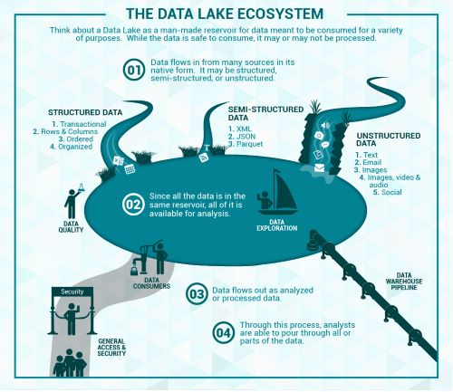
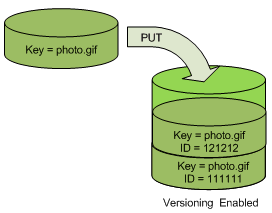
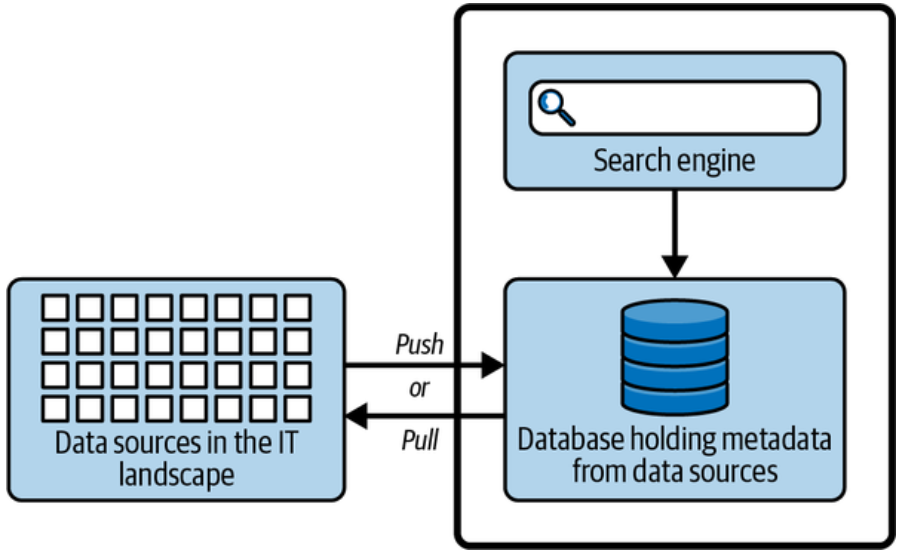
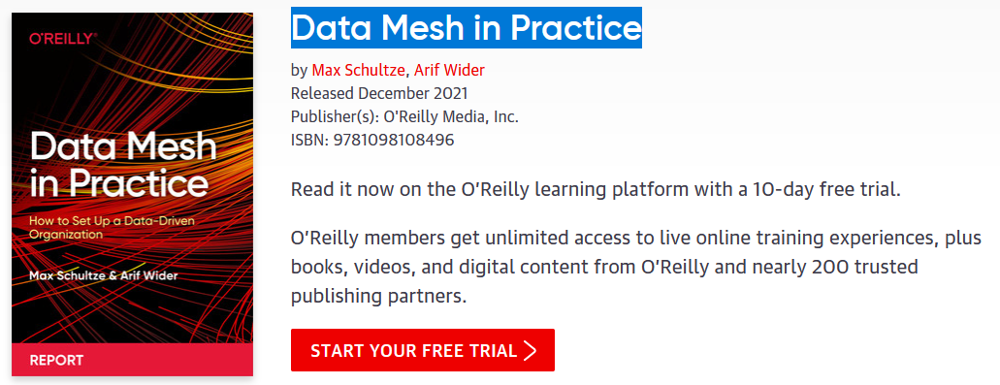

# How did we get here?

**Data-Driven Innovation**

- Use of data and _analytics_ to foster new products, processes, and markets
- Drive discovery and execution of innovation, achieving new services with a business value

**Analytics**

- A catch-all term for different business intelligence (BI) and application-related initiatives
  - E.g., analyzing information from a particular domain
  - E.g., applying BI capabilities to a specific content area (e.g., sales, service, supply chain)

**Advanced Analytics**

- (Semi-)Autonomous examination of data to discover deeper insights, make predictions, or generate recommendations (e.g., through data/text mining and machine learning)

**Augmented Analytics**

- Use of technologies such as machine learning and AI to assist with data preparation, insight generation, and insight explanation to augment how people explore and analyze data

[https://www.gartner.com/en/information-technology/glossary](https://www.gartner.com/en/information-technology/glossary) (accessed 2022-08-01)

# How did we get here?


# Data platform

Companies are collecting tons of data to enable advanced analytics.

- Raw data is difficult to obtain, interpret, and maintain
- Data is more and more heterogeneous
- There is a need for curating data to make it _consumable_

Where are we _collecting/processing_ data?

- Getting _value_ from data _is not_ (only) a matter of _storage_
- Need integrated and multilevel analytical skills and techniques

# Data platform

> "It is a capital mistake to theorize before one has data. Insensibly, one begins to twist the facts to suit theories, instead of theories to suit facts."
>
> – Sherlock Holmes

Getting _value_ from data _is not_ (only) a matter of _storage_

- Any example?

#  Case study: photo gallery {background-color="#121011"}

 

# End of the case study {background-color="#121011"}

# From databases to data platforms

# Data platform

:::: {.columns}
::: {.column width=50%}

> **Database** [@ozsu2018]
>
> "A database is a _structured and persistent collection_ of information about some aspect of the real world, organized and stored in a way that facilitates efficient retrieval and modification. The structure of a database is determined by an _abstract data model_. Primarily, it is this structure that differentiates a database from a data file."

:::
::: {.column width=50%}


:::
::::

# Data platform

At the beginning, computer science was seen as a *subsidiary discipline* that makes information management *faster* and *cheaper*

- ... but *did not create (new) profits in itself*

The main goal of databases in companies has been that of storing **operational data** [@DBLP:journals/cacm/Codd70]

- Data generated by operations carried out within business processes

**Online transaction processing (OLTP)** is a type of database system used in transaction-oriented applications, such as many operational systems.

- "Online" refers to the fact that such systems are expected to respond to user requests and process them in real-time.
- Large number of database transactions (writing and reading data) in real-time

# Data platform

An exponential increase in operational data has made computers the only tools suitable for *decision-making performed by business users*

- The massive use of techniques for analyzing enterprise data made information systems a key factor to achieve business goals

The role of computer science in companies has radically changed since the early 70's.

- ICT systems turned from simple tools to improve process efficiency...
- ... into key factors of company organizations capable of deeply impacting on the structure of business processes

# Problem: how do we manage **data heterogeneity**?

# Data platform

:::: {.columns}
::: {.column width=50%}

> **Schemaless databases**
>
> There is no predefined schema that the data must conform to before being added to the database.
> As a result, you don't need to know the structure of your data, enabling you to store all your data more easily and quickly.

:::
::: {.column width=50%}


:::
::::

# Problem: how do we transform data into **actionable business insights**?

# Data platform

*Big Data* must be transformed into *Small Data* so that it can be exploited for decision-making purposes

- Small data is data that is "small" enough for human comprehension.
- It is data in a volume and format that makes it accessible, informative and actionable.


# Data platform

Scenario: 

- Large company, with several branches
- Managers wish to quantify and evaluate the contribution given from each branch to the global profit


# Data platform


# Data platform


# Data platform 

:::: {.columns}
::: {.column width=50%}

> **Data Warehouse (DWH)** [@golfarelli2009data]
>
> "A collection of data that supports decision-making processes. It provides the following features: subject-oriented, integrated and consistent, not volatile."

:::
::: {.column width=50%}


:::
::::

# Data platform

A DWH is a collection of data that supports decision-making processes. It provides the following features:

- It is *subject-oriented*;
- It is *integrated and consistent*;
- It shows its *evolution over time and it is not volatile*

The **multidimensional model** is the key for representing and querying information in a DW

- (Business) *Facts* of interest are represented in *(hyper) cubes* where:
  - Each cell stores *numerical measures* that quantify the fact from different points of view;
  - Each axis is a *dimension* for analyzing measure values;
  - Each *dimension can be the root of a hierarchy* of attributes used to aggregated measure values

**Online analytical processing (OLAP)** to answer multi-dimensional analytical queries.

- Interactive sessions of analysis reading large amounts of data. 

# Data platform

Querying the cube with OLAP operators: *roll up*

:::: {.columns}
::: {.column width=50%}


:::
::: {.column width=50%}

:::{.fragment}

:::
:::
::::

# Data platform

Querying the cube with OLAP operators: *drill down*

:::: {.columns}
::: {.column width=50%}


:::
::: {.column width=50%}
:::{.fragment}

:::
:::
::::

# Data platform

The **Dimensional Fact Model** [@DBLP:journals/ijcis/GolfarelliMR98] is a graphical conceptual model for DWH design, devised to:

- create an environment in which user queries may be formulated intuitively
- make communication possible between designers and end users with the goal of formalizing requirement specifications
- build a stable platform for logical design (independently of the target logical model)
- provide clear and expressive design documentation

<div></div>


# Data platform

:::: {.columns}
::: {.column width=50%}


:::
::: {.column width=50%}

:::{.fragment}
![Corresponding Entity-Relationsip representation [@DBLP:conf/hicss/GolfarelliMR98]](img/cube-dfm.png)
:::
:::
::::

# OLTP vs OLAP?

# Data platform: OLTP vs OLAP

| Characteristic | OLTP | OLAP |
|:-: |:-: |:-: |
| Type of workload | Constant transactions (reads/writes) | Periodic large writes, interactive large reads |
| Examples | Accounting database, online retail transactions | Reporting, decision support |
| Type | Operational data | Business data |
| Data retention | Short-term (2-6 months) | Long-term (2-5 years) |
| Storage | Gigabytes (GB) | Terabytes (TB) / Petabytes (PB) |
| Users | Many | Few |

# Data platform


# Data platform

:::: {.columns}
::: {.column width=50%}

> **Data lake** [@couto2019mapping]
>
> "A DL is a _central repository_ system for _storage, processing, and analysis of raw data_, in which the data is kept in its _original format and is processed to be queried only when needed_. It can _store a varied amount of formats_ in big data ecosystems, from unstructured, semi-structured, to structured data sources."

:::
::: {.column width=50%}



:::
::::

# Data platform


# Data platform

The data lake started with the Apache Hadoop movement, using the Hadoop File System (HDFS) for cheap storage

- *Schema-on-read* architecture 
- Agility of storing any data at low cost
- Eludes the problems of quality and governance

Downsides of data lakes

- *Security*
  - All the data is stored and managed as files
  - No fine-grained access control on the contents of files, but only coarse-grained access governing who can access what files or directories
- *Quality*
  - Hard to prevent data corruption and manage schema changes
  - Challenging to ensure atomic operations when writing a group of files
  - No roll-back mechanism
- *Query performance*
  - Formats are not optimized for fast access

It is often said that the *lake* easily turns into a *swamp*

# DWH vs Data Lake?

# Data platform: DWH vs Data Lake

| | Data warehouse | Data lake |
|:-: |:-: |:-: |
| Data model | Relational | Non-relational and relational |
| Schema | Designed prior to implementation <br />(**schema-on-write**) | Written at the time of analysis <br /> (**schema-on-read**) |
| Price/performance | Faster queries, higher cost storage | Slower queries, lower-cost storage |
| Data quality | Highly curated data, the central version of the truth | Any (raw) data |
| Users | Business analysts | Data scientists, developers, and business analysts |
| Analytics | Batch reporting, BI, and visualizations | Machine learning, predictive analytics, data discovery, and profiling. |

# Data platform

A two-tier data lake + DWH architecture is dominant in the industry

- HDFS replaced by cloud data lakes (e.g., S3, ADLS, GCS)
- Data lake directly accessible to a wide range of analytics engines
- A subset of data is "ETL-ed" to a DWH for important decision support and BI apps

While the data lake and DWH architecture is ostensibly cheap, a two-tier architecture is highly complex for users

- *Problems*?

# Data platform

(Some) main problems:

- Data is first ELTed into lakes, and then again ETLed into DWHs
  - *Reliability*. Keeping the data lake and DWH consistent is difficult and costly
  - *Data staleness*. The data in the DWH is stale compared to that of the data lake, with new data frequently taking days to load
- *Limited support for advanced analytics*.
  - Businesses want to ask predictive questions using their DWHs
  - Machine learning systems does not work well on (directly) top of DWHs
- *Process large datasets using complex non-SQL code*

# Data platform


# Data lakehouse [@armbrust2021lakehouse]

:::: {.columns}
::: {.column width=50%}

> **Data lakehouse**
>
> Data management architecture that combines the flexibility, cost-efficiency, and scale of data lakes with the data management and ACID transactions of DWHs, enabling business intelligence (BI) and machine learning (ML) on all data

Key technologies used to implement Data Lakehouses

- Databricks' Delta Tables
- Apache Hudi
- Apache Iceberg

:::
::: {.column width=50%}


:::
::::

[https://databricks.com/blog/2021/05/19/evolution-to-the-data-lakehouse.html](https://databricks.com/blog/2021/05/19/evolution-to-the-data-lakehouse.html)

[https://www.databricks.com/glossary/data-lakehouse](https://www.databricks.com/glossary/data-lakehouse)

# Data lakehouse

Main features:

- Store data in a low-cost object store using a standard file format such as Apache Parquet
- Implement a transactional metadata layer on top of the object store that defines which objects are part of a table version
- Implement management features within the metadata layer

Challenges:

- The metadata layer is insufficient to achieve good SQL performance
- DWHs use several techniques to get state-of-the-art performance
  - Storing hot data on fast devices such as SSDs, maintaining statistics, building efficient indexes, etc.
- In a Lakehouse it is not possible to change the format, but it is possible to implement other optimizations that leave the data files unchanged

# Data lakehouse

**Challenges:**

- Most data lakes (e.g., cloud object stores) are simple key-value stores without cross-key consistency.  
- Multi-object updates aren't atomic, and there's no isolation between queries.  
  - Queries updating multiple objects can expose readers to partial updates as each object is written individually.  
- For large tables with millions of objects, metadata operations are costly.
  - The latency of cloud object stores can make data-skipping checks slower than the query itself.  

:::: {.columns}
::: {.column width=50%}

**Delta Lake** uses a transaction log compacted into Apache Parquet for much faster metadata operations on large tabular datasets.  

- The log resides in the `_delta_log` subdirectory.  
- It contains:  
  - JSON objects with sequential IDs for log records (i.e., commits)
  - Periodic checkpoints summarizing the log up to that point  

:::
::: {.column width=50%}


:::
::::

# Data lakehouse

|  | Data Warehouse | Data Lake | Data Lakehouse |
|:-:|:-:|:-:|:-:|
| Data format | Proprietary format | Open format | Open format |
| Types of data | Structured, limited semi-structured | \* | \* |
| Data access | SQL-only, no file access | File access | APIs for SQL, R, Python, etc. |
| Reliability | High quality, ACID transactions | Low quality, "data swamp" | High quality, ACID transactions |
| Governance & security | Fine-grained (row/column-level) | Weak governance; file-level security | Fine-grained (row/column-level) |
| Performance | High | Low | High |
| Scalability | Expensive at scale | Scales cheaply for any data type | Scales cheaply for any data type |
| Use case | BI | Machine learning | Unified for BI and ML |

# Data platform

*Data lakes (or lakehouses)* have increasingly taken the role of *data hubs*

- Eliminate up-front costs of ingestion and ETL since data are stored in the original format
- Once in DL, data are available for analysis by everyone in the organization

*Drawing a sharp line between storage/computation/analysis is hard*

- Is a database just storage?
- What about SQL/OLAP?

*Blurring* of the *architectural borderlines*

- DL is often replaced by "data platform" or "data ecosystem"
- Encompass systems supporting data-intensive storage, computation, analysis

# Data platform

> **Data platform**
>
> A *unified* infrastructure that facilitates the ingestion, storage, management, and exploitation of large volumes of heterogeneous data. It provides a collection of *independent* and *well-integrated* services meeting *end-to-end* data needs.
>
> - *Unified*: is conceptually a data backbone
> - *Independent*: a service is not coupled with any other
> - *Well-integrated*: services have interfaces that enable easy and frictionless composition
> - *End-to-end*: services cover the entire data life cycle

Rationale: relieve users from the complexity of administration and provision

- Not only technological skills, but also privacy, access control, etc.
- Users should only focus on functional aspects

# Data platform

Are we done? No!

- Lacking smart support to govern the complexity of data and transformations
- Data transformations must be governed to prevent DP from turning into a swamp
  - Amplified in data science, with data scientists prevailing over data architects
  - Leverage descriptive metadata and maintenance to keep control over data

# Which functionalities for (automated) data management can you think about?


# Managing data platforms

- *Tracking data pipelines*: Data provenance
- *Tracking changes*: Data versioning
- *Saving storage*: Compression
- *Understanding the data*: Data profiling
- *Integrating data sources*: Entity resolution
- ...

# Data governance

:::: {.columns}
::: {.column width=60%}

> **Data governance**
>
> Techniques to ensure that data is secure, private, accurate, available, and usable

- It includes the actions people must take, the processes they must follow, and the technology that supports them throughout the data life cycle
- Every organization needs data governance since industries proceed on their digital-transformation journeys

A *data steward* is a role that ensures that data governance processes are followed and that guidelines are enforced, and recommends improvements to data governance processes. 

:::
::: {.column width=40%}


:::
::::

#  Case study: data governance {background-color="#121011"}



# End of the case study {background-color="#121011"}

# Data governance: data profiling

# Data profiling


# Data profiling

:::: {.columns}
::: {.column width=60%}

Data profiling [@naumann2014data]

- A broad range of methods to efficiently analyze a given data set
- E.g., in a _relational_ scenario, _tables_ of a relational database are _scanned_ to derive _metadata_, such as _data types_, _completeness_ and _uniqueness_ of columns, _keys_ and  _foreign keys_, and occasionally _functional dependencies_ and _association rules_

:::
::: {.column width=40%}


:::
::::

# Data profiling: single column (Iris dataset)

Schema and statistics

```
df.info()
```

> ```
> <class 'pandas.core.frame.DataFrame'>
> RangeIndex: 150 entries, 0 to 149
> Data columns (total 5 columns):
> #   Column             Non-Null Count  Dtype  
> ---  ------             --------------  -----  
> 0   sepal length (cm)  150 non-null    float64
> 1   sepal width (cm)   150 non-null    float64
> 2   petal length (cm)  150 non-null    float64
> 3   petal width (cm)   150 non-null    float64
> 4   species            150 non-null    int64  
> dtypes: float64(4), int64(1)
> memory usage: 6.0 KB
> ```

# Data profiling: single columns (Iris dataset)

Statistics

```
df.describe()
```

> |       |   sepal length (cm) |   sepal width (cm) |   petal length (cm) |   petal width (cm) |
> |:------|--------------------:|-------------------:|--------------------:|-------------------:|
> | count |          150        |         150        |           150       |         150        |
> | mean  |            5.80917  |           3.06167  |             3.72667 |           1.18333  |
> | std   |            0.823805 |           0.449123 |             1.75234 |           0.752289 |
> | min   |            4.3      |           2        |             1       |           0.1      |
> | 25%   |            5.1      |           2.8      |             1.5     |           0.3      |
> | 50%   |            5.75     |           3        |             4.25    |           1.3      |
> | 75%   |            6.4      |           3.4      |             5.1     |           1.8      |
> | max   |            7.7      |           4.4      |             6.7     |           2.5      |

How much metadata are we producing?

:::{.fragment}
- 8 statistics × 4 columns = 32 metadata values
- The dataset contains 150 rows
- Metadata-to-data ratio: $\frac{32}{150} ≈ 21.3\%$
:::

# Data profiling: multiple columns (Iris dataset)

```
df.corr(method='pearson', numeric_only=True)
```

> |                   |   sepal length (cm) |   sepal width (cm) |   petal length (cm) |   petal width (cm) |
> |:------------------|--------------------:|-------------------:|--------------------:|-------------------:|
> | sepal length (cm) |            1        |          -0.106926 |            0.862175 |           0.80148  |
> | sepal width (cm)  |           -0.106926 |           1        |           -0.432089 |          -0.369509 |
> | petal length (cm) |            0.862175 |          -0.432089 |            1        |           0.962577 |
> | petal width (cm)  |            0.80148  |          -0.369509 |            0.962577 |           1        |

# Data profiling

The results of data profiling are _computationally heavy_ to discover

- E.g., discovering keys/dependencies usually involves some sorting step for each considered column

... and we need to verify them _for groups of columns_ in a database

**Complexity**: given a table with four columns $\{w, x, y, z\}$, how many groups of columns?


| w | x | y | z |
|:-: |:-: |:-: |:-: |
| 1 | 1 | 2 | 2 |
| 1 | 2 | 1 | 4 |

# Data profiling

:::: {.columns}
::: {.column width=50%}

Given a table with four columns $\{w, x, y, z\}$

<div style="display: flex; justify-content: center; align-items: center; height: 100%;">
| w | x | y | z |
|:-: |:-: |:-: |:-: |
| 1 | 1 | 2 | 2 |
| 1 | 2 | 1 | 4 |
</div>

:::
::: {.column width=50%}


:::
::::

- To extract the (distinct) cardinality of each column, I will consider $\binom{|C|}{1}=|C|$ columns $\{(w), (x), (y), (z)\}$
- To extract the correlations between pairs of columns, I will consider $\binom{|C|}{2}$ groups $\{(w, x), (w, y), (w, z), (x, y), ...\}$
- Extracting the relationships among all possible groups of columns generalizes to $\sum_{n=1}^{|C|}\binom{|C|}{n}=2^{|C|}−1$ groups
    - 3 columns → 7 groups, 4 columns → 15 groups, 5 columns → 31 groups, 10 columns → 1023 groups, ...

# Data profiling

Use cases

- _Query optimization_
  - Performed by DBMS to support query optimization with statistics about tables and columns
  - Profiling results can be used to estimate the selectivity of operators and the cost of a query plan
- _Data cleansing_ (typical use case is profiling data)
  - Prepare a cleansing process by revealing errors (e.g., in formatting), missing values, or outliers
- _Data integration and analytics_


# Data profiling: statistic query optimization

:::: {.columns}
::: {.column width=30%}

> Table `R`
>
> | `a` | `b` |
> |-----|-----|
> | 10  | 20  |
> | 20  | 30  |
> | 30  | 40  |
>
> `min(R.a) = 10`
>
> `max(R.a) = 30`

No need to access `R.a`, `min(R.a) >= 10`

:::
::: {.column width=70%}

![[@bruno2002exploiting]](img/executionplan.png)

:::
::::


# Data governance: data provenance

# Data provenance [@herschel2017survey]

> **Provenance** (also referred to as lineage, pedigree, parentage, genealogy)
> 
> - The description of the origins of data and the process by which it arrived at the database
> - Not only data products (e.g., tables, files), but also the processes that created them

:::{.fragment}
Examples of use cases [@simmhan2005survey]

- Business domain.
  - Users traditionally work with an _organized data schema_, where the structure and _semantics of the data in use are shared_ across the corporation or even B2B. Yet, a large proportion of businesses deal with _bad-quality data_. _Sources_ of bad data _need to be identified_ and corrected to avoid costly errors in business forecasting.
- Scientific/research domain.
  - _Data_ used in the scientific field can be _ad hoc_ and driven by _individual researchers_ or small communities. The scientific field is moving _towards more collaborative research_ and organizational boundaries are disappearing. _Sharing data and metadata across organizations is essential_, leading to convergence on common schemes to ensure compatibility. Issues of _trust_, _quality_, and _copyright_ of data are significant when using third-party data in such a loosely connected network.
:::

# Data provenance: astronomers 

:::: {.columns}
::: {.column width=60%}

Astronomers are creating an international Virtual Observatory.

- A _federation_ of all the world significant astronomical _data resources_ coupled with _provision of the computational resources_ needed to exploit the data scientifically
- Astronomy changed from being an individualistic to a _collective enterprise_
- Telescope time is devoted/allocated to systematic sky surveys, and analysis is performed using data from the archives
- Astronomers are _increasingly relying on data that they did not take themselves_
- Raw data bear _many instrumental signatures that must be removed_ in the process of generating data products [@mann2002some]

:::
::: {.column width=40%}


:::
::::

[https://www.esa.int/Science_Exploration/Space_Science/Webb/Webb_inspects_the_heart_of_the_Phantom_Galaxy](https://www.esa.int/Science_Exploration/Space_Science/Webb/Webb_inspects_the_heart_of_the_Phantom_Galaxy) (accessed 2022-08-01)

# Data provenance

Provenance is a graph, for which we have a standard: [PROV-DM](https://www.w3.org/TR/prov-dm/) [@moreau2022provenance]

:::: {.columns}
::: {.column width=60%}

_Entity_

- Physical/conceptual things

_Activity_

- Dynamic aspects of the world, such as actions
- How entities come into existence, often making use of previously existing entities

_Agent_

- A person, a piece of software
- Takes a role in an activity such that the agent can be assigned some degree of responsibility for the activity taking place

:::
::: {.column width=40%}


:::
::::

[https://www.w3.org/TR/2013/NOTE-prov-primer-20130430/](https://www.w3.org/TR/2013/NOTE-prov-primer-20130430/)

# Data provenance

:::: {.columns}
::: {.column width=70%}
Measures of centrality

* **Betweenness centrality (A)**
  * Number of shortest paths between two nodes that pass from a certain node
* **Closeness centrality (B)**
  * Sum of distances to all other nodes.
* **Eigenvector centrality (C)**
  * The score of a node is influenced by score of adjacent nodes (Page rank)
* **Degree centrality (D)**
  * Number of adjacent nodes
:::
::: {.column width=30%}

:::
::::

# Data provenance 

![Characteristics of data provenance [@simmhan2005survey]](img/slides15.png)

# Data provenance

Granularity [@simmhan2005survey]

- _Fine-grained_ (instance level): tracking data items (e.g., a tuple in a dataset) transformations
- _Coarse-grained_ (schema-level): tracking dataset transformations

# Data provenance: fine-grained vs coarse-grained

How would you document this table update?
 
> :::: {.columns}
> ::: {.column width=50%}
> 
> Original data
> 
> | `product_id` | `sales_v1` |
> |:-------------|--------:|
> | "p1"         |      10 |
> | "p2"         |      20 |
> | "p3"         |      30 |
> | "p4"         |      10 |
> | "p5"         |      20 |
> | "p6"         |      30 |
> 
> :::
> ::: {.column width=50%}
> 
> Update action: ```sales_v2 = sales_v1 + 1```
> 
> | `product_id` | `sales_v2` |
> |:-------------|--------:|
> | "p1"         |      11 |
> | "p2"         |      21 |
> | "p3"         |      31 |
> | "p4"         |      11 |
> | "p5"         |      21 |
> | "p6"         |      31 |
> 
> :::
> ::::

# Data provenance: fine-grained vs coarse-grained

:::: {.columns}
::: {.column width=20%}

:::
::: {.column width=60%}

:::: {.columns}
::: {.column width=100%}


:::
::: {.column width=100%}

:::{.fragment}


:::
:::
::::

:::
::::

# Data provenance: fine-grained vs coarse-grained

*Fine-grained* provenance is typically used for single vertical applications

* It requires to collect huge amounts of detailed information to enable a very detailed tracing

*Coarse-grained* provenance is appropriate to ensure a broad coverage of heterogeneous transformations involving several applications

Choosing a granularity is the *result of a trade-off between accuracy and computational effort*

* Storing only the name and the version of a clustering algorithm enables an approximate reproducibility of the results
* Storing all its parameters makes this functionality much more accurate

# Data provenance

Queries [@ikeda2009data]

- _Where_ provenance: given some output, which inputs did the output come from?
- _How_ provenance: given some output, how were the inputs manipulated?
- _Why_ provenance: given some output, why was data generated?
  - E.g., in the form of a proof tree that locates source data items contributing to its creation


# Data provenance

Use cases for data provenance.

- Accountability and auditing
- Data quality
    - Monitoring of the quality (e.g., accuracy) of the objects produced
    - Notify when a transformation pipeline is not behaving as expected
- Debugging
    - Inferring the cause of pipeline failures is challenging
    - Store inputs of each operation with versions and environmental settings (RAM, CPUs, etc.)

# Data governance: data versioning

# Data versioning

:::: {.columns}
::: {.column width=50%}

Version control

- A class of systems responsible for managing changes to computer programs, documents, or data collections
- Changes are identified by a number/letter code, termed the revision/version number

However, data pipelines are not only about code but also about

- Model Version control
- Data Version Control
- Model Parameter Tracking
- Model Performance Comparison

:::
::: {.column width=50%}


:::
::::

# Data versioning

Support CRUD (Create, Read, Update, Delete) operations with versions.

For example, on [AWS (PUT, GET, DELETE)](https://docs.aws.amazon.com/AmazonS3/latest/userguide/versioning-workflows.html)

:::: {.columns}
::: {.column width=40%}


:::
::: {.column width=24%}



:::
::: {.column width=25%}


:::
::::

What about updating?

# Data governance: data compression

# Compression

:::: {.columns}
::: {.column width=60%}

**Data compression** is the process of encoding information using fewer bits than the original representation

- *Lossless*: reduces bits by identifying and eliminating redundancy
  - No information is lost in lossless compression
  - Examples?
- *Lossy*: reduces bits by removing less important information
  - Examples?

**Summarization**: find a concise representation of a dataset in a comprehensible, informative manner

> :::: {.columns}
> ::: {.column width=50%}
> 
> Transaction dataset
>
> | TID | Products |
> |-----|----------|
> | T1  | Beer, Diapers, Cola |
> | T2  | Cola, Fanta |
> | T3  | Beer, Cola |
> | T3  | Beer, Diapers |
>
>:::
>::: {.column width=50%}
>
> Frequent itemset mining
>
> Itemset 1: {Cola}
>
> Itemset 2: {Beer}
>
> Itemset 3: {Beer, Diapers}
> 
> :::
> ::::

:::
::: {.column width=40%}

![Characteristics of data summarization [@ahmed2019data]](img/slides18.png)

:::
::::

# Data governance: entity resolution

# Entity resolution

:::: {.columns}
::: {.column width=50%}

Entity resolution [@papadakis2020blocking]

- (also known as entity matching, linking)
- Find records that refer to the same entity across different data sources (e.g., data files, books, websites, and databases)

:::
::: {.column width=50%}


:::
::::

# Data governance: data catalog

# Data catalog

:::: {.columns}
::: {.column width=60%}

A **data catalog** is an organized inventory of the company's data [@olesen2023enterprise]

- The data catalog provides an overview at a metadata level only
- No actual data values are exposed.
- Everyone see everything without fear of exposing confidential or sensitive data.

:::
::: {.column width=40%}



:::
::::

# Data catalog

:::: {.columns}
::: {.column width=60%}

Metadata is organized into **domains**.

- A domain is a group of entities sharing knowledge, goals, methods of operation, and communication

:::
::: {.column width=40%}


:::
::::

# Data catalog: processes vs capabilities

:::: {.columns}

*Processes* describe how a company performs its tasks.

*Capabilities* describe what tasks a company performs.

- Neither processes nor capabilities reflect the business units of your company 1:1.

::: {.column width=50%}


:::
::: {.column width=50%}


:::
::::

#  Case study: data governance {background-color="#121011"}

Check Colab

<a href="https://colab.research.google.com/github/w4bo/AA2526-unibo-bigdataandcloudplatforms/blob/main/slides/lab-01-Metadata.ipynb" target="_parent"></a>

#  Case study: data catalog {background-color="#121011"}

[Link to the DataHub catalog](http://localhost:9002/)

# End of the case study {background-color="#121011"}

# Data governance: meta-metadata management

# Data platform

Are we done? No!

- Metadata can become bigger than the data itself

We need meta meta-data (or models)...

- ... chasing our own tails

Data management is still a (research) issue in data platforms.

# Data platform {visibility="hidden"}

**Is it a Lakehouse with another name?**

- A Lakehouse is a part of the data platform, a layer that enables querying multiple data sources (with SQL/Spark) transparently by using some metadata (JSON) log
- Still, you could get a data platform where such transparency is not mandatory or could be achieved by different techniques (e.g., multistore [@forresi2021dataspace])

# Data platform {visibility="hidden"}

**Is it a new name for BI?**

No, in a data platform, you also need to manage (streams of) operational data and OLTP workloads.

# How do we build data platforms?

# Data fabric

**Data fabric** is a "vision for data management [...] that seamlessly connects different clouds, whether they are private or public environments." ([2016](https://cloud.netapp.com/hubfs/Data-Fabric/Data%20Fabric%20WP%20April%202017.pdf))

Frictionless access and sharing of data in a distributed data environment

- Enables a *single and consistent data management framework*
- *Continuously identifies and connects data* from disparate applications to discover unique business-relevant relationships

It is a unified architecture with an integrated set of technologies and services.

- Designed to deliver integrated and enriched data at the right time, in the right method, and to the right data consumer
- Combines key data management technologies such as *data governance*, *integration*, *pipelining*, and *orchestration*

[Gartner (2021). Data fabric architecture](https://www.gartner.com/smarterwithgartner/data-fabric-architecture-is-key-to-modernizing-data-management-and-integration)

[K2View Whitepaper (2021). What is a Data Fabric? The Complete Guide](https://www.k2view.com/what-is-data-fabric/)

# Data fabric: example from Cloudera


# Data fabric

**It is a design concept**

- It optimizes data management by automating repetitive tasks
- According to Gartner estimates, 25% of data management vendors will provide a complete framework for data fabric by 2024 – up from 5% today

:::: {.columns}
::: {.column width=50%}


:::
::: {.column width=50%}


:::
::::

[Gartner (2021). Data fabric is key to modernizing data management](https://www.gartner.com/smarterwithgartner/data-fabric-architecture-is-key-to-modernizing-data-management-and-integration)

# Data fabric

* *Catalog all data*: Cover business glossary, design-time, and runtime metadata.
* *Enable self-service capabilities*: Support data discovery, profiling, exploration, quality checks, and consumption.
* *Provide a knowledge graph*: Visualize links among data, people, processes, and systems for actionable insight.
* *Deliver automatic integration*: Help IT and business users with data integration, transformation, virtualization, and federation.
* *Manage unified lifecycle*: Maintain a consistent end-to-end Data Fabric lifecycle across platforms and teams.

# Data fabric

:::: {.columns}
::: {.column width=55%}

**Active metadata**: leverage open APIs to connect platform services using metadata.

*Active metadata is always on*

- Automatically and continually collect metadata from various sources.

*Active metadata is "intelligent"*:

- Constantly process metadata to connect the dots and create intelligence.
- E.g., auto-classify sensitive data, automatic suggestions to document data.

*Active metadata is action-oriented*

- Active metadata should drive actions such as curating recommendations

*Active metadata is open by default*

- Use APIs to hook into every piece of the data platform.

:::
::: {.column width=45%}


:::
::::

[Gartner (2021). Data fabric is key to modernizing data management](https://www.gartner.com/smarterwithgartner/data-fabric-architecture-is-key-to-modernizing-data-management-and-integration)

# Automation through orchestration

The orchestrator is the component in charge of controlling the execution of computation activities

  * Either through a regular scheduling of the activities
  * Or by triggering a process in response to a certain event

Several entities (either processes or human beings) can cover this role to activate some data processes

# Automation through orchestration

Dynamic/condition-based behavior

* Decide _what_ data process should be activated under different conditions
* Decide _how_ to tune the parameters in case of parametric data processes

Triggering

* Decide _when_ to trigger a certain data process

Scoping

* Assess the trustworthiness of objects to decide _if_ a certain data process should be activated or not

Resource estimation or prediction (based on previous executions and current settings)

* Decide the optimal amount of resources required to terminate successfully while leaving sufficient resources to the other concurrent process
* Negotiate the resources with the cluster's resource manager

# Automation through orchestration

:::: {.columns}
::: {.column width=60%}

![[@barika2019orchestrating]](img/phdslides_209.png)

:::
::: {.column width=40%}

R1 Compute/CPU resource provisioning

* Determine the right amount of resources
* Continuous management in a dynamic environment

R2 Storage

* Choose the right cloud storage resource, data location, and format (if the application is parametric)

R3 Data movement

* Dynamically transfer large datasets between compute and storage resources

R4 Synchronization and asynchronization

* Manage data flow dependencies across analytics tasks

:::
::::

# Automation through orchestration

:::: {.columns}
::: {.column width=60%}

![[@barika2019orchestrating]](img/phdslides_209.png)

:::
::: {.column width=40%}

R5 Analytic Task Scheduling and Execution

- Coordinate workflows across diverse big data models
- Track and capture data provenance

R6 Service Level Agreement

- Meet user-defined QoS, such as strict deadlines

R7 Security

- Support anonymous computation, verify outcomes in multi-party settings, etc.

R8 Monitoring and Failure-Tolerance

- Ensure streamlined execution
- Handle or predict failures as they occur
:::
::::

# Data mesh

Distributed data architecture under centralized governance and standardization for interoperability, enabled by a shared and harmonized self-serve data infrastructure

- *Domain-oriented decentralized data ownership*
  - Decentralization and distribution of responsibility to people who are closest to the data, to support continuous change and scalability
  - Each domain exposes its own op/analytical APIs
- **Data as a product** (_quantum_)
  - Products must be discoverable, addressable, trustworthy, self-describing, and secure
- *Self-serve data infrastructure as a platform*
  - High-level abstraction of infrastructure to provision and manage the lifecycle of data products
- *Federated computational governance*
  - A governance model that embraces decentralization and domain self-sovereignty, interoperability through global standardization, a dynamic topology, and automated execution of decisions by the platform

[Zhamak Dehghani (2019). Data monolith to mesh](https://martinfowler.com/articles/data-monolith-to-mesh.html)

[Zhamak Dehghani (2020). Data mesh principles](https://martinfowler.com/articles/data-mesh-principles.html)

[Zhamak Dehghani (2021). Introduction to Data Mesh](https://www.youtube.com/watch?v=_bmYXWCxF_Q)

# Data mesh

:::: {.columns}
::: {.column width=50%}

Data Mesh organizes data around **business domain owners** and transforms relevant data assets (data sources) to **data products** that can be consumed by distributed business users from various business domains or functions.

- Data products are created, governed, and used in an **autonomous, decentralized**, and self-service manner
- **Self-service capabilities**, which we have already referenced as a Data Fabric capability, enable business organizations to entertain a data marketplace with shopping-for-data characteristics

:::
::: {.column width=50%}


:::
::::

# What makes data a product?

A **data product** is raw data transformed into a business context

- Data products are registered in the **knowledge catalog** through specifications (XML, JSON, etc.).
- Data products need to be searchable and discoverable by potential data product consumers and business users.
  - *Cataloged*: All data products need to be registered in the knowledge catalog.
  - *Data product description*: The data product needs to be well-described.
  - *Access methods*: for example, REST APIs, SQL, NoSQL, etc., and where to find the data asset.
  - *Policies and rules*: who is allowed to consume the data product for what purpose.
  - *SLAs*: agreements regarding the data product availability, performance characteristics, functions, and cost of data product usage.
- Data products themselves are not stored in the knowledge catalog

#  Case study: data mesh {background-color="#121011"}

Check the seminars from HERA.

# End of the case study {background-color="#121011"}

# Data mesh vs data fabric

They are design concepts, not things.

- They are not mutually exclusive
- They are architectural frameworks, not architectures
  - The frameworks must be adapted and customized to your needs, data, processes, and terminology
  - Gartner estimates 25% of data management vendors will provide a complete data fabric solution by 2024 – up from 5% today

Alex Woodie, 2021 [https://www.datanami.com/2021/10/25/data-mesh-vs-data-fabric-understanding-the-differences/](https://www.datanami.com/2021/10/25/data-mesh-vs-data-fabric-understanding-the-differences/)

Dave Wells, 2021 [https://www.eckerson.com/articles/data-architecture-complex-vs-complicated](https://www.eckerson.com/articles/data-architecture-complex-vs-complicated)

# Data mesh vs data fabric

Both provide an architectural framework to access data across multiple technologies and platforms.

**Data fabric**

- Attempts to centralize and coordinate data management
- Tackles the complexity of data and metadata in a smart way that works well together
- Focus on the architectural, technical capabilities, and intelligent analysis to produce active metadata supporting a smarter, AI-infused system to orchestrate various data integration styles

**Data mesh**

- Emphasis on decentralization and data domain autonomy
- Focuses on organizational change; it is more about people and process
- Data are primarily organized around domain owners who create business-focused data products, which can be aggregated and consumed across distributed consumers

Alex Woodie, 2021 [https://www.datanami.com/2021/10/25/data-mesh-vs-data-fabric-understanding-the-differences/](https://www.datanami.com/2021/10/25/data-mesh-vs-data-fabric-understanding-the-differences/)

Dave Wells, 2021 [https://www.eckerson.com/articles/data-architecture-complex-vs-complicated](https://www.eckerson.com/articles/data-architecture-complex-vs-complicated)

# Data mesh vs data fabric


# Data mesh vs data fabric

Data Fabric and Mesh are the results of the data architecture evolution.

- **Many capabilities were in existence already long before** the terms were coined

Takeaway:

- Abstract the "building blocks" of such platforms
- Let them evolve according to scalability and flexibility requirements

# Data mesh

:::: {.columns}
::: {.column width=50%}


:::
::: {.column width=50%}


:::
::::

As new technologies and solutions mature to support a centralized approach to data access, distributed approaches like Data Mesh are expected to fall increasingly out of favor in enterprise IT.

# Data mesh

:::: {.columns}
::: {.column width=50%}


:::
::: {.column width=50%}


:::
::::

As new technologies and solutions mature to support a centralized approach to data access, distributed approaches like Data Mesh are expected to fall increasingly out of favor in enterprise IT.

# Wooclap (examples of exam questions)

<iframe allowfullscreen frameborder="0" height="100%" mozallowfullscreen src="https://app.wooclap.com/LKDKIY/questionnaires/670e89be981e282b0b69ee7c" style="min-height: 550px; min-width: 300px" width="100%"></iframe>

# (Some) References

:::: {.columns}
::: {.column width=33%}


:::
::: {.column width=33%}



:::
::: {.column width=33%}


:::
::::

# Example of data platform: Hadoop-based

A data platform on the Hadoop stack requires several tools.


How many levels of complexity are hidden here?

How do you provision it?

- Manual provisioning on-premises
- Semi-automatic provisioning on-premises
- Automatic provisioning in the cloud

# "Example" of architecture


(*) "Ormai sta xkcd é una base troppo usata" A. Tappi

# On-premises manual provisioning

It is hardly advisable, if not for small and local tests.

**Technical challenges**

- Installation: how do I set up a new machine?
- Networking: how do I cable dozens of machines?
- Management: how do I replace a broken disk?
- Upgrade: how do I extend the cluster with new services/machines?
- (energy and cooling, software licenses, insurance...)

**Technological challenges**

- How do we configure a distributed environment?
- How do we set up/integrate/control independent services?
- How do we orchestrate data flows?

**Business challenges**

- Can we afford to spend resources on tasks that are not mission-oriented?
- No free lunch, each choice has a cost/benefit
- How much time does it take to master a technology?
- How many people do I need?

# Data platform: related job positions


# Data platform: related job positions

_Data platform engineer_

- Orchestrate the successful implementation of cloud technologies within the data infrastructure of their business
- Solid understanding of impact database types and implementation
- Responsible for purchasing decisions for cloud services and approval of data architectures

_Data architect_

- Team members who understand all aspects of a data platform's architecture
- Work closely with the data platform engineers to create data workflows

_Data scientist_

- Analyze and interpret complex digital data
- Work with new technologies (e.g., machine learning) to deepen the business's understanding and gain new insights

_Data analyst_

- Analyze data systems, creating automated systems for retrieving data from the data platform
- Cloud data analysts are more commonly members of the business user population

# From DevOps...

**DevOps** combines development and operations to increase the efficiency, speed, and security of software development and delivery compared to traditional processes.

DevOps practices enable software development (dev) and operations (ops) teams to accelerate delivery through automation, collaboration, fast feedback, and iterative improvement.


[https://about.gitlab.com/topics/devops/](https://about.gitlab.com/topics/devops/) (accessed 2023-06-03)

# ... to DataOps

:::: {.columns}
::: {.column width=60%}

**DataOps** refers to a general process aimed at shortening the end-to-end data analytics life-cycle time by introducing automation in the data collection, validation, and verification process

![Evolution of DataOps [@munappy2020ad]](img/slides30.png)

:::
::: {.column width=40%}


:::
::::

# DataOps

:::: {.columns}
::: {.column width=60%}

From DevOps to DataOps

- "A collaborative data management practice focused on improving the _communication, integration and automation of data flows between data managers and data consumers across an organization_"
- Data analytics improved in terms of velocity, quality, predictability, and scale of software engineering and deployment

Some key rules

- Establish progress and performance measurements at every stage
- Automate as many stages of the data flow as possible
- Establish governance discipline (_governance-as-code_)
- Design process for growth and extensibility

:::
::: {.column width=40%}


:::
::::

Gartner, 2020 [https://www.gartner.com/smarterwithgartner/how-dataops-amplifies-data-and-analytics-business-value](https://www.gartner.com/smarterwithgartner/how-dataops-amplifies-data-and-analytics-business-value)

Andy Palmer, 2015 [https://www.tamr.com/blog/from-devops-to-dataops-by-andy-palmer/](https://www.tamr.com/blog/from-devops-to-dataops-by-andy-palmer/)

William Vorhies, 2017 [https://www.datasciencecentral.com/profiles/blogs/dataops-it-s-a-secret](https://www.datasciencecentral.com/profiles/blogs/dataops-it-s-a-secret)

# Summing up

Storage should be flexible enough to support heterogeneous data models and raw data.

- From operational databases to DWHs **(why?)**
- From relational data models to NoSQL **(why?)**
- Data lake to (directly) ingest raw data

Storage,  _per se_, is insufficient to get value from the data **(examples?)**

- We also need data processing and fruition
- Data lakes are blurring into data platforms

Data platforms support end-to-end data needs **(which ones?)**

- Building data platforms is hard **(why?)**
- Managing data platforms is hard; exploit metadata to ease this task
- Data lineage, compression, profiling, resolution, etc.

**Open question**: How do we deploy working data platforms?

# How do I know if I am prepared for the exam?

:::{.fragment}
Open a random slide, are you able to explain its content and connect it to the rest of the topics?
:::

# References