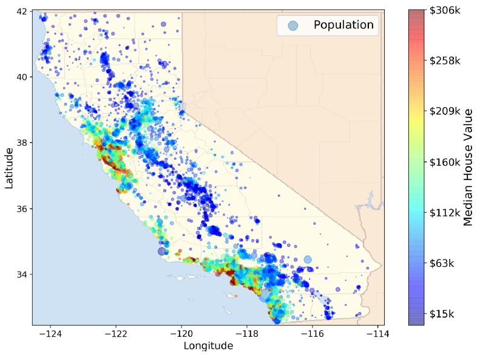
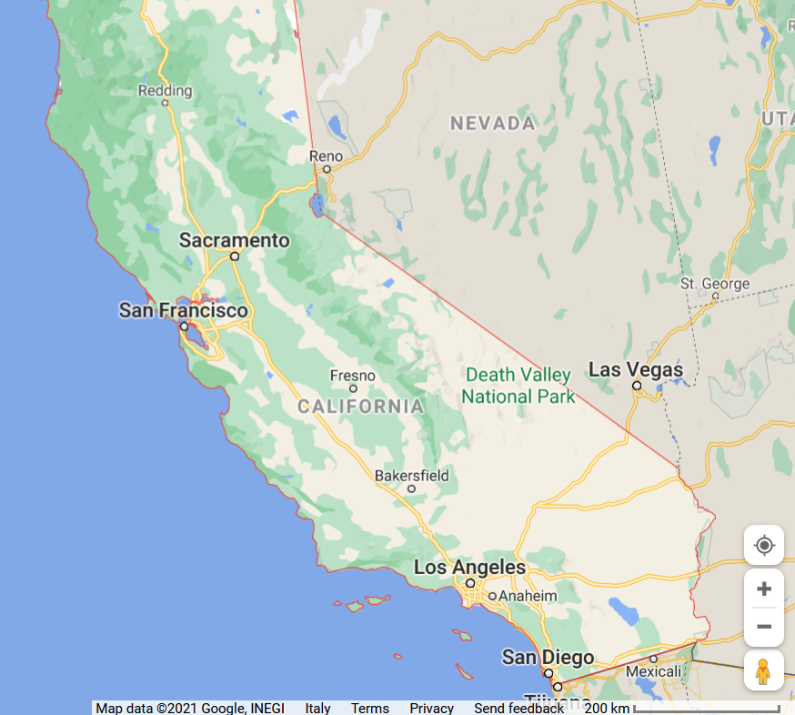
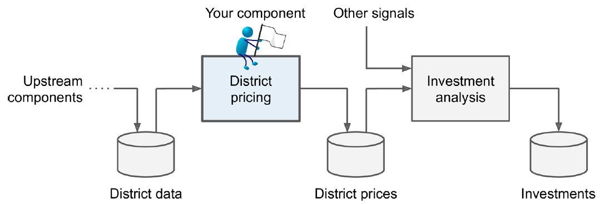

# A necessary introduction

:::: {.columns}
::: {.column width=50%}

Computational thinking: solving problems using concepts and ideas from computer science.

* Take a complex problem
* Understand better what the problem involves
* Develop possible solutions
* Present these solutions in a way that a computer, human or both can understand

Pillars to computational thinking:

* Decomposition
* Pattern recognition
* Data representation
* Abstraction

:::
::: {.column width=50%}

:::
::::

# Computational thinking

**Decomposition**

* Taking a complex problem and breaking it into more manageable sub-problems.
* The solution to each sub-problem may be much simpler by putting together the solutions to the sub-problems (any example?)

**Pattern recognition**

* Find patterns among the sub-problems
* Identify problems sharing similarities or characteristics
* Discovering these patterns make the complex problem easier to solve since we can use the same solution for each occurrence of the pattern (any example?)

Data **representation** and **abstraction**

* Determining the important characteristics of the problem and filtering out those that are not
* Can create a representation of what we're trying to solve

**Algorithm**

* A set of step-by-step instructions of how to solve a problem.
* It identifies what is to be done (the instructions), and the order in which they should be done

... there is no magic in programming computers

# Integrated analytics lab

Requirements:

* Knowledge of programming, data structures, and algorithms
* Acquaintance with Python programming and notebooks

The labs will be mainly guided...

* ... but the notebooks contain all the details
* ... no time for a complete (coding) discussion during the lectures

Focus on the problem **understanding**, **definition**, and **solution**!

# Integrated analytics lab

:::: {.columns}
::: {.column width=50%}

Building data pipelines

* Frame the problem and look at the big picture
* Get the data
* Explore the data to gain insights
* Prepare the data
* Explore different models and find the best ones
* Fine-tune your models
* Present your solution
* Launch, monitor, and maintain your system

:::
::: {.column width=50%}

:::
::::

# Integrated analytics lab

Building data pipelines

* _Frame the problem_ and look at the big picture
* _"We’ll use the California Housing Prices. Our task is to use California census data to forecast housing prices given the population, median income, and median housing price for each block group in California. Block groups are the smallest geographical unit for which the US Census Bureau publishes sample data (a block group typically has a population of 600 to 3,000 people)"_

:::: {.columns}
::: {.column width=50%}

:::
::: {.column width=50%}

:::
::::

# Integrated analytics lab

Building data pipelines

* Frame the problem and look at the big picture
  * _Knowing the objective_ is important because it will determine how you frame the problem, which algorithms you will select, which performance measure you will use to evaluate your model, and how much effort you will spend tweaking it.
  * _"Your boss answers that your model’s output (a prediction of a district’s median housing price) will be fed to another Machine Learning system, along with many other signals. This downstream system will determine whether it is worth investing in a given area or not. Getting this right is critical, as it directly affects revenue."_

# Integrated analytics lab

Building data pipelines

* ✔ Frame the problem and look at the big picture
  * Define the objective in business terms
  * How should performance be measured? (postponed for later)
* ✔ Get the data
  * List the data you need and how much you need
    * Data could be available in a relational database and/or spread across multiple tables/documents/files
    * In this project, however, things are much simpler
* Explore the data to gain insights (_let's do this!_)
  * Create an environment to keep track of your data exploration
    * You have been provided with notebook environments
  * Study each attribute and its characteristics
* Apply machine learning models

# In action

