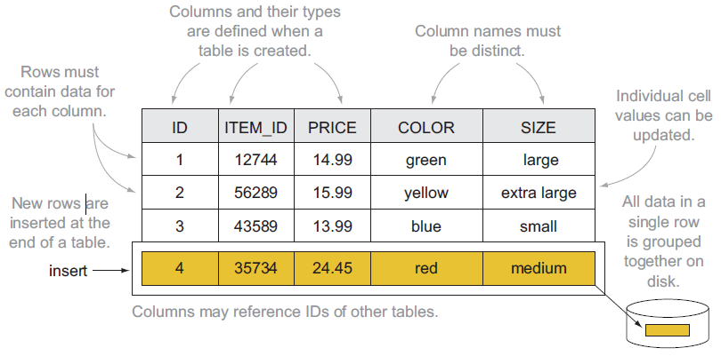
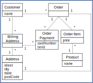
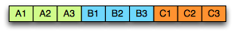
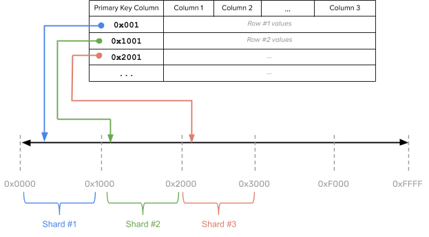
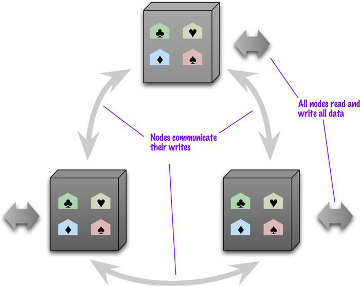
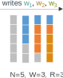
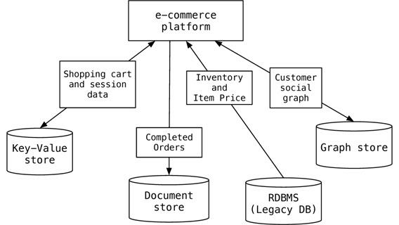

# Not only SQL

# Strengths of RDBMSs?

# Strengths of RDBMSs

*ACID properties*

- Provides guarantees in terms of consistency and concurrent accesses

*Data integration and normalization of schemas*

- Several application can share and reuse the same information

*Standard model and query language*

- The relational model and SQL are very well-known standards
- The same theoretical background is shared by the different implementations

*Robustness*

- Have been used for over 40 years

# Weaknesses of RDBMS?

# Weaknesses of RDBMS

*Impedance mismatch*

- Data are stored according to the relational model, but applications to modify them typically rely on the object-oriented model
- Many solutions, no standard
  - E.g.: Object Oriented DBMS (OODBMS), Object-Relational DBMS (ORDBMS), Object-Relational Mapping (ORM) frameworks

*Painful scaling-out*

- Not suited for a cluster architecture
- Distributing an RDBMS is neither easy nor cheap (e.g., Oracle RAC)

*Consistency vs latency*

- Consistency is a must – even at the expense of latency
- Today's applications require high reading/writing throughput with low latency

*Schema rigidity*

- Schema evolution is often expensive

# What NoSQL means

The term has been first used in 1998 by Carlo Strozzi

- It referred to an open-source RDBMS that used a query language different from SQL

In 2009 it was adopted by a meetup in San Francisco

- Goal: discuss open-source projects related to the newest databases from Google and Amazon
- Participants: Voldemort, Cassandra, Dynomite, HBase, Hypertable, CouchDB, MongoDB

Today, *NoSQL* indicates *DBMSs* adopting a *different data model from the relational one*

- **NoSQL = Not Only SQL**
- According to Strozzi himself, NoREL would have been a more proper noun

# The first NoSQL systems

*LiveJournal, 2003*

- Goal: reduce the number of queries on a DB from a pool of web servers
- Solution: *Memcached*, designed to keep queries and results in RAM

*Google, 2005*

- Goal: handle Big Data (web indexing, Maps, Gmail, etc.)
- Solution: *BigTable*, designed for scalability and high performance on Petabytes of data

*Amazon, 2007*

- Goal: ensure availability and reliability of its e-commerce service 24/7
- Solution: *DynamoDB*, characterized by strong simplicity for data storage and manipulation

# NoSQL common features

*Not just rows and tables*: several data models adopted to store and manipulate data

:::: {.columns}
::: {.column width=50%}


:::
::: {.column width=50%}


:::
::::

# NoSQL common features

*Freedom from joins*: joins are either not supported or discouraged

:::: {.columns}
::: {.column width=50%}


:::
::: {.column width=50%}


:::
::::

# NoSQL common features

*Distributed, shared-nothing architecture*

- A shared-nothing architecture is a distributed computing architecture in which each update request is satisfied by a single node in a computer cluster
  - Nodes do not share (independently access) the same memory or storage. 
- Trivial scalability in a distributed environment with no performance decay


# NoSQL common features

*Freedom from rigid schemas*: data can be stored or queried without pre-defining a schema (*schemaless* or *soft-schema*)

:::: {.columns}
::: {.column width=50%}

|Product|Name|Price|
|:-:|:-:|:-:|
|P1|Beer|6|
|P2|Cola|5|
|P3|Pizza|6|

:::
::: {.column width=50%}

```json
[
  { "Product": "P1", "Name": "Beer", "Price": 6, "Quantity": "0.4L"},
  { "Product": "P2", "Name": "Milk", "Price": 1, "Expiration": "2024-11-30"},
  { "Product": "P3", "Name": "Pizza", "Price": 6, "Ingredients": [...]},
]
```

:::
::::

# NoSQL common features

*SQL is dead, long live SQL*!

- Some systems do adopt SQL (or a SQL-like language)

# NoSQL in the Big Data world

*NoSQL* systems are mainly used for operational workloads (*OLTP*)

- Optimized for high read and write throughput on small amounts of data

*Big Data* technologies are mainly used for analytical workloads (*OLAP*)

- Optimized for high read throughput on large amounts of data

Can NoSQL systems be used for OLAP?

- Possibly, but through Big Data analytical tools (e.g., Spark)

# NoSQL: several data models

One of the key challenges is to understand which one fits best with the required application

| Model | Description | Use cases |
|:-: |:-: |:-: |
| **Key-value** | Associates any kind of value to a string | Dictionary, lookup table, cache, file and images storage |
| **Document** | Stores hierarchical data in a tree-like structure | Documents, anything that fits into a hierarchical structure |
| **Wide-column** | Stores sparse matrixes where a cell is identified by the row and column keys | Crawling, high-variability systems, sparse matrixes |
| **Graph** | Stores vertices and arches | Social network queries, inference, pattern matching |

# Running example

Typical use case: customers, orders and products


# Relational: data model

Based on tables and rows



# Data modeling example: relational model


# Graph: data model

Each DB contains one or more *graphs*

- Each graph contains *vertices* and *arcs*
- *Vertices*: usually represent real-world entities
  - E.g.: people, organizations, web pages, workstations, cells, books, etc.
- *Arcs*: represent directed relationships between the vertices
  - E.g.: friendship, work relationship, hyperlink, ethernet links, copyright, etc.
- Vertices and arcs are described by *properties*
- Arcs are stored as physical pointers

Most known specializations:

- Reticular data model: parent-child or owner-member relationships
- Triplestore: subject-predicate-object relationships (e.g., RDF)


# Graph: querying

Graph databases usually model relationships-rich scenarios

- The query language simplifies the navigation of these relationships
- **Query language based on detecting patterns**
- Support for transactions
- Support for indexes, selections and projections

| Query | Pattern |
|:-: |:-: |
| Find friends of friends | (user)-[:KNOWS]-(friend)-[:KNOWS]-(foaf) |
| Find shortest path from A to B | shortestPath((userA)-[:KNOWS*..5]-(userB)) |
| What has been bought by those who bought my same products? | (user)-[:PURCHASED]->(product)<-[:PURCHASED]-()-[:PURCHASED]->(otherProduct) |

# Data modeling example: graph model

IDs are implicitly handled; different edge colors imply different edge types

:::: {.columns}
::: {.column width=50%}


:::
::: {.column width=50%}


:::
::::

# Graph vs Aggregate modeling

The graph data model is intrinsically different from the others

**Data-driven modeling**

- Focused on the relationships rather than on the entities per-se
- *Limited scalability*: it is often impossible to shard a graph on several machines without "cutting" several arcs
  - I.e. having several cross-machine links
  - Batch cross-machine queries: don’t follow relationships one by one, but "group them" to make less requests
  - Limit the depth of cross-machine node searches

**Aggregate-oriented modeling**: data queries together are stored together

- Aggregate = key-value pair, document, row (respectively)
- The aggregate is the atomic block (no guarantees for multi-aggregate operations)

Based on the concept of encapsulation

- Avoid joins as much as possible and achieve *high scalability*
- Data denormalization and *potential inconsistencies in the data*
- *Query-driven modeling*

# Document: data model

:::: {.columns}
::: {.column width=70%}

Each DB contains one or more *collections* (corresponding to tables)

- Each collection contains a list of *documents* (usually JSON)
- Documents are hierarchically structured

Each document contains a set of *fields*

- The *ID* is mandatory

Each field corresponds to a *key-value pair*

- Key: unique string in the document
- Value: either simple (string, number, boolean) or complex (object, array, BLOB)
  - A complex field can contain other field
 
:::
::: {.column width=30%}


:::
::::

# Document: querying

The query language is quite expressive

- Can create indexes on fields
- Can filter on the fields
- Can return more documents with one query
- Can select which fields to project
- Can update specific fields

Different implementations, different functionalities

- Some enable (possibly materialized) views
- Some enable MapReduce queries
- Some provide connectors to Big Data tools (e.g., Spark, Hive)
- Some provide *full-text search * capabilities

# Data modeling example: aggregate model

:::: {.columns}
::: {.column width=50%}


:::
::: {.column width=50%}


:::
::::

# Data modeling example: document model

:::: {.columns}
::: {.column width=50%}



:::
::: {.column width=50%}


:::
::::

# Key-value: data model

:::: {.columns}
::: {.column width=50%}

Each DB contains one or more *collections* (corresponding to tables)

- Each collection contains a list of *key-value pairs*
- Key: a unique string
  - E.g.: ids, hashes, paths, queries, REST calls
- Value: a BLOB (binary large object)
  - E.g.: text, documents, web pages, multimedia files

Looks like a simple dictionary

- *The collection is indexed by key*
- *The value may contain several information*
  - Definitions, synonyms and antonyms, images, etc.

:::
::: {.column width=50%}


:::
::::

# Key-value: querying

:::: {.columns}
::: {.column width=50%}

Three simple kinds of query:

- *put($key as xs:string, $value as item())*
  - Adds a key-value pair to the collection
  - If the key already exists, the value is replaced
- *get($key as xs:string) as item()*
  - Returns the value corresponding to the key (if it exists)
- *delete($key as xs:string)*
  - Deletes the key-value pair

The value is a *black box*: it cannot be queried!

- No "where" clauses
- No indexes on the values
- Schema information is often indicated in the key

:::
::: {.column width=50%}

| Key | Value |
|:-: |:-: |
| user:1234:name | Enrico |
| user:1234:city | Cesena |
| post:9876:written-by | user:1234 |
| post:9876:title | NoSQL Databases |
| comment:5050:reply-to | post:9876 |

:::
::::

# Data modeling example: key-value model

:::: {.columns}
::: {.column width=20%}

Product collection

| key | value |
|:-: |:-: |
| p-1:name | Cola |
| p-2:name | Fanta |

:::
::: {.column width=80%}

Customer collection

| key | value |
|:-: |:-: |
| cust-1:name | Martin |
| cust-1:adrs | [   {"street":"Adam", "city":"Chicago", "state":"Illinois", "code":60007},    {"street":"9th", "city":"NewYork", "state":"NewYork", "code":10001}] |
| cust-1:ord-99 | {   "orderpayments": [      {"card":477, "billadrs":         {"street":"Adam", "city":"Chicago", "state":"illinois", "code":60007} },      {"card":457, "billadrs":        {"street":"9th", "city":"NewYork", "state":"NewYork", "code":10001}   ], "products": [      {"id":1, "name":"Cola", "price":12.4},      {"id":2, "name":"Fanta", "price":14.4}   ], "shipAdrs": {"street":"9th", "city":"NewYork", "state":"NewYork", code":10001}} |

:::
::::

# Wide column: data model

:::: {.columns}
::: {.column width=50%}

Each DB contains one or more *column families* (corresponding to tables)

- Each column family contains a list of *row* in the form of a key-value pair
- Key: unique string in the column family
- Value: a set of *columns*

Each column is a key-value pair itself

- Key: unique string in the row
- Value: simple or complex (*supercolumn*)

Essentially a 2-dimensional key-value store

- Rows specify only the columns *for which a value exists*
- Particularly suited for sparse matrixes and many-to-many relationships

:::
::: {.column width=50%}


:::
::::

# Wide column: querying

The query language expressiveness is in between key-value and document data models

- Column indexes are discouraged
- Can filter on column values (not always)
- Can return more rows with one query
- Can select which columns to project
- Can update specific columns (not always)

Given the similarity with the relational model, a *SQL-like * language is often used

# Wide column: ≠ columnar

:::: {.columns}
::: {.column width=33%}


:::
::: {.column width=33%}


:::
::: {.column width=33%}



:::
::::

Do not mistake the wide column data model with the columnar storage used for OLAP applications

*Row-oriented*

- Pro: inserting a record is easy
- Con: several unnecessary data may be accessed when reading a record

*Column-oriented*

- Pro: only the required values are accessed
- Con: writing a record requires multiple accesses

# Data modeling example: wide-column model


# Aggregate modeling strategy

The *aggregate* term comes from Domain-Driven Design

- An aggregate is a group of tightly coupled objects to be handled as a block
- Aggregates are the basic unit for data manipulation and consistency management

Advantages

- *Can be distributed trivially*
  - Data that should be used together (e.g., orders and details) are stored together
- *Facilitate the developer's job*
  - By surpassing the impedance mismatch problem

Disadvantages

- **No design strategy exists for aggregates**
  - *It only depends on how they are meant to be used*
- Can optimize only a limited set of queries
- Data denormalization -> possible inconsistencies

RDBMSs are agnostic from this point of view

# Sharding data

A look behind the curtain

# Sharding data

One of the strengths of NoSQL systems is their *scale-out capability*

- *Aggregate data modeling*: well suited for being distributed within a cluster
- NoSQL systems can be used in a *single server environment* too
  - Graph databases do not scale as well as the others

Two aspects must be considered when deploying on a cluster

- **Sharding**: *distributing the data across different nodes*
- **Replication**: *creating copies of the data on several nodes*

# Sharding

**Sharding**: subdividing data in *shards that are stored in different machines*

- Intrinsic in a distributed DB
- Improves the efficiency of the system
  - Read/write operations are distributed

A good *sharding strategy* is **fundamental ** to optimize performances

- Usually based on one or more fields composing the sharding key


# Sharding strategy

Thumbs-up rules for a sharding strategy:

*Data-locality*

- Store the data close to those that need to access them
- E.g., store orders of Italian customers in the European data center

*Keep a balanced distribution*

- Each node should have the same percentage of data (more or less)

*Keep together the data that must be accessed together*

- E.g., store each client’s orders in the same node

# Sharding strategy

*Hash strategy*: a hash function is used to allocate data to partitions

- Adopted by DynamoDB and Cassandra
- Pro: ensures even data distribution across nodes and massive scalability
- Pro: new nodes can be added without heavy data redistribution
- Con: range queries become inefficient


# Sharding strategy

*Range strategy*: each partition contains a range of sorted data

- Adopted by HBase
- Pro: efficiently run range queries that work on the sharding key values
- Con: global ordering often generates hot spots -> risk of bottlenecks
- Con: ranges are defined a priori and this can determine heavy data redistribution



# Sharding strategy

*Auto-sharding*: the database distributes the data according to the workload

- Beware: redefining (or choosing later) the sharding strategy can be quite expensive


# Replication

**Replication**: the data is *copied* on several nodes

- Improves the robustness of the system
  - In case of node failure, replicas prevent data loss
- Improves the efficiency of the system
  - More users read the same data from different copies, in parallel
  - Higher chance of enforcing data-locality

How to distribute the replicas?

- Random (possibly *topology-aware*) distribution of each record
  - Similarly to HDFS blocks
- Replication of entire instances

Main issue: each update must be pushed to every replica

- Two techniques to handle updates: master-slave, peer to peer

# Master-slave replication

:::: {.columns}
::: {.column width=50%}

*Master*

- It’s the manager of the data
- *Handles each and every write operation*
- Can be chosen or drawn

*Slaves*

- Enable read operations
- In sync with the master
- Can become masterif the latter fails

:::
::: {.column width=50%}


:::
::::

# Master-slave replication

**Pros**

- Easily handles many read requests
  - Slaves do not need the master to perform reads
- Useful when the workload mainly consists of reads
- Useful to avoid write conflicts

**Cons**

- *The master is a bottleneck*
  - **Only the master can handle writes**
  - In case of failure, a new master must be drawn
- Delay in write propagation can be a source of inconsistency
  - Two users may read different values at the same time
  - *Read inconsistency can be problematic, but are relatively limited in time*
- Not ideal when the workload mainly consists of writes

# Peer-to-peer replication

:::: {.columns}
::: {.column width=50%}

Each node has the same importance

*Each node can handle write operations*

The loss of a node does not compromise reads nor writes

:::
::: {.column width=50%}



:::
::::

# Peer-to-peer replication

**Pro**

- The failure of a node does not interrupt read nor write requests
- Write performances easily scale by adding new nodes

**Cons**

- *Conflicts! *
- Delay in write propagation can be a source of inconsistency
  - Same as with master-slave replication
- Two users may update the same value from different replicas
  - *Write inconsistencies are way worse*

# Handling conflicts

Read conflicts

- *Tolerate conflicts*: the *inconsistency window* is usually limited
- *Read-your-writes*: read consistency is guaranteed for the data written by the same user
  - Applies only to reads that immediately follow a write operation
  - One way is to associate a user to a node (risk: unbalanced workloads)
  - Typically, versioning fields are used to ensure that the up-to-date version is read

Write conflicts (P2P model)

- *Last write wins*: in case of conflict, the latest update overrides the others
- *Conflict prevention*: enforce writes on the most recent version by verifying that the value hasn’t changed since the last read
- *Conflict detection*: preserve history, merge results, and let the user decide

# The quorum mechanism

:::: {.columns}
::: {.column width=60%}

The *quorum mechanism* ensures consistent IO under replication

- Based on contacting a majority of the nodes responsible for certain data
- The quorum is the minimum number of nodes that a distributed operation has to obtain in order to be allowed to perform an operation on a replicated data item

Each data item has $N$ replicas

- Writing quorum: $W > \frac{N}{2}$
  - The write operation is allowed only if W replicas can be updated
  - Ensures that two write operations cannot occur concurrently
- Reading quorum: $R > N-W$
  - The read operation is allowed only if R replicas can be read
  - Ensures that (at least) one copy with the up-to-date value is read

:::
::: {.column width=40%}



:::
::::

# Managing consistency

A look behind the curtain

# RDBMS vs NoSQL: different philosophies

:::: {.columns}
::: {.column width=50%}

RDBMS come from decades of widespread usage

- Strong focus on data consistency
- Years of research activities to optimize performances
- Highly complex systems (triggers, caching, security, etc.)

NoSQL systems are designed to succeed where RDBMSs fail

- Strong focus on data sharding and high availability
- Quite simple systems (for now)
- Speed and manageability rather than consistency at all costs

:::
::: {.column width=50%}


:::
::::

# Consistency: an example

Consider 1000€ to be transferred from bank account A to B; the transfer is made by:

- Removing 1000€ from A
- Adding 1000€ to B

What should never happen

- The money is removed from A but not added to B
- The money is added twice to B
- A query on the database shows an intermediate state
  - E.g., A+B = 0€

RDBMS adopt *transactions * to avoid this kind of issue

# Consistency in RDBMSs: ACID

Transactions guarantee four fundamental properties: ACID

*A*tomicity

- The transaction is indivisible: either it fully completes, or it fails
- It cannot be completed partially

*C*onsistency

- The transaction leaves the DB in a consistent state
- Integrity constraints can never be violated

*I*solation

- The transaction is independent from the others
- In case of concurrent transactions, the effect is the same of their sequential execution

*D*urability

- The DBMS protects the DB from failures

# Consistency in RDBMSs: ACID

Implementation of ACID properties relies on *locking mechanisms and logs*

- Resources are locked, updates are logged
- In case of problems, rollback to the original state
- If no error occurs, unlock the resources

Consistency is guaranteed to the detriment of speed and availability

- User may have to wait
- Hard to replicate this mechanism in a distributed environment

But, sometimes, consistency is not that important

- E.g.: e-commerce application
- Shopping cart management requires speed and availability
- Order emission requires consistency

# Consistency in NoSQL

Several attempts have been made to describe NoSQL properties with respect to ACID properties

- CAP theorem
- PACELC theorem
- BASE philosophy

They are not properties on which NoSQL systems rely

- Rather, they simply *try * to describe their behavior

# Consistency in NoSQL: CAP

:::: {.columns}
::: {.column width=60%}

"Theorem": only two of the following three properties can be guaranteed

*C*onsistency: the system is always consistent

- Every node returns the same, most recent, successful write
- Every client has the same view of the data

*A*vailability: the system is always available

- Every non-failing node returns a response for all read and write requests in a reasonable amount of time

*P*artition tolerance: the system continues to function and upholds its consistency guarantees in spite of network partitions

- In distributed systems, network **partitioning is inevitably a possibility**

:::
::: {.column width=40%}


:::
::::

See [CAP demonstration](https://dl.acm.org/doi/pdf/10.1145/564585.564601?casa*token=m69maazxkqIAAAAA:cBn5y1eKnJUh7Tl4GVsw9Hqv984qwQ3*b8XvSM*wM3U2zp*-363uPINWJADEmMt-8ZjPzA1yaoE)

# Consistency in NoSQL: CAP

Three situations

- *CA*: the system cannot suffer from network partitioning (single server)
- *AP*: in case of partitioning, the system sacrifices consistency (overbooking)
- *CP*: in case of partitioning, the system sacrifices availability (bookings prevented)

Theorem interpretation is not trivial

- Asymmetric properties: consistency is sacrificed to favor speed at all times, not just when partitioning happens
- Different application requirements -> different algorithms handle these properties more strictly/loosely

# Consistency in NoSQL: relaxing CAP

Consider two users that want to book the same room when a network partition happens

**CP**: no one can book (*A is sacrificed*)

- Not the best solution

**AP**: both can book (*C is sacrificed*)

- Possible overbooking: writing conflict to handle

**caP**: only one can book

- The other will se the room available but cannot book it

*This is admissible only in certain scenarios*

- Finance? Blogs? E-commerce?

It’s important to understand:

- *What is the tolerance to obsolete reads*
- *How large can the inconsistency window be*


# Consistency in NoSQL: PACELC

Evolution of the CAP theorem (less known, but more precise)

- if (*P*artition) then {  *A*vaialbility or *C*onsistency? }
- Else  { *L*atency or *C*onsistency? }

Different behavior in case or in absence of partitioning

- PA: in case of partitioning, the system sacrifices consistency (overbooking)
- PC: in case of partitioning, the system sacrifices availability (bookings prevented)
- EL: otherwise, the system sacrifices consistency in favor of speed
- EC: otherwise, the system sacrifices speed in favor of consistency

Four situations:

- PA EL: system focused on speed and availability (main NoSQL philosophy)
- PA EC: consistency sacrificed only when partitioning happens
- PC EL: consistency enforced only when partitioning happens (e.g., Yahoo Sherpa)
- PC EC: system focused on consistency (RDBMS)

# Consistency in NoSQL: BASE

The CAP theorem is often cited as a justification for the use of weaker consistency models, for example **BASE**

- *Basically Available Soft-state services with Eventual consistency*

*B*asic *A*vailability: the system should always be available

*S*oft-state: it is acceptable for the system to be temporarily inconsistent

*E*ventual consistency: eventually, the system becomes consistent

ACID

- Pessimistic approach (better safe than sorry)

BASE

- Optimistic approach (everything is going to be ok)
- Higher throughput is better than enforcing consistency

# Consistency in NoSQL: summary

| Source | Cause | Effect | Solution |
|:-: |:-: |:-: |:-: |
| Replication (MS and P2P) | Write propagation delay between replicas is slow | Read conflicts | - Tolerate<br />- Read-your-writes<br />- Quorum |
| Replication (P2P) | Two write operations can be issued on different replicas | Write conflicts | - Last write wins<br />- Conflict prevention<br />- Conflict detection<br />- Quorum |
| Network partitioning | Inability to communicate with all replicas of a certain data | - Read conflicts<br />- Possibly write conflicts | - Relax CAP<br />- Prevent write conflicts<br />- Handle read conflict as above |
| No ACID transactions | - An update over multiple records fails mid-query<br />- Two updates over multiple records are interleaved | Unrecoverable inconsistency | - Each system provides its own mechanism to offer limited ACID-like transactions |
| Data de-normalization | The same data is repeated in different instances with different values | Inability to find the correct values | - Avoid denormalization if strong consistency is needed<br />- Data cleaning before analysis |

# One size does not fit all

To each application its own data model

# Key-Value: popular DBs

**Redis** (Data Structure server): [http://redis.io/](http://redis.io/)

- Supports complex fields (list, set, ...) and operations on values (range, diff, ...)

**Memcached DB: ** [http://memcached.org/](http://memcached.org/)

- **Riak**: [http://basho.com/riak/](http://basho.com/riak/)

# Key-Value: when to use

Very simple use cases

- Independent data (no need to model relationships)
- The typical query is a simple lookup
- Need super-fast performance

Examples

- **Session information**
  - Each web session is identified by its own sessionId: All related data can be stored with a PUT request and returned with a GET request
- **User profiles, preferences**
  - Each user is uniquely identified (userId, username) and has her own preferences in terms of language, colors, timezone, products, etc.
  - *data that fits well within an aggregate*
- **Shopping cart, chat services**
  - Each e-commerce websites associates a shopping cart to a user; it can be stored as *an aggregate identified by the user ID*

# Key-Value: real use cases

**Crawling of web pages**

- The URL is the key, the whole page content (HTML, CSS, JS, images, ...) is the value

**Twitter timeline**

- The user ID is the key, the list of most recent tweets to be shown is the value

**Amazon S3 (Simple Storage Service)**

- A cloud-based file system service
- Useful for personal backups, file sharing, website or apps publication
- The more you store, the more you pay
  - Storage: approx. $0.03 per GB per month
  - Uploading files: approx. $0.005 per 1000 items
  - Downloading files: approx. $0.004 per 10,000 files* PLUS $0.09 per GB (first GB free)


# Key-Value: when to avoid

**Data with many relationships**

- When relationships between data (in the same or in different collections) must be followed
- Some systems offer limited link-walking mechanisms

**Multi-record operations**

- Because operations (mostly) involve one record at a time

**Querying the data**

- If it is necessary to query the values, not just the key
- Few systems offer limited functionalities (e.g., Riak Search)

# Document: popular DBs

**MongoDB**: [http://www.mongodb.org](http://www.mongodb.org/)

**Couchbase: ** [http://www.couchbase.com](http://www.couchbase.com/)

**CouchDB**: [http://couchdb.apache.org](http://couchdb.apache.org/)

# Document: when to use

Higher expressiveness

- Store data according to a highly nested data model
- Need to formulate complex queries on many fields

Examples

- **Event logs**
  - *Central repo to store event logs from many applications; * shard on app name or event type
- **CMS, blogging platforms**
  - *The absence of a predefined schema *fits well* within content management systems (CMS) or website management applications, to handle comments, registrations and user profiles
- **Web Analytics or Real-Time Analytics**
  - *The ability to update only specific fields* enables fast update of analytical metrics
  - *Text indexing* enables real-time sentiment analysis and social media monitoring
- **E-commerce applications**
  - *Schema flexibility is often required* to store products and orders, as well as to enable schema evolution without incurring into refactoring or migration costs

# Document: real use cases

**Advertising services**

- MongoDB was born as a system for banner ads
  - 24/7 availability and high performance
  - Complex rules to find the right banner based on user’s interests
  - Handle several kinds of ads and show detailed analytics

**Internet of Things**

- Real-time management of sensor-based data
- Bosch uses MongoDB to capture data from cars (breaks, ABS, windscreen wiper, etc.) and aircrafts maintenance tools
  - Business rules are applied to warn the pilot when the breaking system pressure falls under a critical threshold, or the maintenance operator when the tool is used improperly
- Technogym uses MongoDB to capture data from gym equipment

# Document: when to avoid

**ACID transactions requirement**

- If not for a few exceptions (e.g., RavenDB), document databases are not suited for cross-document atomicity

**Queries on high-variety data**

- *If the aggregate structure continuously evolves, queries must be constantly updated * (and normalization clashes with the concept of aggregate)

# Wide column: popular DBs

**Cassandra**: [http://cassandra.apache.org](http://cassandra.apache.org/)

**HBase**: [https://hbase.apache.org](https://hbase.apache.org/)

**Google ** **BigTable**:  [https://cloud.google.com/bigtable](https://cloud.google.com/bigtable/)

# Wide column: when to use

Compromise between expressiveness and simplicity

- Limited (but some) requirements in terms of data model
- Limited (but some) requirements in terms of querying records

Examples

- **Event logs; CMS, blogging platforms**
  - Similarly to document databases, *different applications may use different columns*
- **Sparse matrixes**
  - While an RDBMS would store *null * values, a wide column *stores only the columns for which a value is specified*
- **GIS applications**
  - Pieces of a map (tiles) can be stored as *couples of latitude and longitude*

# Wide column: real use cases

**Google applications**

- BigTable is the DB used by Google for most of its applications, including Search, Analytics, Maps and Gmail

**User profiles and preferences**

- Spotify uses Cassandra to store metadata about users, artists, songs, playlists, etc.

**Manhattan**

- After using Cassandra, Twitter ha developed its own proprietary NoSQL system to support most of its services

# Wide column: when to avoid

**Same as for document model**

- ACID transactions requirement
- Queries on high-variety data

**Need for full query expressiveness**

- Joins are highly discouraged
- Limited support for filters and group bys

# Graph: popular DBs

**Neo4J**: [http://neo4j.com](http://neo4j.com/)

**TigerGraph**: [https://www.tigergraph.com/](https://www.tigergraph.com/)

# Graph: when to use

**Interlinked data**

- *Social networks* are one of the most typical use case of graph databases (e.g., to store friendships or work relationships); *every relationship-centric domain is a good one*

**Routing and location-based services**

- Applications working on the *TSP (Travelling Salesman Problem)* problem
- Location-based application that, for instance, recommend the best restaurant nearby; in this case, *relationships model the distance between node*

**Recommendation applications, fraud-detection**

- Systems recommending «the products bought by your friends», or «the products bought by those who bought your same products»
- When relationships model behaviors, outlier detection may be useful to identify frauds

# Graph: real use cases

**Relationships analysis**

- Finding common friends (e.g., friend-of-a-friend) in a social network
- Identifying clusters of phone calls that identify a criminal network
- Analyzing flows of money to identifying money recycling patterns or credit card theft
- Main users: law firms, police, intelligence agencies
  - [https://neo4j.com/use-cases/fraud-detection/](https://neo4j.com/use-cases/fraud-detection/)
- Useful for text analysis as well (Natural Language Processing)

**Inference**

- Creating rules that define new knowledge based on existing patterns (e.g., transitive relationships, trust mechanisms)

# Graph: when to avoid

**Data-intensive applications**

- Traversing the graph is trivial, but *analyzing the whole graph can be expensive*
- There exist framework for distributed graph analysis (e.g., Apache Giraph), but they do not rely on a graph DB

# Polyglot persistence

:::: {.columns}
::: {.column width=60%}

*Different databases are designed to solve different problems*

Using a single DBMS to handle everything...

- Operational data
- Temporary session information
- Graph traversing
- OLAP analyses
- ...

... usually lead to inefficient solutions

- Each activity has its own requirements (availability, consistency, fault tolerance, etc.)

:::
::: {.column width=40%}


:::
::::

# Traditional approach

The *one-size-fits-all* solution...


# Polyglot data management

... replaced by the *polyglot* solution




# Service-oriented polyglot data management

Each DB should be "embedded" within services, which offer API services to enable data access and manipulation

- Several NoSQL systems (e.g., Riak, Neo4J) already provide REST APIs


# Supporting existing technologies

If the current solution cannot be changed, NoSQL systems can still support the existing ones


# Beyond NoSQL

NewSQL systems

- Combine the benefits from both relational and NoSQL worlds
- Ensure scalability without compromising consistency, but by **compromising some availability**

Extended RDBMSs

- KV implementable as a table with two fields: a string key, and a blob value
- Cypher query language on top of a relational implementation of a graph
- Hstore data type in PostgreSQL for wide-column-like implementation
- **Scalabilty issue remains**

Multi-model NoSQL DBMSs

- ArangoDB, OrientDB
- **Support all NoSQL data models, but not the relational one**

Database-as-a-service

- All cloud providers offer storage services supporting all data models