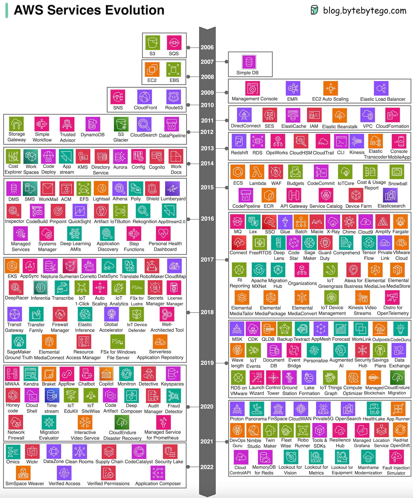
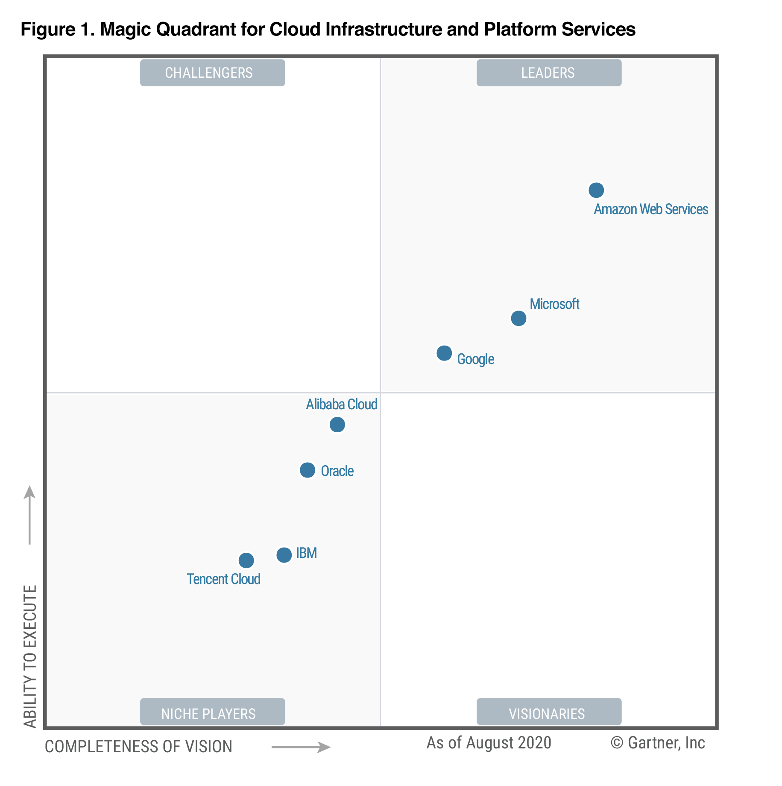
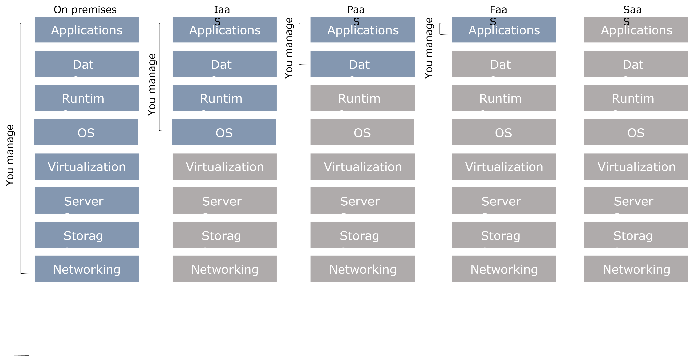
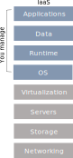
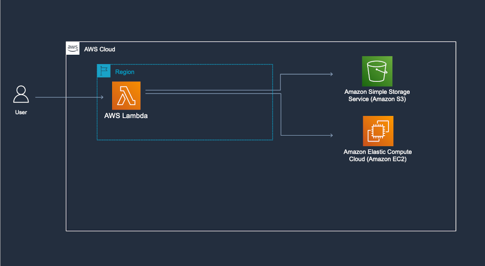
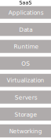

# 

# Reference scenario

:::: {.columns}
::: {.column width=60%}

The big-data cube [@meijer2012your]

- *Volume*: small to big
- *Variety*: structure to unstructured
- *Velocity*: pull to push

:::
::: {.column width=40%}

:::
::::

# Reference scenario

:::: {.columns}
::: {.column width=60%}

**Variety**

- **Structured**
  - Relational tuples with FK/PK relationships
- **Unstructured**
  - Key-value
  - Columnar
  - Document-based
  - Graph
  - ...

:::
::: {.column width=40%}

:::
::::

[https://www.datamation.com/big-data/structured-vs-unstructured-data/](https://www.datamation.com/big-data/structured-vs-unstructured-data/) (accessed 2022-08-01)

# Reference scenario

:::: {.columns}
::: {.column width=60%}

**Velocity** (latency)

- *High*: clients synchronously pulling data from sources
- *Low*: sources asynchronously pushing data to clients

**Velocity** (speed; dual to latency)

- *High*: processing in real-time (milliseconds) or near-real-time (minutes)
- *Low*: processing can take hours

:::
::: {.column width=40%}

:::
::::

# Reference scenario

**Acceleration**

- Velocity is not constant, data comes in bursts
- Take Twitter as an example
  - Hashtags can become hugely popular and appear hundreds of times in just seconds
  - ... or slow down to one tag an hour
- Your system must be able to efficiently handle the peak as well as the lows

# [Data never sleeps](https://www.domo.com/learn/infographic/data-never-sleeps-11)

:::: {.columns}
::: {.column width=50%}

:::
::: {.column width=50%}

:::
::::

# 

#

:::: {.columns}
::: {.column width=25%}

:::
::: {.column width=25%}

:::
::: {.column width=25%}

:::
::: {.column width=25%}

:::
::::

# Netflix

The Netflix scenario

# Reference scenario

**Collecting data**

- *Scheduled Batch* 
  - Large volume of data processed on a regularly scheduled basis
  - Velocity is very predictable
- *Periodic*
  - Data processed at irregular times (e.g., after collecting a certain ---large--- amount of data)
  - Velocity is less predictable
- *Near real-time* 
  - Streaming data processed in small individual batches collected and processed within minutes
  - Velocity is a huge concern
- *Real-time*
  - Streaming data collected and processed in very small individual batches within milliseconds
  - Velocity is the paramount concern

# Reference scenario

**Processing data**

- *Batch and periodic* 
  - Once data has been collected, processing can be done in a controlled environment
  - There is time to plan for the appropriate resources
- *Near real-time and real-time* 
  - Collection of the data leads to an immediate need for processing
  - The complexity of the processing can slow down the velocity of the solution significantly
  - Plan accordingly

# Reference scenario

:::: {.columns}
::: {.column width=60%}

Plus other Vs

- **Veracity**: data trustworthiness/quality
- **Value**: ability to extract meaningful information
- ...

Our focus

- (Un)Structured big-data batch
- (Un)Structured big-data streams

**Goal**: keep in mind the cube to categorize the services

:::
::: {.column width=40%}

:::
::::

# Data-driven companies

*Data-driven company* refers to companies where decisions and processes are supported by data

- Decisions are based on quantitative rather than qualitative knowledge
- Processes & Knowledge are asset of the company and are not lost if managers change
- The gap between a data-driven decision and a good decision is a good manager

Adopting a data-driven mindset goes far beyond adopting a business intelligence solution and entails:

- *Create a data culture*
- *Change the mindset of managers*
- *Change processes*
- *Improve the quality of all the data*

# Why moving to the cloud?

# Why moving to the cloud?

:::: {.columns}
::: {.column width=50%}

*Digitalization* is a journey that involves three main dimensions

- Moving from A to B is a multi-year process made of intermediate goals
- Each of which must be *feasible*
  - Solves a company's pain and brings value
  - Can be accomplished in a limited time range (typically less than one year)
  - Costs must be economically related to gains

:::
::: {.column width=50%}

:::
::::

# Why moving to the cloud?

> **Cloud Computing** (National Institute of Standards and Technology)
>
> A model for enabling *ubiquitous, convenient, on-demand network access* to a *shared pool* of configurable computing resources (e.g., networks, servers, storage, services) that can be rapidly provisioned and released with *minimal management effort* or *service provider interaction*
> 
> - On-demand self-service (consume services when you want)
> - Broad network access (consume services from anywhere)
> - Resource pooling (infrastructure, virtual platforms, and applications)
> - Rapid elasticity (enable horizontal scalability)
> - Measured service (pay for the service you consume as you consume)

**Digital transformation** involves the **cloud** to create/change business flows

- CC is the delivery of on-demand computing resources to businesses/individuals via a network (usually the Internet)
- CC enables organizations to access and store information without managing their own physical devices or IT infrastructure 
- Often involves changing the company culture to adapt to this new way of doing business
- One of the end goals is to meet ever-changing business and market demand

# Types of cloud

:::: {.columns}
::: {.column width=50%}

There are different types of cloud

- **Public**: accessible to anyone willing to pay
  - Any resources that you are not using can be used by other
  - Users share the costs
  - E.g., Microsoft Azure, AWS, Google Cloud
- **Private**: accessible by individuals within an institution
  - Cost-sharing disappears in private clouds
- **Hybrid**: a mix of the previous

:::
::: {.column width=50%}

:::
::::

# Why moving to the cloud?

**Scalability**

- Adjusts capacity to have predictable performance at the lowest cost
- Scale from one to thousands of computers
  - This is not possible on-premises

# Why moving to the cloud?

**Elasticity**

- Automatically scale resources in response to run-time conditions
- Adapt to changes in workload by turning on/off resources to match the necessary capacity
- Core justification for the cloud adoption

# Why moving to the cloud?

:::: {.columns}
::: {.column width=60%}

Hardware scalability

- No longer think about rack space, switches, power supplies, etc.

Grow storage from GBs to PBs

- 1PB: one hundred 10TB Enterprise Capacity 3.5 HDD hard drives

:::
::: {.column width=40%}

:::
::::

[https://blog.seagate.com/business/linus-tech-tips-want-petabyte-system/](https://blog.seagate.com/business/linus-tech-tips-want-petabyte-system/)

# Why moving to the cloud?

**Resource pooling**

- Enable *cost-sharing*, a resource to serve different consumers
- Resources are dynamically reassigned according to demands
- Based on *virtualization*, running multiple virtual instances on top of a physical computer system
- Economy of scale for physical resources

# Virtualization

How do provide computational resources?

:::: {.columns}
::: {.column width=60%}

*Containers* and *virtual machines* are packaged computing environments

*Containers*

- On top of physical server and its host OS
- Share the host OS kernel
- Shared components are read-only
- "Light", take seconds to start

*Virtual machines*

- Emulate a hardware/software system
- On top of a hypervisor (VM monitor)

:::
::: {.column width=40%}

:::
::::

Containerization isolates an application with its environment

- Lightweight alternative to full virtualization
- Containers are isolated but need to be deployed to (public/private) server
- Excellent solution when dependencies are in play
- Housekeeping challenges and complexities

# Why moving to the cloud?

**Reliability**

- Built to handle failures
- Fault-tolerant or highly available

# Why moving to the cloud?

:::: {.columns}
::: {.column width=40%}

**Worldwide deployment**

- Deploy applications as close to customers as possible
  - E.g., to reduce network latency
- Improve data locality
- Compliant to privacy regulations (e.g., GDPR)

:::
::: {.column width=60%}

](img/google-worlwide.jpg)

:::
::::

# Worldwide deployment

:::: {.columns}
::: {.column width=50%}

Cloud services are hosted in separate geographic areas

- Locations are composed of **regions** and **availability zones**
- [Using regions and availability zones](https://docs.aws.amazon.com/AWSEC2/latest/UserGuide/using-regions-availability-zones.html)

Region (e.g., us-east-1)

- Is an independent geographical area that groups data centers
- Has availability zones

Availability zones in a region

- A data center
- Connected through low-latency links
- Resources are usually replicated across zones but not regions

:::
::: {.column width=50%}

:::
::::

# Why moving to the cloud?

Measured **quality of service**

- Services leverage a quantitative metering capability making *pay-as-you-go (or pay-per-use)* billing

](img/aws-billing.png)

# Why moving to the cloud?

:::: {.columns}
::: {.column width=40%}

:::
::: {.column width=60%}

Service **integration**

- Do not reinvent the wheel, eliminate repetitive tasks
  - Use services that solve common problems (e.g., queuing)
- Abstract and automatically adapt the architecture to requirements
  - E.g., create (test) environments on demand

*Integration* and *abstraction* are drivers of change

- From *databases* to *data platforms*
- From *on-premises* to *serverless* architectures
- From *custom* to *standardized* data pipelines

:::
::::

# Which services?

# Cloud computing: principal vendors

:::: {.columns}
::: {.column width=50%}

:::
::: {.column width=50%}

How do we choose the Cloud Service Providers?

[Gartner Magic Quadrant](https://www.gartner.com/en/research/methodologies/magic-quadrants-research)

- **Leaders** execute well and are well-positioned for tomorrow
- **Visionaries** understand where the market is going but do not yet execute well
- **Niche Players** focus successfully on a small segment, or are unfocused and do not out-innovate or outperform others
- **Challengers** execute well but do not demonstrate an understanding of the market direction
- Focusing on leaders isn’t always the best
  - A niche player may support needs better than a market leader. It depends on how the provider aligns with business goals

:::
::::

# Cloud computing: principal vendors

:::: {.columns}
::: {.column width=50%}

:::
::: {.column width=50%}

:::
::::

# Data pipeline

**Data pipeline**: a *sequence* of operations to transform and consume raw data

# Data pipeline - AWS

:::: {.columns}
::: {.column width=30%}

Three main steps

- *Ingest*
  - Gateway, DataSync (batch)
  - Kinesis, SNS, SQS (stream)
- *Transform and store*
  - S3 and Glacier (storage)
  - Glue (ETL)
- *Serve and consume*
  - EMR (Hadoop-like cluster)
  - Athena (serverless query)
  - Machine learning services

:::
::: {.column width=70%}

:::
::::

# Data pipeline - Google Cloud

:::: {.columns}
::: {.column width=30%}

Three main steps

- *Ingest*
  - Transfer service (batch)
  - Pub/Sub (stream)
- *Analyze*
  - Dataproc (batch)
  - Dataflow (stream)
  - Cloud storage (storage)
  - Machine learning services
- *Serve*
  - BigQuery (query service)

:::
::: {.column width=70%}

:::
::::

# A tentative organization

# A tentative organization

:::: {.columns}
::: {.column width=50%}

We have services

- To transform data
- To support the transformation

The (DIKW) pyramid abstracts many techniques and algorithms

- Standardization
- Integration
- Orchestration
- Accessibility through APIs

:::
::: {.column width=50%}

:::
::::

# A tentative organization

:::: {.columns}
::: {.column width=50%}

This is not a sharp taxonomy

*Ingestion* vs *Analytics*

- Data streams are used for ingestion
- ... and (event) processing

:::
::: {.column width=50%}

:::
::::

# A tentative organization

:::: {.columns}
::: {.column width=50%}

This is not a sharp taxonomy

*Storage* vs *Serving*

- Databases are storage
- ... with processing capability
- ... and with serving capability

:::
::: {.column width=50%}

:::
::::

# Is cloud a silver bullet?

# Is cloud a silver bullet?

](img/slides104.png)

# Is cloud a silver bullet?

](img/crowstrike.png)

# Is cloud a silver bullet?

:::: {.columns}
::: {.column width=50%}

](img/google-energy1.jpg)

:::
::: {.column width=50%}

](img/google-energy2.jpg)

:::
::::

# 

# Cloud computing: deployment models

Understanding architectures is paramount to successful systems

- Good architectures help to scale
- Poor architectures cause issues that necessitate a costly rewrite

**Anything as a service (XaaS)**

- A collective term that refers to the delivery of anything as a service
- It encompasses the products, tools, and technologies that vendors deliver to users

# Cloud computing: deployment models

:::: {.columns}
::: {.column width=70%}

**On-premises**

- Provisioning servers is time-consuming
  - A non-trivial environment is hard to set up
- Require dedicated operations people
- Often a distraction from strategic tasks

:::
::: {.column width=30%}

:::
::::

# Cloud computing: deployment models

:::: {.columns}
::: {.column width=70%}

**Infrastructure as a service (IaaS)**

- A computing infrastructure provisioned and managed over the internet (e.g., AWS EC2)
- Avoid the expense/complexity of buying/managing physical servers/data centers
- IaaS overcomes issues on-premises
- Possibly requires managing many environments

:::
::: {.column width=30%}

:::
::::

# Cloud computing: deployment models

:::: {.columns}
::: {.column width=70%}

**Platform as a Service (PaaS)**

- A development and deployment environment in the cloud (e.g., AWS Elastic Beanstalk)
- Support complete application life-cycle: building, testing, deploying, etc.
- Avoid the expense/complexity of managing licenses and application infrastructure

:::
::: {.column width=30%}

:::
::::

# Cloud computing: deployment models

:::: {.columns}
::: {.column width=70%}

**Function as a Service (FaaS)**

- A coding environment, cloud provider provisions platform to run the code (e.g., AWS Lambda)
- Infrastructure provisioning and management are invisible to the developer

:::
::: {.column width=30%}

:::
::::

# Cloud computing: deployment models

:::: {.columns}
::: {.column width=50%}

:::
::: {.column width=50%}

:::
::::

# Cloud computing: deployment models

Principles of FaaS architectures

- FaaS is based on a *serverless* approach, using a compute service to execute code on demand
- Every function could be considered as a standalone service
- Write single-purpose stateless functions

Functions *react to events*

- Design push-based, event-driven pipelines
- Create thicker, more powerful front ends
- Embrace third-party services (e.g., security)

FaaS is not a silver bullet

- *Not appropriate for latency-sensitive applications*
- Strict specific service-level agreements
- Migration costs
  - Vendor lock-in can be an issue

# Cloud computing: deployment models

:::: {.columns}
::: {.column width=70%}

**Software as a service (SaaS)**

- An application environment
- Access cloud-based apps over the Internet (e.g., email, Microsoft Office 365, Github)

:::
::: {.column width=30%}

:::
::::

# Cloud computing: deployment models

On a cloud architecture, you can rely on [*serverless* or *managed* services](https://cloud.google.com/blog/topics/developers-practitioners/serverless-vs-fully-managed-whats-difference) (accessed 2020-08-01)

# Cloud computing: deployment models

*Serverless*

- Standalone independent services built for a specific purpose and integrated by the cloud service provider
- No visibility into the machines
  - There are still servers in serverless, but they are abstracted away
  - No server management, do not have to manage any servers or scale them
  - E.g., when you run a query on [BigQuery](https://cloud.google.com/blog/products/bigquery/separation-of-storage-and-compute-in-bigquery) you do not know how many machines were used
- Pay for what your application uses, usually per request or usage

*(Fully) Managed*

- Visibility and control of machines
  - You can choose the number of machines that are being used to run your application
- Do not have to set up any machines, the management and backup are taken care for you
- Pay for machine runtime, however long you run the machines and resources that your application uses

# 

# References