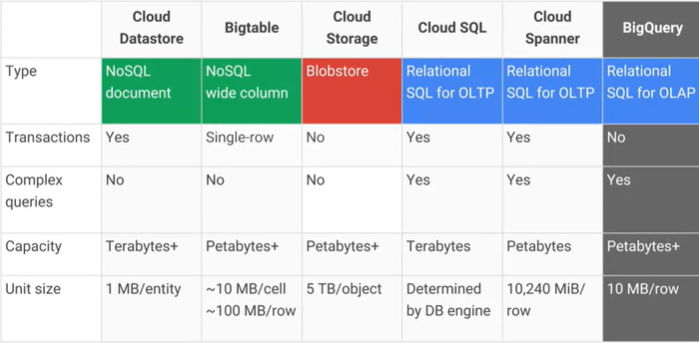
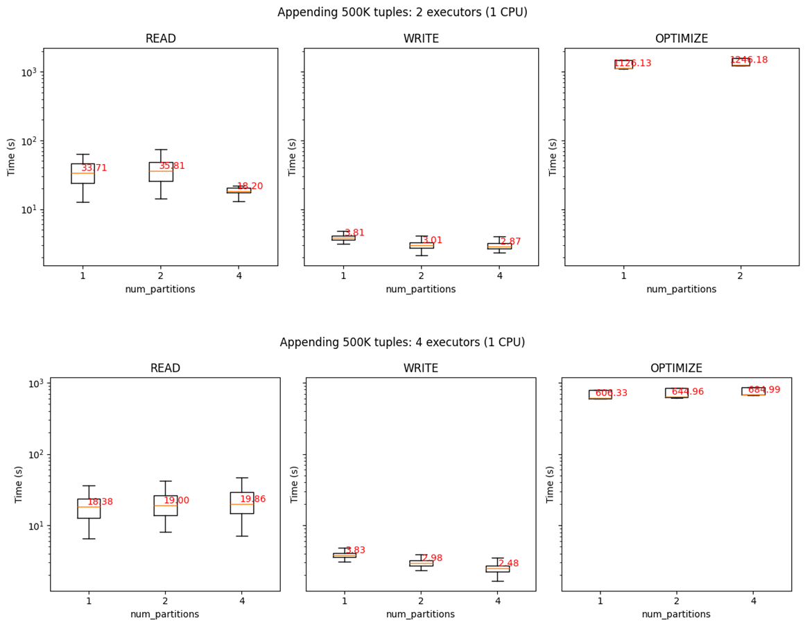

#


# Storage

**Goal**: persisting data

What storage do we choose?

- **Storage model** (or data model) ~= variety
  - How data are organized/accessed in a storage system
    * Structured vs unstructured
    * Data access model (key-value, column, etc.)
- Access **frequency**
- **Analyses** to be performed

# Storage models

![Taxonomy of storage models [@mansouri2017data]](img/252.svg)

# Storage models (AWS)

|*Data structure*|*Data abstraction*|*Data access*|
|:-:|:-:|:-:|
|Structured|Database|Relational|
</br>

:::: {.columns}
::: {.column width=60%}

**Relational database**

- Store data with predefined schemas and relationships between them
- Support ACID transactions
- Maintain referential integrity

:::
::: {.column width=40%}

](img/253.svg)

:::
::::

# Storage models (AWS)


|*Data structure*|*Data abstraction*|*Data access*|
|:-:|:-:|:-:|
|Semi/unstructured|Database|\*|
</br>

:::: {.columns}
::: {.column width=60%}

- **Key/value**: store and retrieve large volumes of data
- **Document**: store semi-structured data as JSON-like documents
- **Wide column**: use tables but unlike a relational database, columns can vary from row to row in the same table
- **Graph**: navigate and query relationships between highly connected datasets
- ... and more

:::
::: {.column width=40%}

](img/254.svg)

:::
::::

# Storage models ([Google Cloud](https://cloud.google.com/products/databases))

:::: {.columns}
::: {.column width=50%}


:::
::: {.column width=50%}



:::
::::

# Storage models (AWS)

|*Data structure*|*Data abstraction*|*Data access*|
|:-:|:-:|:-:|
|Unstructured|File/Database|Key-value|
</br>

**File system** (EFS), **object storage** (S3) (or **DB K-V** ; e.g., DynamoDB)

- Handle unstructured data
- ... organized as files (or blob)
- ... accessed using a key-value

*Differ in the supported features*

- E.g., maximum item size (DynamoDB: 400KB, S3: 5TB)
- E.g., indexes, querying mechanisms, latency, etc.

# AWS Simple Storage Service (S3)

**Simple Storage Service (S3)**

- *Serverless* storage, save data as **objects** within **buckets** 
- An **object** is composed of a file and any metadata that describes that file (e.g.,  **object key**)
- **Buckets** are logical containers for objects
  - You can have one or more buckets in your account
  - Control access for each bucket individually
  - Choose the geographical region where Amazon S3 will store the bucket and its contents

Benefits

- Unified data architecture
  - Build a multi-tenant environment, where many users can bring their data
  - Improve both cost and data governance over traditional solutions
- *Decoupling of storage from computing and data processing*
  - You can cost-effectively store all data types in their native formats
  - Then, launch transformations as you need

# Storage: access frequency (AWS)

:::: {.columns}
::: {.column width=60%}

AWS S3: [storage classes](https://aws.amazon.com/s3/storage-classes/)

- *Standard*: general purpose
- *Infrequent (rapid) access*
- *One Zone-IA*: lower-cost option for infrequently accessed data that do not require high availability and resilience
- *Glacier*: low-cost storage class for data archiving, three retrieval options that range from a few minutes to hours
- *Deep Glacier*: long-term retention for data accessed once/twice a year. 
  - E.g., retain data sets for 10 years or longer
- *Intelligent-Tiering*: move objects between access tiers when access patterns change

:::
::: {.column width=40%}


:::
::::

# Storage: access frequency (AWS)

:::: {.columns}
::: {.column width=60%}

[Object lifecycle management](https://docs.aws.amazon.com/AmazonS3/latest/userguide/object-lifecycle-mgmt.html)

- Rules that define actions that Amazon S3 applies to a group of objects

Two types of actions:

- *Transition*: when objects transition to another storage class.
  - E.g., archive objects to the S3 Glacier storage 1 year after creating them
- *Expiration*: when objects expire.
  - Amazon S3 deletes expired objects on your behalf

:::
::: {.column width=40%}


:::
::::

# Storage: access frequency ([Google Cloud](https://cloud.google.com/blog/products/storage-data-transfer/archive-storage-class-for-coldest-data-now-available))

:::: {.columns}
::: {.column width=50%}


:::
::: {.column width=50%}


:::
::::

# Organizing the data lake

# Organizing the data lake

:::: {.columns}
::: {.column width=60%}

Having consistent principles on how to organize your data is important

- To build standardized pipelines with the same design with regard to where read/write data
- Standardization makes it easier to manage your pipelines at scale
- Helps data users search for data in the storage and understand exactly what they need
- Decoupling storage from processing

:::
::: {.column width=40%}


:::
::::

# Organizing the data lake

:::: {.columns}
::: {.column width=60%}

**Landing area (LA)**

- Save *raw data* from ingestion
- Transient, data is not stored for long term

**Staging area (SA)**

- Raw data goes through a set of common transformations: ensuring *basic quality* and making sure it *conforms to existing schemas* for this data source and then data is saved into SA

**Archive area (AA)**

- After saving into SA, raw data from LA should be *copied into the archive* to reprocess any given batch of data by simply copying it from AA into LA
- Useful for debugging and testing

:::
::: {.column width=40%}


:::
::::

# Organizing the data lake

:::: {.columns}
::: {.column width=60%}

**Production area (PA)**

- Apply the business logic to data from SA

**Pass-through job**

- Copy data from SA to PA and then into DWH without applying any business logic
- Having a data set in the data warehouse and PA that is a replica can be helpful when debugging any issues with the business logic

**Cloud data warehouse (DWH)**

**Failed area (FA)**

- You need to be able to deal with all kinds of errors and failures
- There might be bugs in the pipeline code, and cloud resources may fail

:::
::: {.column width=40%}


:::
::::

# Organizing the data lake

| Area | Permissions | Tier |
|:-:|:-:|:-:|
| Landing | Ingestion applications can write<br />Scheduled pipelines can read<br />Data consumers can't access | **Hot** |
| Staging | Scheduled pipelines can read/write<br />Selected data consumers can read | **Hot** |
| Production | Scheduled pipelines can read/write<br />Selected data consumers can read | **Hot** |
| Archive | Scheduled pipelines can write<br />Dedicated data reprocessing pipelines can read  | *Cold*/*Archive* |
| Failed | Scheduled pipelines can write<br />Dedicated data reprocessing pipelines can read<br />Data consumers don't have access | **Hot** |

# Organizing the data lake

Alternative organizations are available

:::: {.columns}
::: {.column width=60%}

> "A data lake is a central repository system for storage, processing, and analysis of raw data, in which the data is **kept in its original format ** and is processed to be queried only when needed. It can store a **varied amount of formats ** in big data ecosystems, from unstructured, semi-structured, to structured data sources."
>
> [@couto2019mapping]

:::
::: {.column width=40%}


:::
::::

# Organizing the data lake

Use folders to organize data inside areas into a logical structure

- *Namespace*
  - Logically group multiple pipelines together.
- *Pipeline name*
  - Each data pipeline should have a name that reflects its purpose. For example
    * A pipeline that takes data from the LA, applies common processing steps, and saves data into SA
    * You will also have one for archiving data into AA
- *Data source name*
  - The ingestion layer will assign a name to each data source you bring into the platform
- *BatchId*
  - Unique identifier for any batch of data that is saved into LA
  - E.g., Since only ingestion can write to LA, it is its responsibility to generate this identifier
  - A common choice for this type of identifier is a Universally Unique Identifier (UUID)

Different areas will have slightly different folder structures

- /landing/ETL/sales\_oracle\_ingest/customers/01DFTFX89YDFAXREPJTR94

# Data Lakehouse

# Data Lakehouse

Combine the key benefits of data lakes and data warehouses

- Low-cost storage in an open format accessible by a variety of systems from the former
- Powerful management and optimization features from the latter
  - ACID transactions, data versioning, auditing, indexing, caching, and query optimization.

*Key question: can we effectively combine these benefits?*

- **Lakehouses** are a good fit for cloud environments with separate computing and storage
- Applications can run on-demand on separate computing nodes while accessing data in storage nodes

# Data Independence

:::: {.columns}
::: {.column width=60%}

**Data independence**: modify the schema at one level of the database system without altering the schema at the next higher level

- It can be explained using the three-schema architecture

:::
::: {.column width=40%}


:::
::::

# Data Lakehouse [@armbrust2021lakehouse]


# Data Lakehouse [@armbrust2021lakehouse]

**1st generation systems**: data warehousing started with helping business decision-makers get analytical insights

- Data in warehouses (DWH) would be written with *schema-on-write* to ensure that data is optimized for BI applications
  - *Schema on write* is defined as creating a schema for data before writing into the database
- Several challenges
  - DWH typically couples compute and storage into an on-premises appliance
    - This forced enterprises to provision and pay for the peak of user load and data under management, which is very costly
  - More and more datasets were completely unstructured, which DWHs could not store and query at all

# Data Lakehouse [@armbrust2021lakehouse]

**2nd generation**: offloading all the raw data into data lakes

- The data lake is *schema-on-read* and stores any data at low cost
  - *Schema on read* postpones the structuring of data to the time of analysis or reading 
- From 2015 onwards, cloud data lakes, such as S3 and GCS, started replacing HDFS
  - Superior durability (often >10 nines), geo-replication, and most importantly, extremely low cost
- The use of *open formats* also made data lake data directly accessible to a wide range of other analytics engines, such as machine learning systems
  - An *open file format* is a file format for storing digital data, defined by an openly published specification usually maintained by a standards organization, and which can be used and implemented by anyone.
- A small subset of data in the lake would later be ETLed to a downstream data warehouse
  - *Problems*?

# Data Lakehouse

A two-tier architecture is highly complex for users

- (Optional) Data is first *ETLed* into lakes, ...
- ... and then *ELTed* into warehouses
- Enterprise use cases now include advanced analytics such as machine learning, for which warehouses are not ideal

(Some) main problems:

- *Reliability*: keeping the data lake and warehouse consistent is difficult and costly
- *Staleness*: the data in the warehouse is stale compared to that of the data lake, with new data frequently taking days to load
- *Limited support for advanced analytics*: businesses want to ask predictive questions using their warehousing data
  - E.g., "Which customers should I offer discounts to?" 
  - E.g., process large datasets using complex non-SQL code
- It could require *two teams of users*: data scientists and BI

# Data Lakehouse

:::: {.columns}
::: {.column width=50%}


:::
::: {.column width=50%}


:::
::::

The market is pushing for the adoption of Lakehouse as a standard *de facto*

# Dataset Search for Data Discovery, Augmentation, and Explanation

**Is there a real need for many unstructured and integrated datasets?**

- Recent years have seen an explosion in our ability to collect and catalog data about our environment and society
- Governments and organizations are increasingly making data available on the Web and in various repositories and data lakes
- *This opportunity is often missed due to a central technical barrier*: it is currently nearly impossible for domain experts to weed through the vast amount of available information to discover datasets that are needed for their specific application

Juliana Freire, keynote @ EDBT 2023

# Data Lakehouse

Idea

- *Store data in a low-cost object store* using an open file format such as Apache Parquet
- *Implement a transactional metadata layer* on top of the object store that defines which objects are part of a table version
- *Implement management features* within the metadata layer


# Data Lakehouse

Metadata alone is insufficient to achieve good performance, challenges:

- *Data warehouses use several techniques to get state-of-the-art performance*
  - Storing hot data on fast devices such as SSDs, maintaining statistics, building efficient indexes, etc.
- Most *data lakes (cloud object stores) are merely key-value stores*, with no cross-key consistency
  - *Multi-object updates are not atomic*, there is no isolation between queries
    - If a query updates multiple objects in a table, readers will see partial updates as the query updates each object individually
- In *data lakes* it is possible to implement other optimizations that leave the data files unchanged
  - For large tables with millions of objects, *metadata operations are expensive*
  - The latency of cloud object stores is so much higher that these data-skipping checks can take longer than the actual query

# Delta Lake [@armbrust2020delta]

:::: {.columns}
::: {.column width=50%}

Delta Lake uses a **transaction log** and stores data into Apache Parquet for significantly faster metadata operations for large tabular datasets

- E.g., quickly search billions of table partitions
- The log is stored in the `_delta_log` subdirectory
- The delta log contains
  - Sequence of *commits* JSON objects with increasing, zero-padded numerical IDs to store the log records
  - Occasional *checkpoints* for specific log objects that summarize the log up to that point

:::
::: {.column width=50%}

](img/deltalake1.png)

:::
::::

# Delta Lake

Changes are recorded as ordered, atomic commits in the transaction log.

- Each commit is written as a JSON file, starting with `000000.json`.
- Additional changes to the table generate subsequent JSON files in ascending numerical order
- Each log record object (e.g., `000003.json`) contains an array of actions to apply to the previous table version

Whenever a user modifies a table (such as an INSERT, UPDATE, or DELETE), Delta Lake breaks that operation down into a series of discrete steps composed of one or more of the actions below.

- *Add file*: adds a data file.
- *Remove file*: removes a data file.
- *Update metadata*: Updates the table’s metadata (e.g., changing the table’s name, schema, or partitioning).
- *Set transaction*: Records that a structured streaming job has committed a micro-batch with the given ID.
- *Change protocol*: enables new features by switching the Delta Lake transaction log to the newest software protocol.
- *Commit info*: Contains information around the commit, which operation was made, from where, and when.

# Delta Lake

*You own your data*: we are decoupling the data from database engines!

```sql
CREATE TABLE suppliers(id INT, name STRING, age INT)
 TBLPROPERTIES ('foo'='bar')
 COMMENT 'this is a comment'
    LOCATION 's3://...';
```

Delta tables are stored in S3 (simple files in a data lake), and they can be read using *different computes*:

- Databricks, EMR, etc.
- Otherwise you are locked in with the vendor (e.g., Oracle).

... and *languages*

- Python, SQL, etc.

# Delta Lake

Create a table of `suppliers`, the content of `00000000000000000000.json`

:::: {.columns}
::: {.column width=50%}

```json
{
    "commitInfo": {
        "timestamp": 1709133408152,
        "userId": "8355321721036096",
        "userName": "user1@foo.bar",
        "operation": "CREATE TABLE AS SELECT",
        "operationParameters": {
            "partitionBy": "[]",
            "description": null,
            "isManaged": "false",
            "properties": "{}",
            "statsOnLoad": false
 },
        "notebook": {
            "notebookId": "68312033830310"
 },
        "clusterId": "0112-095737-cgwksnoz",
        "isolationLevel": "WriteSerializable",
        "isBlindAppend": true,
        "operationMetrics": {
            "numFiles": "4",
            "numOutputRows": "1000000",
            "numOutputBytes": "79811576"
 },
        "tags": {
            "restoresDeletedRows": "false"
 },
        "engineInfo": "Databricks-Runtime/13.3.x-scala2.12",
        "txnId": "afc094e5-7096-40cb-b4f7-33e98c5d3a4b"
 }
}
```

:::
::: {.column width=50%}

```json
{
    "add": {
        "path": "part-00000-d7654bfc-8169-41a7-a7fc-28586c8f73f9-c000.snappy.parquet",
        "partitionValues": {},
        "size": 20588082,
        "modificationTime": 1709133407000,
        "dataChange": true,
        "stats": "{\"numRecords\":257994,\"minValues\":{\"s_suppkey\":1,\"s_name\":\"Supplier#000000001\",\"s_address\":\" , Jd6qNPDAgz\",\"s_nationkey\":0,\"s_phone\":\"10-100-166-6237\",\"s_acctbal\":-999.94,\"s_comment\":\" Customer  blithely regular pint\"},\"maxValues\":{\"s_suppkey\":257994,\"s_name\":\"Supplier#000257994\",\"s_address\":\"zzyv9d9xGUF QcjHQG8gDjuLo pLBxBZ�\",\"s_nationkey\":24,\"s_phone\":\"34-999-987-5257\",\"s_acctbal\":9999.93,\"s_comment\":\"zzle. sometimes bold pinto beans�\"},\"nullCount\":{\"s_suppkey\":0,\"s_name\":0,\"s_address\":0,\"s_nationkey\":0,\"s_phone\":0,\"s_acctbal\":0,\"s_comment\":0}}",
        "tags": {
            "INSERTION_TIME": "1709133407000000",
            "MIN_INSERTION_TIME": "1709133407000000",
            "MAX_INSERTION_TIME": "1709133407000000",
            "OPTIMIZE_TARGET_SIZE": "268435456"
 }
 }
}
{
    "add": {
        "path": "part-00001-758ed86b-1400-46b8-b73f-50c6ad4324f1-c000.snappy.parquet",
        "partitionValues": {},
        "size": 20516343,
        "modificationTime": 1709133408000,
        "dataChange": true,
        "stats": "{\"numRecords\":257111,\"minValues\":{\"s_suppkey\":257995,\"s_name\":\"Supplier#000257995\",\"s_address\":\" t2HGWJzQQcWUyx\",\"s_nationkey\":0,\"s_phone\":\"10-100-154-1322\",\"s_acctbal\":-999.96,\"s_comment\":\" Customer  blithe requesComplain\"},\"maxValues\":{\"s_suppkey\":515105,\"s_name\":\"Supplier#000515105\",\"s_address\":\"zzyvSACyGWpp5gCaZbUL7lKRUnhe7m6p�\",\"s_nationkey\":24,\"s_phone\":\"34-999-802-1817\",\"s_acctbal\":9999.95,\"s_comment\":\"zzle. regular foxes are ironic p�\"},\"nullCount\":{\"s_suppkey\":0,\"s_name\":0,\"s_address\":0,\"s_nationkey\":0,\"s_phone\":0,\"s_acctbal\":0,\"s_comment\":0}}",
        "tags": {
            "INSERTION_TIME": "1709133407000001",
            "MIN_INSERTION_TIME": "1709133407000001",
            "MAX_INSERTION_TIME": "1709133407000001",
            "OPTIMIZE_TARGET_SIZE": "268435456"
 }
 }
}
```
:::
::::

# Delta Lake

Add a new `supplier`, content of `00000000000000000009.json`

:::: {.columns}
::: {.column width=50%}

```json
{
    "commitInfo": {
        "timestamp": 1709134798441,
        "userId": "8047431628735957",
        "userName": "user2@foo.bar",
        "operation": "WRITE",
        "operationParameters": {
            "mode": "Append",
            "statsOnLoad": false,
            "partitionBy": "[]"
 },
        "notebook": {
            "notebookId": "4471242088384584"
 },
        "clusterId": "0112-095737-cgwksnoz",
        "readVersion": 8,
        "isolationLevel": "WriteSerializable",
        "isBlindAppend": true,
        "operationMetrics": {
            "numFiles": "1",
            "numOutputRows": "1",
            "numOutputBytes": "2675"
 },
        "tags": {
            "restoresDeletedRows": "false"
 },
        "engineInfo": "Databricks-Runtime/13.3.x-scala2.12",
        "txnId": "45786330-12ee-4e73-85ff-38cdd2caffcf"
 }
}
```

:::
::: {.column width=50%}

```json
{
    "add": {
        "path": "part-00000-7b0e114f-e86f-4952-a030-b877001f8074-c000.snappy.parquet",
        "partitionValues": {},
        "size": 2675,
        "modificationTime": 1709134799000,
        "dataChange": true,
        "stats": "{\"numRecords\":1,\"minValues\":{\"s_suppkey\":1,\"s_name\":\"Supplier#000000001\",\"s_address\":\" N kD4on9OM Ipw3,gf0JBoQDd7tgrzr\",\"s_nationkey\":17,\"s_phone\":\"27-918-335-1736\",\"s_acctbal\":5755.94,\"s_comment\":\"each slyly above the careful\"},\"maxValues\":{\"s_suppkey\":1,\"s_name\":\"Supplier#000000001\",\"s_address\":\" N kD4on9OM Ipw3,gf0JBoQDd7tgrzr�\",\"s_nationkey\":17,\"s_phone\":\"27-918-335-1736\",\"s_acctbal\":5755.94,\"s_comment\":\"each slyly above the careful\"},\"nullCount\":{\"s_suppkey\":0,\"s_name\":0,\"s_address\":0,\"s_nationkey\":0,\"s_phone\":0,\"s_acctbal\":0,\"s_comment\":0}}",
        "tags": {
            "INSERTION_TIME": "1709134799000000",
            "MIN_INSERTION_TIME": "1709134799000000",
            "MAX_INSERTION_TIME": "1709134799000000",
            "OPTIMIZE_TARGET_SIZE": "268435456"
 }
 }
}
```

:::
::::

# Delta Lake

Checkpoint `00000000000000000002.checkpoint.parquet`


# Delta Lake

:::: {.columns}
::: {.column width=50%}

Once we have made several commits to the transaction log, Delta Lake saves a **checkpoint file** in Parquet format in `_delta_log`

- Delta Lake automatically generates checkpoints as needed to maintain good read performance.
- Checkpoints store all the non-redundant actions in the table's log up to a certain log record ID, in Parquet format
- Some sets of actions are redundant and can be removed
- Read the *last checkpoint* object in the table's log directory, if it exists, to obtain a recent checkpoint ID


:::
::: {.column width=50%}


:::
::::

# Delta Lake

:::: {.columns}
::: {.column width=50%}

Checkpoints save the entire state of the table at a point in time.

A "shortcut" to reproducing a table’s state to avoid reprocessing what could be thousands of tiny, inefficient JSON files.

Spark runs a `listFrom v` operation to view all files in the transaction log, starting from `v`

- ... quickly skips to the newest checkpoint file,
- ... only processes JSON commits made since the most recent checkpoint file was saved.

:::
::: {.column width=50%}


:::
::::

Imagine that we’ve created commits up to `000007.json` and that Spark has cached this version of the table in memory.

- In the meantime, other writers have written new data to the table, adding commits up to `0000012.json`.
- To incorporate these new transactions, Spark runs a `listFrom` version 7 operation to see the new changes to the table.
- Rather than processing all of the intermediate JSON files ...
- ... Spark skips ahead to the most recent checkpoint file since it contains the entire state of the table at commit `#10`.

# Delta Lake

**Time Travel**

- Every table is the sum of all commits recorded in the transaction log.
- The log provides a step-by-step instruction guide, detailing how to get from the table’s original state to its current state.
- Recreate a table at any point in time by starting with the original version and processing only commits before that version. 

```sql
select * from suppliers; -- read the last version of the table
delete from suppliers; -- delete all data from the table!
select * from suppliers version as of 3; -- read from a specific version of the table
restore table suppliers to version as of 3; -- restore to a specific version
```

**Data Lineage and Debugging**

- The transaction log offers users a verifiable data lineage useful for governance, audit, and compliance purposes. 
- It can also be used to trace the origin of an inadvertent change or a bug in a pipeline back to the exact action that caused it.

```sql
delete from suppliers; -- delete is important for GDPR
-- what about data in the log?
```

# Delta Lake

:::: {.columns}
::: {.column width=60%}

**Optimize**: Delta Lake can improve the speed of read queries from a table by coalescing small files into larger ones.

- *Bin-packing optimization* is idempotent, meaning that if it is run twice on the same dataset, the second run has no effect.
- *Bin-packing* aims to produce evenly-balanced data files with respect to their size on disk, but not necessarily balanced \#tuples.
  - However, the two measures are most often correlated.
- Python and Scala APIs for executing OPTIMIZE operations are available.

```python
from delta.tables import *
deltaTable = DeltaTable.forPath(spark, pathToTable)  # For path-based tables
# For Hive metastore-based tables: deltaTable = DeltaTable.forName(spark, tableName)
deltaTable.optimize().executeCompaction()
# If you have a large amount of data and only want to optimize a subset of it, you can specify an optional partition predicate using `where`
deltaTable.optimize().where("date='2021-11-18'").executeCompaction()
```

*Auto compaction* automatically reduce small file problems.

- Occur after a write to a table has succeeded and runs synchronously on the cluster that has performed the write.
- Compact files that haven’t been compacted previously.

:::
::: {.column width=40%}


:::
::::

# Delta Lake

Example of a *write transaction*: read the data at table version `r` and attempt to write log record `r+1`

- Read data at table version `r`, if required combine previous checkpoint and further log records
- Write any new data into new files in the correct data directories, generating the object names using GUIDs.
  - This step can happen in parallel
  - At the end, these objects are ready to be referenced in a new log record.
- Attempt to write the transaction's log record into the `r+1.json` log object, if no other client has written this object
  - *This step needs to be atomic*: only 1 client should succeed.
  - If the step fails, the transaction can be retried; depending on the query's semantics (optimistic concurrency)
- Optionally, write a new `.parquet` checkpoint for log record `r+1`

Not all large-scale storage systems have an atomic put operation

- Google Cloud Storage and Azure Blob Store support atomic put-if-absent operations
- HDFS, we use atomic renames to rename a temporary file to the target name
- Amazon S3 needs ad-hoc protocols

# Delta Lake

Check the scalability with respect to the length of the log

```python
i = 0
while i < 20000:
    if i % 10 == 0:
        spark.sql("select sum(quantity) from lineitem")  # Read the whole fact
    spark.sql("insert (500K tuples) into lineitem")  # Append new tuples
    i += 1
```


# Delta Lake

Check the scalability with respect to the length of the log

```python
i = 0
while i < 20000:
    if i % 10 == 0:
        spark.sql("select sum(quantity) from lineitem")  # Read the whole fact
    spark.sql("insert (500K tuples) into lineitem")  # Append new tuples
    if i % 100 == 0: OPTIMIZE  # Optimize
    i += 1
```


# Delta Lake



# Delta Lake

Format-independent optimizations are

- *Caching*: cache files from the cloud object store on faster storage devices such as SSDs and RAM on the processing nodes
- *Auxiliary data*: maintain column min-max statistics for each data file in the table within the same Parquet file used to store the transaction log
- *Data layout*:
  - *Record ordering*: records clustered together are easiest to read together
    - E.g. ordering records using individual dimensions or space-filling curves such as Z-order
  - *Compression strategies* differently for various groups of records or other strategies

See also [I spent 5 hours understanding more about the delta lake table format](https://blog.det.life/i-spent-5-hours-understanding-more-about-the-delta-lake-table-format-b8516c5091eb)

# Lakehouse

A **medallion architecture** is a data design pattern used to logically organize data in a lakehouse, with the goal of incrementally and progressively improving the structure and quality of data as it flows through each layer of the architecture 


# Lakehouse

Example of usage


# References