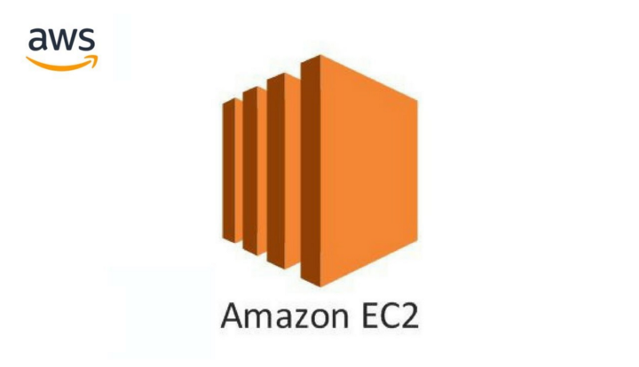
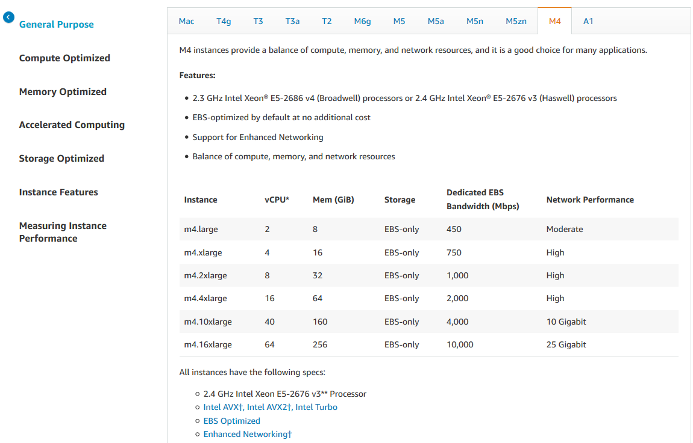
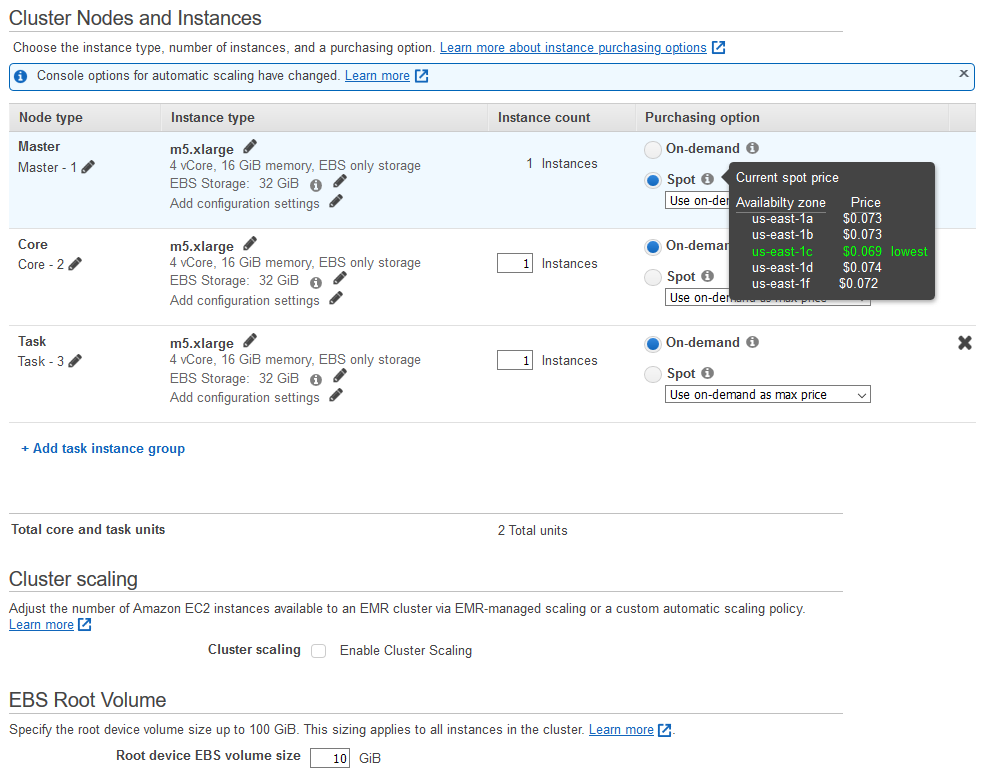

#


# Supporting data pipelines

We can choose the XaaS configuration to build our pipelines

# Supporting data pipelines: *IaaS*

:::: {.columns}
::: {.column width=60%}

- Outsource virtual machines to the cloud ([AWS EC2](https://aws.amazon.com/ec2))
- (You) Manage technological and business challenges

:::
::: {.column width=40%}



:::
::::

# Single instance: AWS EC2

:::: {.columns}
::: {.column width=60%}

Amazon **Elastic Compute Cloud** (EC2)

- A web service that provides resizable computing capacity
- Complete control of computing resources
  - Processor, storage, networking, OS, and purchase model

The [instance type](https://aws.amazon.com/ec2/instance-types) determines the hardware

- [Different](https://docs.aws.amazon.com/AWSEC2/latest/UserGuide/compute-optimized-instances.html) compute and memory capabilities

[Amazon Machine Image](https://docs.aws.amazon.com/AWSEC2/latest/UserGuide/ec2-instances-and-amis.html) is a software template

- The EC2 instance is used for creating the virtual server instance
- The AMI is the EC2 virtual machine image

Interact with EC2 instance as with any computer

- You have complete control of your instances

:::
::: {.column width=40%}


:::
::::

# Single instance: AWS EC2

:::: {.columns}
::: {.column width=50%}



:::
::: {.column width=50%}


:::
::::

# Supporting data pipelines: *PaaS*

:::: {.columns}
::: {.column width=60%}

- Outsource the data ecosystem to the cloud (e.g., [AWS EMR](https://aws.amazon.com/emr))
- (You) Manage business challenges

:::
::: {.column width=40%}


:::
::::

# Cluster: AWS EMR

Amazon EMR is a data platform based on the Hadoop stack

- Apache Spark, Apache Hive, Apache HBase, etc.
- You can run workloads on
  - Amazon EC2 instances
  - Amazon Elastic Kubernetes Service (EKS) clusters

Example of workload

- Upload input data into Amazon S3
- EMR launches EC2 instances that you specified
- EMR begins the execution while pulling the input data from S3 into the launched instances
- Once the cluster is finished, EMR transfers output data to Amazon S3

# AWS EMR

:::: {.columns}
::: {.column width=50%}


:::
::: {.column width=50%}


:::
::::

# AWS EMR

:::: {.columns}
::: {.column width=60%}

EMR cluster

*Master group*

- Control the cluster
- Coordinate the work distribution
- Manage the cluster state

*Core groups*

- Run Data Node (HDFS) daemons

(Optional) Task instances

- Provide computational power

:::
::: {.column width=40%}


:::
::::

# AWS EMR

The central component of Amazon EMR is the *cluster*

- A collection of *Amazon Elastic Compute Cloud (Amazon EC2)* instances
- Each instance is called a *node*

The *node type* identifies the role within the cluster

- *Master* node coordinates the distribution of data and tasks among other nodes
  - Every cluster has (at least) a master node
  - Always active
- *Core* node runs tasks and store data in the Hadoop Distributed File System (HDFS)
  - Multi-node clusters have at least one core node
  - Always active, contains the data node daemon
- *Task* node only runs tasks
  - Task nodes are optional
  - Decoupling processing and storage, we lose data locality

# AWS EMR: [pricing](https://aws.amazon.com/ec2/pricing/)

*On-Demand Instance*

- Pay for computing capacity by the hour (minimum of 60 seconds)
- No long-term commitments

*Spot Instance*

- Unused EC2 instance that is available for less than the on-demand price
- The hourly price is called *spot price*
  - Adjusted based on long-term supply and demand for spot instances
- Run the instance when capacity is available and the price is below the threshold
  - When data-center resources are low, spot instances are dropped
  - Mainly suitable for batch workloads

# AWS EMR

Spot Instance cost strategies
 
*Capacity-optimized strategy*

- Allocated instances into the most available pools
- Look at real-time capacity data, and predict which are the most available
- Works well for workloads such as big data and analytics
- Works well when we have a high cost of interruption

*Lowest-price strategy*

- Allocates instances in pools with the lowest price at the time of fulfillment

# Creating the cluster

Choose to launch **master**, **core**, or **task** on Spot Instances

- The **master** node controls the cluster
  - When terminated, the cluster ends
  - Use *spot instances* if you are running a cluster where sudden termination is acceptable
- **Core** nodes process data and store information using HDFS
  - When terminated, data is lost
  - Use *spot instances* when partial HDFS data loss is tolerable
- **Task** nodes process data but do not hold persistent data in HDFS
  - When terminated, computational capacity is lost
  - The effect of spot instances on the cluster is "minimal"

[https://docs.aws.amazon.com/emr/latest/ManagementGuide/emr-plan-instances-guidelines.html](https://docs.aws.amazon.com/emr/latest/ManagementGuide/emr-plan-instances-guidelines.html)

# Creating the cluster


# Creating the cluster

Amazon EMR provides two main file systems

- **HDFS** and **EMRFS**, specify which file system to use by the prefix
- `hdfs://path` (or just `path`)
  - HDFS is used by the master and core nodes
  - *AWS EBS volume storage is used for HDFS data*
  - It is fast and best used for caching the results produced by intermediate job-flow steps. *Why?*
  - It’s temporary storage which is reclaimed when the cluster ends
- `s3://DOC-EXAMPLE-BUCKET1/path` (EMRFS)
  - An implementation of the Hadoop file system atop Amazon S3
  - We can avoid EBS storage

[https://docs.aws.amazon.com/emr/latest/ManagementGuide/emr-plan-storage.html](https://docs.aws.amazon.com/emr/latest/ManagementGuide/emr-plan-storage.html)

# Creating the cluster


# Creating the cluster



# Creating the cluster


# Creating the cluster


# Creating the cluster

*Infrastructure as code*: using CLI (command line interface)

```bash
aws emr create-cluster
  --auto-scaling-role EMR_AutoScaling_DefaultRole
  --termination-protected
  --applications Name=Hadoop Name=Hive Name=Hue Name=JupyterEnterpriseGateway Name=Spark
  --ebs-root-volume-size 10
  --ec2-attributes '{"KeyName":"bigdata","InstanceProfile":"EMR_EC2_DefaultRole","SubnetId":"subnet-5fa2f912","EmrManagedSlaveSecurityGroup":"sg-07818b5690a50b3f1","EmrManagedMasterSecurityGroup":"sg-0e2f5550a2cb98f79"}'
  --service-role EMR_DefaultRole
  --enable-debugging
  --release-label emr-6.2.0
  --log-uri 's3n://aws-logs-604905954159-us-east-1/elasticmapreduce/'
  --name 'BigData'
  --instance-groups '
    [{  "InstanceCount": 1,
        "BidPrice": "OnDemandPrice",
        "EbsConfiguration": {
          "EbsBlockDeviceConfigs": [{
            "VolumeSpecification": { "SizeInGB": 32, "VolumeType": "gp2" },
            "VolumesPerInstance": 2
          }]},
        "InstanceGroupType": "MASTER",
        "InstanceType": "m4.xlarge",
        "Name": "Master - 1"
      }, {
        "InstanceCount": 1,
        "BidPrice": "OnDemandPrice",
        "EbsConfiguration": {
          "EbsBlockDeviceConfigs": [{
            "VolumeSpecification": { "SizeInGB": 32, "VolumeType": "gp2" },
            "VolumesPerInstance": 2
      }]},
      "InstanceGroupType": "CORE",
      "InstanceType": "m4.xlarge",
      "Name": "Core - 2"}]'
  --scale-down-behavior TERMINATE_AT_TASK_COMPLETION
  --region us-east-1
```

# Cluster lifecycle

:::: {.columns}
::: {.column width=40%}

Creating a cluster (it takes ~10 minutes)

- A cluster cannot be stopped
- It can only be terminated

:::
::: {.column width=60%}


:::
::::

# Cluster lifecycle

`STARTING`: EMR provisions EC2 instances for each required instance

`BOOTSTRAPPING`: EMR runs actions that you specify on each instance

- E.g., install custom applications and perform customizations such as Hive, Hadoop, Spark, and so on

`RUNNING`: a step for the cluster is currently being run

- Cluster sequentially runs any steps that you specified when you created the cluster

`WAITING`: after steps run successfully

`TERMINATING`: after manual shutdown

- *Any data stored on the cluster is deleted*

# Cluster lifecycle

A **step** is a user-defined unit of processing

- E.g., one algorithm that manipulates the data

Step states

- `PENDING`: The step is waiting to be run
- `RUNNING`: The step is currently running
- `COMPLETED`: The step completed successfully
- `CANCELLED`: The step was canceled before running because an earlier step failed
- `FAILED`: The step failed while running

# Running the cluster


# Running the cluster


