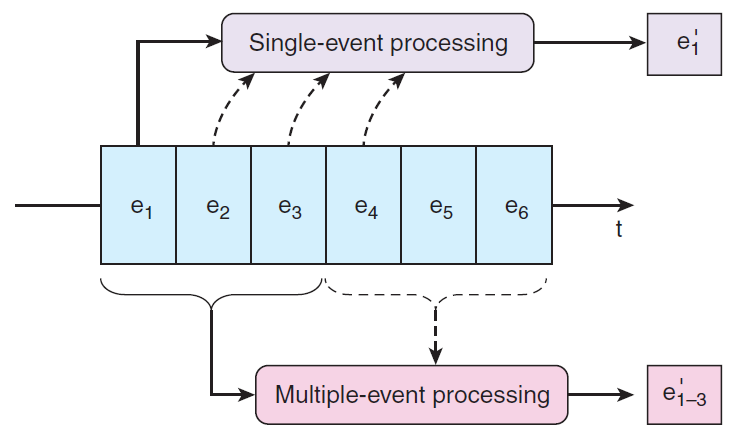

#

# Batch vs. Streaming systems

:::: {.columns}
::: {.column width=50%}

What is a *bulk processing* system?

- High latency
- Exact results
- Process massive data at once (... is this true?)

:::
::: {.column width=50%}

What is a *streaming* system?

- Low latency
- Approximate result (... is this true?)
- Process data item by data item (... is this true?)
:::
::::

# Batch vs. Streaming systems [@akidau2018streaming]

:::: {.columns}
::: {.column width=50%}

What is a bulk processing system?

- An engine capable of handling processing on **bounded** datasets

:::
::: {.column width=50%}

What is a streaming system?

- An engine capable of handling processing on **unbounded** datasets
- Streaming *is a superset* of batch processing

:::
::::

# Ingestion: batch

**Goal**: moving data to the cloud

- *80TB* of data to move
- *1Gbps* connection to the internet

How long does it take?

# Ingestion: batch

How many *days*?

- 80000GB / (1Gbps / 8) / 60 / 60 / 24 ~= a week without internet

# Ingestion: batch

Batch/Bulk: move data from on-premises storage

:::: {.columns}
::: {.column width=60%}

AWS Snowball

- 50TB (North America only) and 80TB versions
- Not rack-mountable
- Throughput
  - 1 Gbps or 10 Gbps using an RJ-45 connection
  - 10 Gbps using a fiber optic connection

:::
::: {.column width=40%}

:::
::::

Workflow

- Receive shipment
- Set up
- Transfer data
- Ship back (shipping carrier)

# [AWS Snowmobile](https://youtu.be/8vQmTZTq7nw?t=60) {background-video="https://youtu.be/8vQmTZTq7nw?t=60&autoplay=1"}

What if we have exabytes of data?

- $10^3$ KB (kilobyte)
- $10^6$ MB (megabyte)
- $10^9$ GB (gigabyte)
- $10^{12}$ TB (terabyte)
- $10^{15}$ PB (petabyte)
- $10^{18}$ EB (exabyte)
- $10^{21}$ ZB (zettabyte)
- $10^{24}$ YB (yottabyte)

# Ingestion: stream [@kreps2014heart]

:::: {.columns}
::: {.column width=60%}

Data (often) flows in both directions, storage systems are both sources and destinations for data transformations

Two pipelines per application (data in/out)

- Worst case (full connectivity): $O(N^2)$

:::
::: {.column width=40%}

:::
::::

# Ingestion: stream 

:::: {.columns}
::: {.column width=60%}

**Stream**: real-time streaming data

- **Event**: anything that we can observe occurring at a particular point in time

**Continuous streaming**

- Illimited succession of individual events
- Ordered by the point in time at which each event occurred

**Publish/subscribe (pub/sub)**: a way of communicating messages

- *Senders* publish messages associated with one or more **topics**
- *Receivers* subscribe to specific topics, and receive all messages with that topic
- *Messages* are events

:::
::: {.column width=40%}

:::
::::

# Ingestion: stream [@kreps2014heart]

:::: {.columns}
::: {.column width=60%}

**Log**

- Append-only data structure
- Each application only knows about the log, it ignores the details of the source
  - E.g., a data consumer is not concerned about whether the data came from a relational database or some application

The log acts as a messaging system with durability guarantees and ordering semantics

:::
::: {.column width=40%}

:::
::::

# Ingestion: stream

:::: {.columns}
::: {.column width=60%}

General idea:

- Collect events from many source systems
- Store them in a unified log
- Enable applications to operate on these event streams

**Unified log**

- *Unified*, *append-only*, *ordered*, *distributed* log that allows the centralization of event streams

:::
::: {.column width=40%}

:::
::::

# Ingestion: stream

**Unified**: a single log in a company with applications sending/reading events

- Log serves as the central data backbone
  - It can contain many distinct continuous streams of events
  - Not all events are sent to the same event stream

**Append-only**: new events are appended to the unified log

- Existing events are never updated in place
  - If read event \#10, never look at events 1 through 10 again
- Events are automatically deleted from the unified log when they age
  - E.g., automatically remove events after 7 days

# Ingestion: stream

:::: {.columns}
::: {.column width=60%}

**Distributed**: the unified log lives across a cluster of machines

- Optionally divide events into shards (i.e., partitions)
- Still, the log is unified since we have a single (conceptual) log

Distribution ensures

- *Scalability*: work with streams larger than the capacity of single machines
- *Durability*: replicate all events within the cluster to overcome data loss

Using a log as a universal integration mechanism is never going to be more than an elegant fantasy if we can’t build a log that is fast, cheap, and scalable

:::
::: {.column width=40%}

:::
::::

# Ingestion: stream

:::: {.columns}
::: {.column width=60%}

**Ordered**: events in a shard have sequential IDs (unique in a shard)

- Local ordering keeps things much simpler than global ordering [@lamport2019time]
- Applications maintain their cursor for each shard

:::
::: {.column width=40%}

:::
::::

# Ingestion: stream

:::: {.columns}
::: {.column width=60%}

Two types of processing

- **Single-event:** a single event produces zero or more events
  - Validating "Does this event contain all the required fields?"
  - Enriching "Where is this IP address located?"
  - Filtering "Is this error critical?"
- **Multiple-event:** multiple events collectively produce zero or more events
  - Aggregating, functions such as minimum, maximum, sum
  - Pattern matching, looking for patterns or co-occurrence
  - Reordering events based on a sort key

:::
::: {.column width=40%}

:::
::::

# Ingestion: stream (AWS)

:::: {.columns}
::: {.column width=60%}

[Amazon Kinesis Data Streams](https://docs.aws.amazon.com/streams/latest/dev/key-concepts.html)

- Created and provisioned by shard
  - Each shard provides 1 MBps and 1000 data puts per second
- A data record consists of
  - User-supplied partition key to balance records across shards
  - Incremental sequence number added by the shard
  - A data blob
- Consumers get records by shard
  - Records are sorted by partition key and sequence number
  - Ordering is not guaranteed across shards
- Records are retained for 7 days at maximum

:::
::: {.column width=40%}

:::
::::

# Ingestion: stream (AWS)

Re-sharding (i.e., scaling)

- Split a shard into two, or merge two shards
- Users must scale shards up and down manually
  - Monitor usage with [Amazon CloudWatch](https://aws.amazon.com/cloudwatch/) and modify scale as needed
- Avoid shard management by using [Kinesis Data Firehose](https://aws.amazon.com/kinesis/data-firehose)

Kinesis is a regional service, with streams scoped to specific regions

- All ingested data must travel to the region in which the stream is defined

Costs

- Priced by shard hour, data volume, and data retention period
- Pay for resources you provision (even if not used)

# Ingestion: stream

| Feature | AWS Kinesis | Google Pub/Sub |
|:-: |:-: |:-: |
| Unit of deployment | Stream | Topic |
| Unit of provisioning | Shard | N/A (fully managed) |
| Data unit | Record | Message |
| Data producer/destination | Producer/Consumer | Publisher/Subscriber |
| Data partitioning | User-supplied partition key | N/A (fully managed) |
| Retention period | Up to 7 days | Up to 7 days |
| Pricing | Per shard-hour, PUT payload units, and optional data retention | Message ingestion and delivery, and optional message retention |

# 

# Serverless computing/processing

:::: {.columns}
::: {.column width=60%}

**AWS Lambda**: compose code functions in a loose orchestration

- Build modular back-end systems
- Event-driven and push-based pipelines

With Lambda, you are responsible only for your code (Lambda function)

- Lambda manages the compute fleet that offers a balance of memory/CPU
- Lambda performs operational and administrative activities on your behalf
  - Provisioning capacity, monitoring fleet health, applying security patches, etc.

:::
::: {.column width=40%}

:::
::::

# Serverless computing (AWS Lambda)

:::: {.columns}
::: {.column width=60%}

AWS Lambda

- A Lambda function is a granular service
- The Lambda runtime invokes a lambda function multiple times in parallel
- Compute service that executes code written in JavaScript/Python/Java
  - Elastic Compute Cloud (EC2) servers run the code (e.g., a Linux server)
- A function is `code + configuration + dependencies`
  - Source code (JARs or DLLs) is zipped up and deployed to a container
- Invocation supports push/pull events

:::
::: {.column width=40%}

:::
::::

# Serverless computing (FaaS)

FaaS: write single-purpose stateless functions

- Keep the single responsibility principle in mind
- A function that does just one thing is more testable and robust
- A function with a well-defined interface is also more likely to be reused
- Code should be created in a stateless style
  - Statelessness allows scalability
  - Local resources or processes will not survive along sessions
- Functions that terminate sooner are cheaper
  - E.g., pricing is based on \#requests, execution time, and allocated memory

# Patterns for data pipelines

:::: {.columns}
::: {.column width=60%}

Patterns are architectural solutions to problems in software design

- A (design) pattern is a general, best-practice reusable solution to a commonly occurring problem within a given context in software design
- It is a template for how to solve a problem in many different situations

Patterns for serverless data pipelines

- *Command* pattern
- *Messaging* pattern
- *Priority queue* pattern
- *Pipes and filters* pattern

:::
::: {.column width=40%}

:::
::::

# Command pattern

:::: {.columns}
::: {.column width=60%}

Command pattern

- A behavioral design pattern in which an object is used to encapsulate the information needed to perform an action or trigger an event

Encapsulate a request as an object

- Issue requests to objects without knowing anything about the operation being requested or the receiver

:::
::: {.column width=40%}

:::
::::

# Pipes and filters pattern

:::: {.columns}
::: {.column width=60%}

Decompose a complex processing task into a sequence of manageable services

- Components designed to transform data are referred to as filters
- Connectors that pass data between components are referred to as pipes

:::
::: {.column width=40%}

:::
::::

# Messaging pattern

:::: {.columns}
::: {.column width=60%}

Messaging pattern

- Describes how two different parts of a message-passing system connect and communicate with each other

Decouple services from direct dependence and allow storage of events in a queue

- Reliability: if the consuming service goes offline, messages are retained in the queue and can still be processed
- A message queue can have a single sender/receiver or multiple senders/receivers

:::
::: {.column width=40%}

:::
::::

# Priority queue pattern

:::: {.columns}
::: {.column width=60%}

Decouple and prioritize requests sent to services

- Requests with a higher priority are received and processed more quickly than those with a lower priority
- Useful in applications that offer different service level guarantees

Control how and when messages are dealt with

- Different queues, topics, or streams to feed messages to your functions
- High-priority messages go through expensive services with more capacity

:::
::: {.column width=40%}

:::
::::

# References