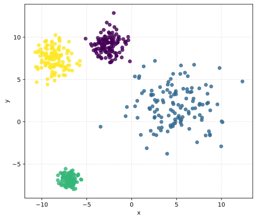
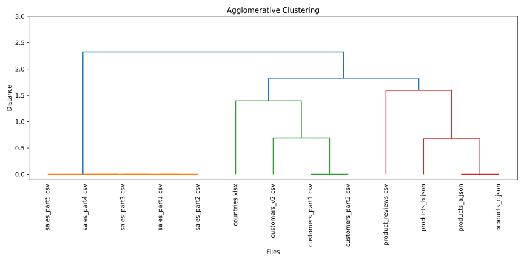

#  **Problem**: how can we manage a datalake?

**Context**:

- You are working for a consultancy company specialized in data engineering.
    - This is a typical use cases of internships or thesis projects in DTM or ISI.
- Your client is a large enterprise that has accumulated massive amounts of heterogeneous data across departments.

```
            ┌─────────────────────────────────────────────────────────────────────────────────────────────────────────────────┐
            │                                                DATA LAKE                                                        │
            └─────────────────────────────────────────────────────────────────────────────────────────────────────────────────┘
            ┌──────────────────────────┐    ┌────────────────────────────┐    ┌───────────────────────────┐   ┌───────────────┐
            │  bucket: dept-a          │    │  bucket: dept-b            │    │  bucket: shared           │   │  bucket: ...  │
            │  (sales)                 │    │  (support)                 │    │  (reference)              │   │               │
            │                          │    │                            │    │                           │   │               │
            │  /customers/             │    │  /customers/               │    │  /geo/                    │   │               │
            │   ├─ customers_part1.csv |    │   ├─ customers_v2.json     │    │   ├─ countries.xlsx       │   │               │
            │   ├─ customers_part2.csv |    │   └─ preferences.csv       │    │   └─ continents.parquet   │   │               │
            │   └─ README.md           │    │                            │    │                           │   │               │
            │                          │    │  /tickets/                 │    │  /products/               │   │               │
            │  /sales/                 │    │   ├─ tickets_2023.csv      │    │   ├─ products_v1.json     │   │               │
            │   ├─ sales_part1.csv     │    │   └─ tickets_2024.csv      │    │   └─ products_v2.json     │   │               │
            │   ├─ sales_part2.csv     │    │                            │    │                           │   │               │
            │   ├─ sales_part3.csv     │    │  /exports/                 │    │  /dictionaries/           │   │               │
            │   └─ sales_part4.csv     │    │   └─ customer_dump.parquet |    |   └─ country_codes.csv    │   |               │
            │                          │    │                            │    │                           │   │               │
            │  /.../                   │    │  /.../                     │    │  /.../                    │   │               │
            │   └─ ...                 │    │   └─ ...                   │    |    └─ ...                 |   |               |  
            │                          │    │                            │    │                           │   │               │
            │  /logs/                  │    │  /logs/                    │    │  /schemas/                │   │               │
            │   └─ ingestion.log       │    │   └─ api_events.log        │    │   └─ inferred_schema.yaml |   │               |
            └──────────────────────────┘    └────────────────────────────┘    └───────────────────────────┘   └───────────────┘
```

**Objectives**: assess and organize the data lake to produce unified data assets ready for downstream analytics.

# Brainstorming: which **problems** do you see?

# Brainstorming: problems

Data lakes collect data from **different sources** (e.g., departments)

Files may have:

- Different **formats** (CSV, Excel, JSON)
- Different **schemas** (column names vary)
- Duplicated or overlapping concepts

> A (table) **schema** is the blueprint or structure that defines how data is organized (within a table), specifying the names, data types, and constraints (for each column).

Users need to **find and integrate** relevant data but they don't know:

- What is inside each file
- Which files describe the **same entities**

... and more

# Brainstorming: where do we start?

# Step 0: What do we have in the data lake?

```bash
ls -R /home/datalake/data/bronze/
```

```
/home/datalake/data/bronze/:
department_a  department_b

/home/datalake/data/bronze/department_a:
countries.xlsx  customers  products  sales

/home/datalake/data/bronze/department_a/customers:
customers_part1.csv  customers_part2.csv

/home/datalake/data/bronze/department_a/products:
products_a.json  products_b.json

/home/datalake/data/bronze/department_a/sales:
sales_part1.csv  sales_part2.csv  sales_part3.csv  sales_part4.csv  sales_part5.csv

/home/datalake/data/bronze/department_b:
customers  products  reviews

/home/datalake/data/bronze/department_b/customers:
customers_v2.csv

/home/datalake/data/bronze/department_b/products:
products_c.json

/home/datalake/data/bronze/department_b/reviews:
product_reviews.csv
```

# Step 0: What do we have in the data lake?

Let's keep to simple, and focus only csv, Excel, and JSON files

# Step 1: Schema Extraction

In CSV files, the schema is in the header (first row)

- For each file, read the first rows to collect column names

Examples:

```bash
head -n1 /home/datalake/data/bronze/department_a/customers/customers_part1.csv
```

```
customer_id,first_name,email,country,telephone
```

```bash
head -n1 /home/datalake/data/bronze/department_a/sales/sales_part1.csv
```

```
order_key,cust_id,product_id,quantity,date,amount_usd
```

What about `.json` and `.xlsx` files?

# Step 1: Schema Extraction

For each file, read the first rows to collect column names

Examples:

```bash
head -n1 /home/datalake/data/bronze/department_a/customers/customers_part1.csv
```

```
customer_id,first_name,email,country,telephone
```

```bash
head -n1 /home/datalake/data/bronze/department_a/sales/sales_part1.csv 
```

```
order_key,cust_id,product_id,quantity,date,amount_usd
```

:::{.fragment}
Problems:

- What about `.json` and `.xlsx` files?
- Manual integration is:
    - Time-consuming
    - Error-prone
    - Not scalable
- Even if we build a Python program (e.g., with Pandas), we have many files to manually analyze
:::

# Step 2: Clustering by Schema Similarity

We can use **clustering** to group files with *similar schemas*

::::{.columns}
:::{.column width="50%"}

:::
:::{.column width="50%"}
How do we define the *schema similarity* (or distance)?

> Example:  
> 
> - $Schema_A = \{`id', `name', `email'\}$
> - $Schema_B = \{`id', `fullname', `mail'\}$
:::
::::

# Step 2: Jaccard Index (Similarity Measures)

Measures **overlap of sets**: $J(Schema_A, Schema_B) = \frac{|Schema_A \cap Schema_B|}{|Schema_A \cup Schema_B|}$

> Example:  
> 
> - $Schema_A = \{`id', `name', `email'\}$
> - $Schema_B = \{`id', `fullname', `mail'\}$
> - $|Schema_A \cap Schema_B| = |\{`id'\}| = 1$
> - $|Schema_A \cup Schema_B| = |\{`id', `name', `email', `fullname', `mail'\}| = 5$
> - $J(Schema_A, Schema_B) = \frac{1}{5} = 0.2$

What do you think about this solution?

# Step 2: Jaccard Index (Similarity Measures)

|                     |   countries.xlsx |   customers_part1.csv |   customers_part2.csv |   products_a.json |   products_b.json |   sales_part1.csv |
|:--------------------|-----------------:|----------------------:|----------------------:|------------------:|------------------:|------------------:|
| countries.xlsx      |                1 |                 0     |                 0     |          0        |         0         |         0         |
| customers_part1.csv |                0 |                 1     |                 1     |          0        |         0         |         0         |
| customers_part2.csv |                0 |                 1     |                 1     |          0        |         0         |         0         |
| products_a.json     |                0 |                 0     |                 0     |          1        |         0.625     |         0.1       |
| products_b.json     |                0 |                 0     |                 0     |          0.625    |         1         |         0.0769231 |




# Step 2: Fuzzy Matching (Similarity Measures)

Capture **spelling variations** in column names

- String similarity based on **edit distance**
- Two attributes are match if they differ by a few characters (i.e., if their similarity is above a threshold $\alpha$)
    -  Example metric: **Levenshtein distance**

> Example:  
> 
> - $Schema_A = \{`id', `name', `email'\}$
> - $Schema_B = \{`id', `fullname', `mail'\}$
> - $|Schema_A \cap Schema_B| = |\{`id', `email'\}| = 2$
> - $|Schema_A \cup Schema_B| = |\{`id', `name', `email', `fullname'\}| = 4$
> - $J_{fuz}(Schema_A, Schema_B) = \frac{2}{4} = 0.5$

# Step 2: Clustering by Schema Similarity

Compute the **Fuzzy Matching similarity** between files

- What about the computational cost/complexity?

Cluster files using **Agglomerative Clustering**

```
Cluster 1:
  Intersection schema: {'currency', 'price', 'product_id', 'name', 'type'}
  Average Jaccard similarity: 0.75
    File: /home/datalake/data/bronze/department_a/products/products_a.json  Schema: ['currency', 'price', 'product_id', 'name', 'type']
    File: /home/datalake/data/bronze/department_a/products/products_b.json  Schema: ['currency', 'material', 'price', 'product_id', 'name', 'color', 'type', 'stock']
    File: /home/datalake/data/bronze/department_b/products/products_c.json  Schema: ['currency', 'price', 'product_id', 'name', 'type']

...

Cluster 3:
  Intersection schema: {'telephone', 'first_name', 'customer_id', 'country', 'email'}
  Average Jaccard similarity: 1.00
    File: /home/datalake/data/bronze/department_a/customers/customers_part1.csv  Schema: ['telephone', 'first_name', 'customer_id', 'country', 'email']
    File: /home/datalake/data/bronze/department_a/customers/customers_part2.csv  Schema: ['telephone', 'first_name', 'customer_id', 'country', 'email']

...
```

# Step 3: Merging

Apply unified schema to all files in a cluster

Concatenate into a **single governed dataset**

- `Cluster1.csv` (merged data)
- `Cluster1_schema.json` (mapping for transparency)

#  **Problems**?

# Step 2.alt: Embeddings (Similarity Measures)

Fuzzy Matching does not capture **semantic similarity** between column names

- We can use *transformers* to represent words as vectors  
- Capturing *semantic meaning*, not just spelling

See the [demo](https://www.cs.cmu.edu/~dst/WordEmbeddingDemo/)

# Step 2.alt: Embeddings (Similarity Measures)

> ::::{.columns}
> :::{.column width="50%"}
> 
> 
> :::
> :::{.column width="50%"}
> 
> Computing the embeddings:
> 
> ```python
> {
>   'telephone': [-0.11484879  0.06089507  0.01468573 ... ],
>   'first_name': [-0.11216891  0.04061386 -0.01322238 ... ],
>   'customer_id': [-0.06831077  0.03470041 -0.02761879 ... ],
> ... }
> ```
> 
> Computing the similarity between embeddings:
> 
> ```python
> sim_cos('country', 'location'): 0.63932264,
> sim_cos('location', 'name'): 0.39198124,
> sim_cos('name', 'first_name'): 0.6186802
> ```
> Example:
>
> - $Schema_A = \{`id', `name', `email', `country'\}$
> - $Schema_B = \{`id', `first_name', `mail', `location'\}$
> - $|Schema_A \cap Schema_B| = |\{`id', `email', `name', `country'\}| = 4$
> - $|Schema_A \cup Schema_B| = |\{`id', `email', `name', `country'\}| = 4$
> - $J_{emb}(Schema_A, Schema_B) = \frac{4}{4} = 1.0$
> :::
> ::::

# Step 2.alt: Embeddings (Similarity Measures)

|                            |   countries.xlsx |   customers_part1.csv |   customers_part2.csv |   products_a.json |   products_b.json |   sales_part1.csv |
|:---------------------------|:----------------:|:---------------------:|:---------------------:|:-----------------:|:-----------------:|:-----------------:|
| <b>countries.xlsx</b>      |              1   |              0.4      |              0.4      |          0        |         0         |          0        |
| <b>customers_part1.csv</b> |              0.2 |              1        |              1        |          0.2      |         0.153846  |          0        |
| <b>customers_part2.csv</b> |              0.2 |              1        |              1        |          0.2      |         0.153846  |          0        |
| <b>products_a.json</b>     |              0   |              0.2      |              0.2      |          1        |         0.625     |          0.3      |
| <b>products_b.json</b>     |              0   |              0.153846 |              0.153846 |          0.625    |         1         |          0.230769 |


# Step 3.alt: Merging

Within each cluster:

- Detect overlapping columns via hybrid similarity
- Map to **canonical names**
- Collapse multiple variants into a single column

> ::::{.columns}
> :::{.column width="50%"}
> Table 1:
> 
> | customer\_id | first\_name | email                       | country |
> | ------------ | ----------- | --------------------------- | ------- |
> | 1            | Alice       | [a@ex.com](mailto:a@ex.com) | US      |
> | 2            | Bob         | [b@ex.com](mailto:b@ex.com) | UK      |
> 
> Table 2:
> 
> | customer\_id | name  | mail                            | location       |
> | ------------ | ----- | ------------------------------- | -------------- |
> | 1            | Chuck | [c@mail.com](mailto:a@mail.com) | United States  |
> | 2            | Dan   | [d@mail.com](mailto:b@mail.com) | United Kingdom |
> 
> :::
> :::{.column width="50%"}
> 
> Unified table:
> 
> | customer\_id | first\_name | email                           | country |
> | ------------ | ----------- | ------------------------------- | ------- |
> | 1            | Alice       | [a@ex.com](mailto:a@ex.com)     | US      |
> | 2            | Bob         | [b@ex.com](mailto:b@ex.com)     | UK      |
> | 1            | Chuck       | [c@mail.com](mailto:c@mail.com) | United States  |
> | 2            | Dan         | [d@mail.com](mailto:d@mail.com) | United Kingdom |
> :::
> ::::

Are we done?

# Conclusion

- Automated **semantic clustering and schema unification**
- Provides **governed integration** in data lakes
- Enables reliable, auditable, and transparent data pipelines
