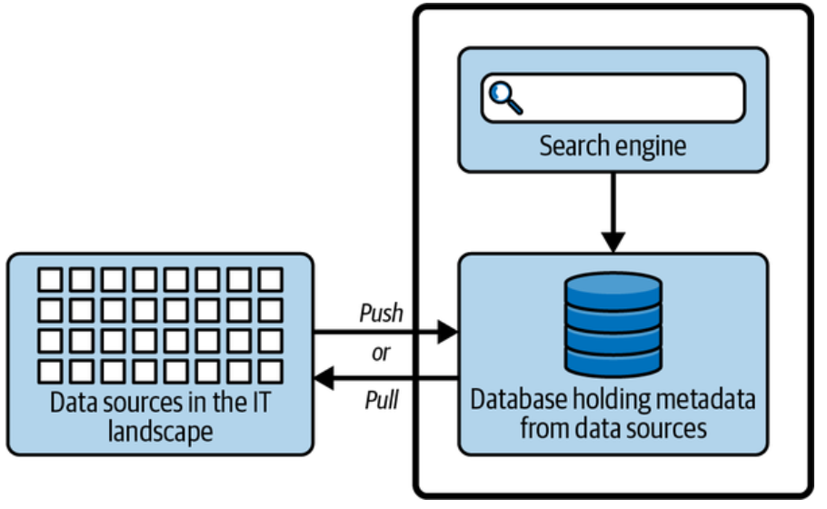
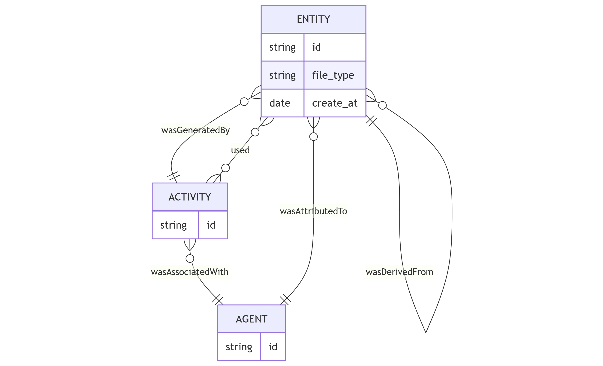
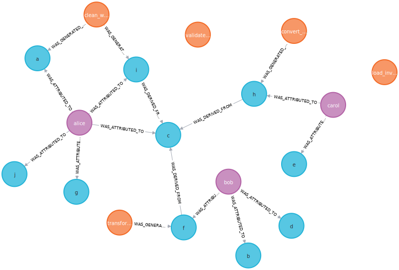

# Metadata Governance

Organizations manage **data catalogs** with details about data, algorithms, and agents.



# How can we implement these concepts into the database?


# Relational data model



# Relational data model

```sql
CREATE TABLE entity (
    entity_id INTEGER PRIMARY KEY,
    name TEXT,
    file_type TEXT,
    created_at TEXT,
    wasDerivedFrom INTEGER REFERENCES entity(entity_id)
);
CREATE TABLE agent (agent_id INTEGER, name TEXT);
CREATE TABLE activity (activity_id INTEGER, name TEXT);
CREATE TABLE wasAttributedTo (entity_id, agent_id);
CREATE TABLE wasGeneratedBy (entity_id, activity_id);
```

# Implementing the relational data model {visibility="hidden"}

```
erDiagram
 ENTITY {
 string id
 string file_type
 date create_at
 }
 ACTIVITY {
 string id
 }
 AGENT {
 string id
 }
 ENTITY }o--|| ACTIVITY : "wasGeneratedBy"
 ACTIVITY }o--o{ ENTITY : "used"
 ACTIVITY }o--|| AGENT : "wasAssociatedWith"
 ENTITY }o--|| AGENT : "wasAttributedTo"
 ENTITY ||--o{ ENTITY : "wasDerivedFrom"
```

# What are the limitations of the relational model?

# Limitations of the Relational Model

Difficult to store **heterogeneous metadata**:

* CSV: columns, delimiter
* TIFF: resolution, color depth
* JSON: nested structures

# Limitations of the Relational Model

| Column Name             | Type      | Applies To | Description                             |
| ----------------------- | --------- | ---------- | --------------------------------------- |
| **entity_id** | `INTEGER` | all        | Unique ID (primary key).                |
| **name** | `TEXT` | all        | Human-readable name of the entity.      |
| **file_type** | `TEXT` | all        | Type of file (`csv`, `tiff`, `json`).   |
| **file_path** | `TEXT` | all        | File path or URI.                       |
| **file_size** | `INTEGER` | all        | File size in bytes.                     |
| **checksum** | `TEXT` | all        | File checksum (e.g., SHA256).           |
| **created_at** | `TEXT` | all        | Timestamp when created.                 |
| **wasDerivedFrom** | `INTEGER` | all        | Foreign key to parent entity.           |
| **csv_columns** | `TEXT` | CSV        | Column names (e.g., `"id,name,price"`). |
| **csv_delimiter** | `TEXT` | CSV        | Column separator (e.g., `","`).         |
| **csv_has_header** | `BOOLEAN` | CSV        | Indicates if first row is header.       |
| **tiff_resolution** | `TEXT` | TIFF       | Image resolution (e.g., `300dpi`).      |
| **tiff_color_depth** | `INTEGER` | TIFF       | Bits per pixel (e.g., `24`).            |
| **tiff_compression** | `TEXT` | TIFF       | Compression type (e.g., `LZW`).         |
| **json_schema_version** | `TEXT` | JSON       | Version of JSON schema.                 |
| **json_root_keys** | `TEXT` | JSON       | Top-level keys.                         |
| **json_nesting_level** | `INTEGER` | JSON       | Max nesting depth.                      |

# Limitations of the Relational Model

<div style=font-size:0.6em>
| entity_id | name              | file_type | file_size | csv_columns     | csv_delimiter | csv_has_header | tiff_resolution | tiff_color_depth | json_schema_version | json_root_keys         | json_nesting_level |
| --------- | ----------------- | --------- | --------- | --------------- | ------------- | -------------- | --------------- | ---------------- | ------------------- | ---------------------- | ------------------ |
| 1         | `customers_raw`   | csv       | 10432     | `id,name,email` | `,`           | TRUE           | NULL            | NULL             | NULL                | NULL                   | NULL               |
| 2         | `satellite_image` | tiff      | 8500000   | NULL            | NULL          | NULL           | `300dpi`        | 24               | NULL                | NULL                   | NULL               |
| 3         | `api_response`    | json      | 2000      | NULL            | NULL          | NULL           | NULL            | NULL             | `v2.1`              | `["users","metadata"]` | 2                  |
</div>


# Limitations of Relational Model

Relationships (e.g., lineage chains) need complex joins:

Which entity was derived from the entity `'a'`?

:::{.fragment}
```sql
SELECT e1.name, e2.name
FROM entity e1 JOIN entity e2 ON e1.wasDerivedFrom = e2.entity_id
WHERE e1.name = 'a';
```
:::

# Limitations of the Relational Model

Reference schema

```sql
CREATE TABLE entity (entity_id, wasDerivedFrom);
CREATE TABLE agent (agent_id, name);
CREATE TABLE activity (activity_id, name);
CREATE TABLE wasAttributedTo (entity_id, agent_id);
CREATE TABLE wasGeneratedBy (entity_id, activity_id);
```

Which entity was derived from an entity derived from `'a'`?

:::{.fragment}
```sql
SELECT e1.name, e2.name
FROM (entity e1 JOIN entity e2 ON e1.wasDerivedFrom = e2.entity_id)
    JOIN entity e3 ON e2.wasDerivedFrom = e3.entity_id
WHERE e1.name = 'a';
```
:::

# Limitations of the Relational Model

Reference schema

```sql
CREATE TABLE entity (entity_id, wasDerivedFrom);
CREATE TABLE agent (agent_id, name);
CREATE TABLE activity (activity_id, name);
CREATE TABLE wasAttributedTo (entity_id, agent_id);
CREATE TABLE wasGeneratedBy (entity_id, activity_id);
```

Which entity was (derived from an entity)$^5$ derived from `'a'`?

:::{.fragment}
```sql
SELECT e1.name, e2.name
FROM (entity e1 JOIN entity e2 ON e1.wasDerivedFrom = e2.entity_id)
    JOIN entity e3 ON e2.wasDerivedFrom = e3.entity_id
    JOIN entity e4 ON e3.wasDerivedFrom = e4.entity_id
    JOIN entity e5 ON e4.wasDerivedFrom = e5.entity_id
WHERE e1.name = 'a';
```
:::

# Document-based model

Each entity becomes a (JSON) **document** with customizable attributes.

::::{.columns}
::: {.column width=50%}

```json
{
  "name": "customers_raw",
  "file_type": "csv",
  "created_at": "2025-07-12",
  "agents": ["alice"],
  "activities": ["extract_sales_data"],
  "columns": 8,
  "delimiter": ",",
  "encoding": "utf-8",
  "wasDerivedFrom": "a"
}
```

:::
::: {.column width=50%}

```json
{
  "name": "satellite_image",
  "file_type": "tiff",
  "created_at": "2025-07-12",
  "agents": ["alice"],
  "activities": [],
  "tiff_resolution": "300dpi",
  "tiff_color_depth": 24,
}
```

:::
::::

A *collection* is a list of documents.

# Document-based model

::::{.columns}
::: {.column width=50%}
The relational model is *data-driven*

- It represents concepts as relations and relationships.

Reference schema

```sql
CREATE TABLE entity (entity_id, wasDerivedFrom);
CREATE TABLE agent (agent_id, name);
CREATE TABLE activity (activity_id, name);
CREATE TABLE wasAttributedTo (entity_id, agent_id);
CREATE TABLE wasGeneratedBy (entity_id, activity_id);
```

Which agents were attributed to the entity?

:::{.fragment}

```sql
SELECT e.name AS entity_name,a.name AS agent_name
FROM entity e JOIN wasAttributedTo w ON e.id = w.entity_id
    JOIN agent a ON w.agent_id = a.id
WHERE e.name = 'a';
```

Which activities generated the entity?
:::

:::{.fragment}
```sql
SELECT e.name AS entity_name, act.name AS activity_name
FROM entity e JOIN wasGeneratedBy wgb ON e.id = wgb.entity_id
    JOIN activity act ON wgb.activity_id = act.id
WHERE e.name = 'a';
```
:::

:::
::: {.column width=50%}

:::{.fragment}

The document-based model is *aggregate-oriented*

- Each document contains the data necessary to answer a query.

Which agents were attributed to the entity?

Which activities generated the entity?

```{.json code-line-numbers="5-6"}
{
  "name": "a",
  "file_type": "csv",
  "created_at": "2025-07-12",
  "agents": ["alice"],
  "activities": ["extract_sales_data"],
  "columns": 8,
  "delimiter": ",",
  "encoding": "utf-8",
}
```
:::

:::
::::


# Limitations of Document-based Model

- Chains of relationships are implicit and difficult to traverse
- Data lineage analysis is cumbersome

# The graph data model

Reference schema

```sql
CREATE TABLE entity (entity_id, wasDerivedFrom);
CREATE TABLE agent (agent_id, name);
CREATE TABLE activity (activity_id, name);
CREATE TABLE wasAttributedTo (entity_id, agent_id);
CREATE TABLE wasGeneratedBy (entity_id, activity_id);
```

The graph data model is **data-driven** and represents data as **nodes** and **edges**.

- Relationships become *first-class citizens*.



# The graph data model


Example of implementation in Resource Description Framework (RDF) triples (Subject-Predicate-Object)

```
<http://example.org/entity/a> <http://example.org/wasDerivedFrom> <http://example.org/entity/b> .
<http://example.org/entity/a> <http://example.org/wasAttributedTo> <http://example.org/agent/alice> .
<http://example.org/entity/a> <http://example.org/wasGeneratedBy> <http://example.org/activity/extract_sales_data> .
```

# The graph data model

Cypher is a declarative graph query language that allows for expressive and efficient data querying in a property graph.

* `(:Agent)-[:WAS_ATTRIBUTED_TO]->(:Entity)`
* `(:Activity)-[:WAS_GENERATED_BY]->(:Entity)`
* `(:Entity)-[:WAS_DERIVED_FROM]->(:Entity)`

Metadata stays attached as key-value node properties.

# The graph data model

SQL 

```sql
SELECT e1.name, e2.name
FROM (entity e1 JOIN entity e2 ON e1.wasDerivedFrom = e2.entity_id) 
    JOIN entity e3 ON e2.wasDerivedFrom = e3.entity_id
    JOIN entity e4 ON e3.wasDerivedFrom = e4.entity_id
    JOIN entity e5 ON e4.wasDerivedFrom = e5.entity_id
WHERE e1.name = 'a';
```

Cypher

```cypher
MATCH (e1:Entity {name: 'a'})
MATCH (e1)-[:WAS_DERIVED_FROM]->(e2:Entity)
 -[:WAS_DERIVED_FROM]->(e3:Entity)
 -[:WAS_DERIVED_FROM]->(e4:Entity)
 -[:WAS_DERIVED_FROM]->(e5:Entity)
RETURN e1.name, e2.name, e3.name, e4.name, e5.name;
```

# The graph data model

SQL

```sql
SELECT e1.name, e2.name
FROM (entity e1 JOIN entity e2 ON e1.wasDerivedFrom = e2.entity_id) 
    JOIN entity e3 ON e2.wasDerivedFrom = e3.entity_id
    JOIN entity e4 ON e3.wasDerivedFrom = e4.entity_id
    JOIN entity e5 ON e4.wasDerivedFrom = e5.entity_id
WHERE e1.name = 'a';
```

Cypher

```cypher
MATCH (e1:Entity {name: 'a'})-[:WAS_DERIVED_FROM*1..5]->(e2:Entity)
RETURN e1.name, e2.name;
```

# Comparison Summary

| Aspect                 | Relational          | Document          | Graph              |
| ---------------------- |:-------------------:|:-----------------:|:------------------:|
| Schema Flexibility     | ❌                  | ✅                 | ✅                  |
| Relationship Modeling  | ✅                  | ⚠️ (manual)       | ✅                  |
| Querying Relationships | ⚠️ (joins)          | ⚠️                | ✅                  |
| Use Case Fit           | Structured data     | Semi-structured data     | Semi-structured data + Lineage |

Takeaways

* **No single DB fits all purposes.**
* This example mirrors **real-world metadata governance systems** (e.g., DataHub, Amundsen, OpenMetadata).